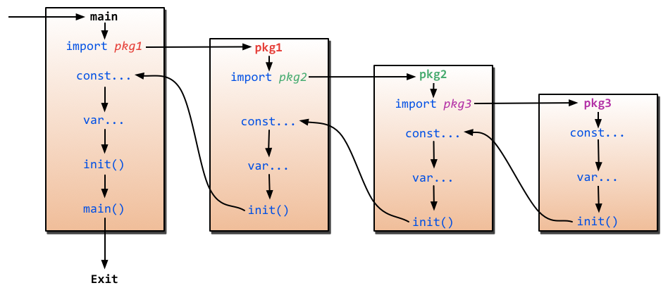

# Chapter 2 - Go basic knowledge

# Go Reseverd Words

| | | | | |
| --- | --- | --- | --- | --- |
| break | default | func | interface | select |
| case | defer | go | map | struct |
| chan | else | goto | package | switch |
| const | fallthrough | if | range | type |
| continue | for | import | return | var |

# Hello World

Create a new file `$GOPATH/src/hello/hello.go` and type the following code:

```go
package main

import "fmt"

func main() {
    fmt.Printf("Hello, world")
}
```

Then compile and run the application:

```bash
$ go run hello.go
Hello, world
```

## Explination

- `package main` - This tells the Go compiler that the package should compile as an executable program instead of a shared library.

Every executable go application has only one `main` package.

- To print a text to the console, we use the `fmt` package. The `fmt` package implements formatted I/O functions similar to C's `printf` and `scanf`. The `fmt.Printf` function is used to print a formatted string to standard output, which is usually the console.

To import a package, we use the `import` keyword. The `fmt` package is one of the standard library packages, so we don't need to install it.

- Go uses UTF-8 encoded strings, so we can use Unicode characters directly in the source code.
- Notice that there are no semicolons at the end of the statements.

# Go Foundation

## Variables

`var` is used to declare a variable, after the name of the variable, we need to specify the type of the variable.

```go
var variableName type
```

For multiple variables, we can declare them in one line:

```go
var vname1, vname2, vname3 type
```

With initializers:

```go
var vname1, vname2, vname3 type = v1, v2, v3
```

You can omit the type if the initializer is present and the compiler can infer the type:

```go
var vname1, vname2, vname3 = v1, v2, v3
```

You can use short assignment (which is more popular) `:=` instead of `var` declaration with implicit type:

```go
vname1, vname2, vname3 := v1, v2, v3
```

Note that `:=` cannot be used outside of a function.

`_` (blank) is used to ignore a variable that will not be used.

```go
_, b := 34, 35
```

If you declared a variable without using it, the program will give an error.

```go
// this will give an error
package main

func main() {
    var a int
}
```

## Constants

Constants are declared like variables, but with the `const` keyword.

```go
const constantName = value
// example
const Pi float32 = 3.1415926
```

## Elementary Data Types

### Boolean

`bool` is a boolean type, it can only be `true` or `false`.

```go
var b bool = true
```

### Numeric Types

- `uint8` - unsigned 8-bit integers (0 to 255)
- `uint16` - unsigned 16-bit integers (0 to 65535)
- `uint32` - unsigned 32-bit integers (0 to 4294967295)
- `uint64` - unsigned 64-bit integers (0 to 18446744073709551615)
- `int8` - signed 8-bit integers (-128 to 127)
- `int16` - signed 16-bit integers (-32768 to 32767)
- `int32` - signed 32-bit integers (-2147483648 to 2147483647)
- `int64` - signed 64-bit integers (-9223372036854775808 to 9223372036854775807)
- `float32` - IEEE-754 32-bit floating-point numbers
- `float64` - IEEE-754 64-bit floating-point numbers
- `complex64` - complex numbers with float32 real and imaginary parts
- `complex128` - complex numbers with float64 real and imaginary parts
- `byte` - alias for uint8
- `rune` - alias for int32  
- `uint` - 32 or 64 bits
- `int` - 32 or 64 bits

### String

A string is a immutable sequence of bytes. Strings can contain arbitrary data, including bytes with value 0, but usually they contain human-readable text. String literals can be created using double quotes `""` or backticks `` ` ``.

```go
var frenchHello string
var emptyString string = ""
```

Strings are immutable, once created, it is not possible to change the contents of a string.

```go
// This code will give an error
s = "hello"
s[0] = 'c'
```

To concatenate two strings, use the `+` operator:

```go
s := "hello"
m := "world"
a := s + " " + m
```

To have a multi-line string, use backticks `` ` ``:

```go
m := `hello
world`
```

### Error Type

The `error` type is a built-in interface.

```go
err := errors.New("This is an error")

if err != nil {
    fmt.Print(err)
}
```

## Define by group

instead of

```go
import "fmt"
import "os"

var i = 1
var pi = 3.1415926
var prefix = "Go_"

const pi = 3.1415926
const prefix = "Go_"
const e = 2.7182
```

we can use

```go
import (
    "fmt"
    "os"
)

var (
    i = 1
    pi = 3.1415926
    prefix = "Go_"
)

const (
    pi = 3.1415926
    prefix = "Go_"
    e = 2.7182
)
```

## iota enumerate

Go has a special `iota` identifier that can be used in const declarations to simplify definitions of incrementing numbers (starts with 0 and increments by 1).

```go
const (
    x = iota // x == 0
    y = iota // y == 1
    z = iota // z == 2
    w // If there is no expression after the constants name, it uses the last expression, so it is the same as `const w = iota` and w == 3.
)

const v = iota // once iota meets `const`, it resets to 0, so v == 0

const (
    h, i, j = iota, iota, iota // h=0, i=0, j=0, iota is reset to 0
)
```

## public vs private

There are no access modifiers like `public` or `private` in Go. If a constant, variable or function's name starts with a capital letter, it will be exported (public). Otherwise, it will not be exported (private).

```go
const Pi = 3.1415926 // Pi is exported
const pi = 3.1415926 // pi is not exported

var Pi = 3.1415926 // Pi is exported
var pi = 3.1415926 // pi is not exported

func Pi() { // Pi is exported
    return 3.1415926
}

func pi() { // pi is not exported
    return 3.1415926
}
```

# Array, Slice, Maps

## Array

An array is a numbered sequence of elements of a single type with a fixed length.

```go
var arr [n]type
```

where `n` is the size of the array and `type` is the type of the elements.

```go
var arr [10]int
arr[0] = 41
arr[1] = 30
fmt.Printf("The first element in the array %d\n", arr[0])
fmt.Printf("The entire array %d\n", arr)
```

It is possible to define an array using `:=`:

```go
arr := [10]int{1, 2, 3, 4, 5, 6, 7, 8, 9, 10}
arr2 := [...]int{1, 2, 3, 4, 5, 6, 7, 8, 9, 10} // the compiler will count the length of the array
```

To define 2D arrays:

```go
var arr [n][m]type
```

where `n` is the number of rows and `m` is the number of columns.

```go
var arr [2][2]int
arr[0][0] = 1
arr[0][1] = 2
arr[1][0] = 3
arr[1][1] = 4
fmt.Printf("The entire array %d\n", arr)
```

A short way to define 2D arrays:

```go
doubleArray := [2][4]int{{1, 2, 3, 4}, {5, 6, 7, 8}}
```

## Slice

A slice is a segment of an array. Like arrays, slices are indexable and have a length. Unlike arrays, this length is allowed to change (so we can consider it as a dynamic array). A slice is formed by specifying two indices, a low and high bound, separated by a colon:

```go
var slice []type = arr[low:high]
```

If there are no initial array to slice:

```go
var slice []type
```

a shorter way to define a slice:

```go
slice := []int{1, 2, 3, 4, 5}
```

To get the length of a slice, use the `len` function:

```go
fmt.Printf("The length of the slice is %d\n", len(slice))
```

To get the capacity of a slice, use the `cap` function:

```go
fmt.Printf("The capacity of the slice is %d\n", cap(slice))
```

To append elements to a slice, use the `append` function:

```go
slice = append(slice, 6, 7, 8)
```

To copy a slice, use the `copy` function:

```go
slice2 := make([]int, 2)
copy(slice2, slice)
```

## Maps

A map is an unordered group of elements of one type, called the element type, indexed by a set of unique keys of another type, called the key type.

```go
var mapname map[keytype]valuetype
```

```go
var numbers map[string]int
// another way to define a map
numbers := make(map[string]int)

numbers["one"] = 1
numbers["ten"] = 10
numbers["three"] = 3

fmt.Printf("The third number is: %d\n", numbers["three"])

// a shorter way to define a map

numbers := map[string]int{
    "one": 1,
    "ten": 10,
    "three": 3,
}
```

To check if a key exists in a map:

```go
value, ok := numbers["three"]
if ok {
    fmt.Printf("The third number is: %d\n", value)
} else {
    fmt.Printf("The third number does not exist\n")
}
```

To delete a key from a map:

```go
delete(numbers, "three")
```

# Control Statements

## Conditional Statements

### if

```go
if condition {
    // do something
} else if condition {
    // do something
} else {
    // do something
}
```

For example:

```go
if x > 10 {
    fmt.Printf("x is greater than 10\n")
} else if x < 10 {
    fmt.Printf("x is less than 10\n")
} else {
    fmt.Printf("x is equal to 10\n")
}
```

A special thing about `if`in go that it can have one initialization statement before the condition:

```go
if x := computedValue(); x > 10 {
    fmt.Printf("x is greater than 10\n")
} else if x < 10 {
    fmt.Printf("x is less than 10\n")
} else {
    fmt.Printf("x is equal to 10\n")
}
```

### goto

`goto` is a statement that jumps to the statement with the corresponding label.

```go
goto label
... 
label: statement
```

For example:

```go
func myFunc() {
    i := 0
    Here: // label
    fmt.Printf("i is %d\n", i)
    i++
    goto Here // jump to Here
}
```

### for

```go
for initialization; condition; post {
    // do something
}
```

For example:

```go
sum := 0
for i := 0; i < 10; i++ {
    sum += i
}
fmt.Printf("sum is equal to %d\n", sum)
```

You can omit the initialization and post statements:

```go
sum := 1
for ; sum < 1000; {
    sum += sum
}
fmt.Printf("sum is equal to %d\n", sum)
```

You can omit all semicolons (which is equivalent to a while loop in other languages):

```go
sum := 1
for sum < 1000 {
    sum += sum
}
fmt.Printf("sum is equal to %d\n", sum)
```

#### break and continue

`break` is used to break out of the loop, `continue` is used to skip the current loop.

```go
for i := 0; i < 10; i++ {
    if i == 5 {
        break // break out of the loop
    }
    if i == 3 {
        continue // skip the current loop
    }
    fmt.Printf("i is %d\n", i)
}
```

#### range

`range` is used to iterate over an array, slice, string, map or channel. It returns two values, the first is the index and the second is the corresponding value.

```go
for key, value := range oldMap {
    newMap[key] = value
}
```

```go
for index, value := range slice {
    fmt.Printf("The index is %d and the value is %d\n", index, value)
}
```

Because Go supports multi-value returns and gives compile errors when you don't use values that were defined, you may want to use `_` to discard certain return values.

```go
for _, value := range slice {
    fmt.Printf("The value is %d\n", value)
}
```

to create an infinite loop:

```go
for {
    // do something
}
```

### switch

```go
switch sExpr {
    case expr1:
        some instructions
    case expr2:
        some other instructions
    case expr3:
        some other instructions
    default:
        other code
}
```

Go will automatically break out of the switch statement if it is true, unless it ends with `fallthrough`.

```go
switch sExpr {
    case expr1:
        some instructions
    fallthrough
    case expr2:
        some other instructions
    fallthrough
    case expr3:
        some other instructions
    fallthrough
    default:
        other code
}
```

# Functions

## Function Declaration

```go
func funcName(param1 type1, param2 type2) (returnType1, returnType2) {
    // do something
    return value1, value2
}
```

- use the keyword `func` to declare a function
- the return type can be omitted if the function does not return a value
- functions have zero or more parameters
- functions can return multiple values

For example, a function that return the maximum of two numbers:

```go
func max(num1, num2 int) int {
    if num1 > num2 {
        return num1
    } else {
        return num2
    }
}
```

To illustrate multiple return values, we can write a function that returns the sum, difference and product of two numbers:

```go
func SumDiffProduct(num1, num2 int) (int, int, int) {
    return num1 + num2, num1 - num2, num1 * num2
}
```

You can name the return values:

```go
func SumDiffProduct(num1, num2 int) (sum int, diff int, product int) {
    sum = num1 + num2
    diff = num1 - num2
    product = num1 * num2
    return
}
```

## Variadic functions

Variadic functions can be called with any number of trailing arguments, in the body of the function, the variadic parameter becomes actually a slice.

```go
func myFunc(arg ...int) {}
```

For example, a function that sums an arbitrary number of integers:

```go
func sum(nums ...int) int {
    total := 0
    for _, num := range nums {
        total += num
    }
    return total
}
```

Yo use a variadic function, you can pass zero or more arguments to the function:

```go
sum(1, 2)
sum(1, 2, 3)
sum(1, 2, 3, 4)
```

## Pass by value and pointers

When we pass an argument to the function that was called, that function actually gets the copy of our variables so any change will not affect to the original variable.

For example, let consider this `increment` function:

```go
// this will not work
func increment(x int) {
    x++
}
```

The solution is to pass a pointer to the variable we want to change (a memory address):

```go
func increment(x *int) {
    *x++
}
```

When you call this function, you need to pass the address of the variable you want to change:

```go
x := 1
increment(&x)
fmt.Printf("x is equal to %d\n", x)
```

## Defer

`defer` is used to ensure that a function call is performed later in a program's execution, usually for purposes of cleanup. `defer` is often used where e.g. `ensure` and `finally` would be used in other languages. `defer` helps you to write a cleaner code where related things are close to each other.

```go
func ReadWrite() bool {
    file.Open("file")
    defer file.Close() // this will be executed at the end of the enclosing function
    if failureX {
        return false
    }
    if failureY {
        return false
    }
    return true
}
```

If there are multiple `defer` statements, they are pushed onto a stack and executed in last-in-first-out order (reverse order).

```go
for i := 0; i < 5; i++ {
    defer fmt.Printf("%d ", i)
}
```

output:

```
4 3 2 1 0
```

## Functions as values and types

Functions are values too. They can be passed around just like other values. One use case is to pass a function to another function as an argument.

```go
type testInt func(int) bool // define a function type of variable

func isOdd(integer int) bool {
    if integer % 2 == 0 {
        return false
    }
    return true
}

func isEven(integer int) bool {
    if integer % 2 == 0 {
        return true
    }
    return false
}

func filter(slice []int, f testInt) []int {
    var result []int
    for _, value := range slice {
        if f(value) {
            result = append(result, value)
        }
    }
    return result
}

func main() {
    slice := []int {1, 2, 3, 4, 5, 7}
    fmt.Println("slice = ", slice)
    odd := filter(slice, isOdd) // function as values
    fmt.Println("Odd elements of slice are: ", odd)
    even := filter(slice, isEven)
    fmt.Println("Even elements of slice are: ", even)
}
```

## panic and recover

`panic` is a built-in function that stops the ordinary flow of control and begins panicking. When the function `F` calls `panic`, execution of `F` stops, any deferred functions in `F` are executed normally, and then `F` returns to its caller. To the caller, `F` then behaves like a call to `panic`. The process continues up the stack until all functions in the current goroutine have returned, at which point the program crashes. Panics can be initiated by invoking `panic` directly. They can also be caused by runtime errors, such as out-of-bounds array accesses.

```go
var user = os.Getenv("USER")

func init() {
    if user == "" {
        panic("no value for $USER")
    }
}
```

`recover` is a built-in function that regains control of a panicking goroutine. `recover` is only useful inside deferred functions. During normal execution, a call to `recover` will return `nil` and have no other effect. If the current goroutine is panicking, a call to `recover` will capture the value given to `panic` and resume normal execution.

```go
func main() {
    defer func() {
        if r := recover(); r != nil {
            fmt.Println("Recovered in f", r)
        }
    }()
    panic("panic")
}
```

## `main` and `init`

Go has two retentions which are called `main` and `init`, `main` can only be used in the `main` package and `init` can be used in any package.

Even if you can write many `init` function, it is strongly recommended to have only one `init` function per package.

Go will execute `main` and `init` function automatically, you do not need to call them explicitly.

Programs initialize and begin execution from the `main` package. If the `main` package imports other packages, they will be imported in the compile time. If one package is imported many times, it will be only compiled once. After importing packages, programs will initialize the constants and variables within the imported packages, then execute the `init` function if it exists, and so on. After all the other packages are initialized, programs will initialize constants and variables in the `main` package, then execute the `init` function inside the package if it exists. The following figure shows the process.



## import

We use the `import` keyword to import packages. The `import` keyword must be placed before any other code.

```go
import "fmt"
import "os"

// or 

import (
    "fmt"
    "os"
)
```

Go supports third party packages in two ways:

- Using relative paths (e.g. `import "./package"`), this will look up the package in the current directory. (not recommended)
- Using absolute paths (e.g. `import "shorturl/package"`), this will look up the package in the directories specified by the `GOROOT` and `GOPATH` environment variables.

There are some special operators in Go that are used to import packages:

- Dot (`.`) operator, it is used to import packages for accessing their exported identifiers without having to qualify them with their package names. For example, `fmt.Println` can be written as `Println` after importing the `fmt` package using the dot operator.

```go
import . "fmt"

// ... code

Println("Hello, World!")
```

- Alias (`_`), it is used to rename a package when importing it. For example, if we want to import the `fmt` package as `format`, we can do it using the alias operator as follows:

```go
import format "fmt"

// ... code

format.Println("Hello, World!")
```

- Blank identifier (`_`), it is used to import packages only for their side-effects (its `init` function). For example, if we import the `os` package using the blank identifier, the package will be imported only for its side-effect, which is the initialization of the package, and the package itself will not be available for use.

```go
import (
"database/sql"
_ "github.com/ziutek/mymysql/godrv"
)
```

# Structs

## struct

A struct is a type which contains named fields. It is similar to a class in OOP. It is useful to collect data together to form records.

```go
type structName struct {
    field1 type1
    field2 type2
    ...
}
```

For example, a struct that represents a person:

```go
type Person struct {
    name string
    age int
}
```

There are two fields in the `Person` struct:

- `name` of type `string`, used to store the name of the person
- `age` of type `int`, used to store the age of the person

To use a struct, we need to create an instance of it, then we can access the fields using the `.` operator:

```go
var p Person
p.name = "John"
p.age = 21
fmt.Printf("The name of the person is %s\n", p.name)
fmt.Printf("The age of the person is %d\n", p.age)
```

There are three ways to create a struct:

```go
// 1. create a struct and assign values to fields (order not important)
p := Person{age: 21, name: "John"}

// 2. create a struct and assign values to fields in order
p := Person{"John", 21}

// 3. Define an anonymous struct and assign values to fields
p := struct {
    name string
    age int
} {
    name: "John",
    age: 21,
}
```

## embedded fields in structs

Go supports embedded fields in structs. This is similar to inheritance in OOP.

```go
type Person struct {
    name string
    age int
}

type Student struct {
    Person // embedded field
    school string
}

func main() {
    s := Student{Person{"John", 21}, "MIT"}
    fmt.Println("His name is ", s.name)
    fmt.Println("His age is ", s.age)
    fmt.Println("He studies at ", s.school)
}
```

Overloading is supported in Go, so if the embedded struct has a field with the same name as another field in the outer struct, we need to use the outer struct's name to access it.

```go
package main

import "fmt"

type Human struct {
    name  string
    age   int
    phone string // Human has phone field
}
type Employee struct {
    Human
    specialty string
    phone     string // phone in employee
}

func main() {
    Bob := Employee{Human{"Bob", 34, "777-444-XXXX"}, "Designer", "333-222"}
    fmt.Println("Bob's work phone is:", Bob.phone)
    fmt.Println("Bob's personal phone is:", Bob.Human.phone)
}
```

output:

```
Bob's work phone is: 333-222
Bob's personal phone is: 777-444-XXXX
```
