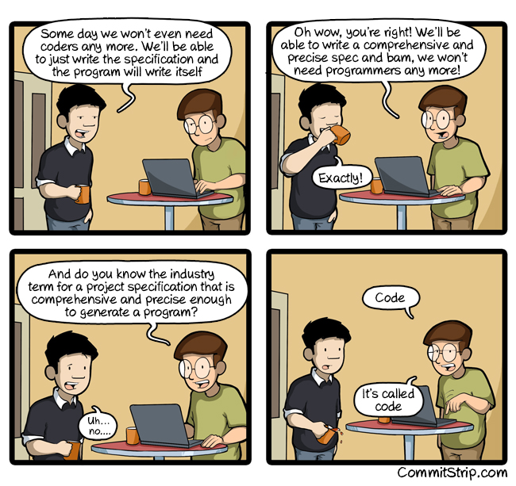

# Chapter 1 - Clean Code

## There Will Always Be Code

We will never be able to get rid of code, because code represents the details of the requirements, at some level those details cannot be ignored or abstracted, they have to be specified, and specifying requirements in such details that a machine can execute is called *programming*, and such a specification is called *code*.

## Bad Code

Clean code matters, without considering putting the effort into making the code clean it will end up being one of this killer apps, where release cycles began to stretch, bugs are not repaired from on release to the next, load time grew and crashes increases.

Why we are in rush, to meet the deadlines and ship the code faster? we all almost wrote a code and said we will improve it later, but the law is *Later equals never*.

## The Total Cost of Owning a Mess

If you have been a programmer for a while, you have probably been slowed down by someone else's messy code. Team that were moving so fast ends up moving at a snail's pace. Every change they made breaks two or three other parts of the code, no change is trivial, they are all risky. The productivity of the team drops down significantly.

## Attitude

It is the developers responsibility to keep the code clean, it is not the managers, marketers or the product managers responsibility to meet the schedule. It is *your* job to defend the code with equal passion and emphasis the importance of the code quality even if it may slow down the progress in the short term, but it will speed up the progress in the long term.

To drive this point home, what if you were a doctor and had a patient who demanded that you stop all the silly hand-washing in preparation for surgery because it was taking too much time? Clearly the patient is the boss; and yet the doctor should absolutely refuse to comply. Why? Because the doctor knows more than the patient about the risks of disease and infection. It would be unprofessional (never mind criminal) for the doctor to comply with the patient.

## The Art of Clean Code

If you agree that clean code is important, how to write clean code if you don't know how clean code is written, the bad news is writing clean code is like painting a picture. Most of us know when a picture is painted well, but we can't paint well ourselves. Being able to recognize good code doesn't mean you can write good code.

## What is Clean Code?

Here's some definitions of clean code by some of the most experienced programmers:

### Bjarne Stroustrup

1. I like code to *elegant* and *efficient*.
2. The *logic should be straightforward* to make it hard for bugs to hide.
3. *Minimal dependencies* to make it easy to maintain.
4. *Error handling complete* according to an articulated strategy.
5. Performance close to the optimal so to not tempt people to make the code messy with unprincipled optimizations. (*bad code tempts the mess to grow!*)
6. Clean code does *one thing well*. (Clean code is *focused*)

### Grady Booch

1. Clean code is simple and direct. Clean code reads like well-written prose. (clean code is *readable*)
2. Never obscures the designers intent. (Clean code is *clear on what it wants to do*)
3. Full of crisp abstractions. (simplify the complexity with appropriate abstractions)
4. Straightforward lines of control

### David Thomas

1. Clean code can be read and enhanced by a developer other than its original author.
2. It has unit and acceptance tests.
3. It has meaningful names.
4. It provides one way rather than many ways for doing one thing.
5. It has minimal dependencies, which are explicitly defined, and provides a clear and minimal API.
6. Code should be literate since depending on the language, not all necessary information can be expressed clearly in code alone. (You may not be able to fully understand the code by just reading it, so *comments* or *code documentation* is important)

### Michael Feathers

1. Clean code is written by someone who *cares*.
2. There is nothing obvious that you can do to make it better.
3. If you try to imagine improvements, you are led back to where you are.

### Ron Jeffries

1. Simple code runs all the tests.
2. Contains no duplication.
3. Expresses all the design ideas that are in the system.
4. Expressiveness include meaningful names.
5. Expressiveness means that to no object or method is doing more than one thing. If so, an object or method should be split into two or more objects or methods. Resulting in one method that says more clearly what it does, and some submethods saying how it is done.
6. Minimize the number of entities such as classes, methods, functions, and the like.

### Ward Cunningham

1. You know you are working on clean code when each routine you read turns out to be pretty much what you expected.
2. You can call it beautiful code when the code also makes it look like the language was made for the problem.

Of course the language is not designed specifically your problem, but it is your responsibility to write a code that makes it look like it was designed for the problem!

## We are Authors

We are authors, we have readers who will read our code later, we are responsible to make the code readable, understandable and maintainable. We should communicate well with our readers.

You may ask, how much is code really read? Doesn't the much effort go into writing it?

Read this story, which represents what we do most of the time:

*Bob enters the module.*
*He scrolls down to the function needing change.*
*He pauses, considering his options.*
*Oh, he’s scrolling up to the top of the module to check the initialization of a variable.*
*Now he scrolls back down and begins to type.*
*Ooops, he’s erasing what he typed!*
*He types it again.*
*He erases it again!*
*He types half of something else but then erases that!*
*He scrolls down to another function that calls the function he’s changing to see how it is called.*
*He scrolls back up and types the same code he just erased.*
*He pauses.*
*He erases that code again!*
*He pops up another window and looks at a subclass. Is that function overridden?*

A conclusion, we constantly read code, we must put an effort into write clean code, because we read it more than we write it.

## The Boy Scout Rule

It is not enough to write clean code, we must also keep it clean.

> The Boy Scouts of America have a simple rule that we can apply to our profession.
> *Leave the campground cleaner than you found it.*

If we all checked-in our code a little cleaner than when we checked it out, the code simply could not rot. The cleanup doesn’t have to be something big. Change one variable name for the better, break up one function that’s a little too large, eliminate one small bit of duplication, clean up one composite `if` statement.
