# Chapter 3 | Tree Data Structures

# Trees

Think about a tree in real life. It has a root, trunk, branches, and leaves.

In computer science, a tree is a data structure similar to the real world tree that has a root, branches, and leaves. The difference is that the root is at the top and the leaves are at the bottom. (flip the tree upside down)

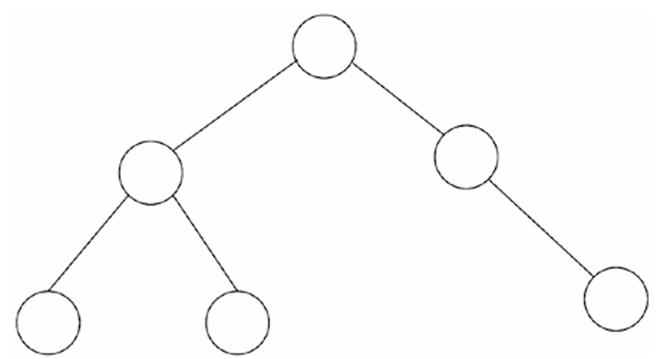

In biological trees, there is a root that responsible for the growth of the tree. In computer science, the root is the starting point of the tree and without it the tree cannot exist.

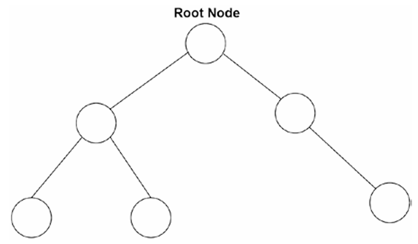

When a node is connected to another node in the direction away from the root, it is called a child node. The node that is connected to the child is called a parent.

A parent node can have multiple child nodes but a child node can only have one parent node. Otherwise, it would be a graph.

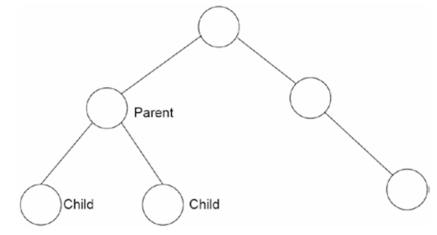

Like the real trees, we call the last nodes of the trees that have no children as leaves.

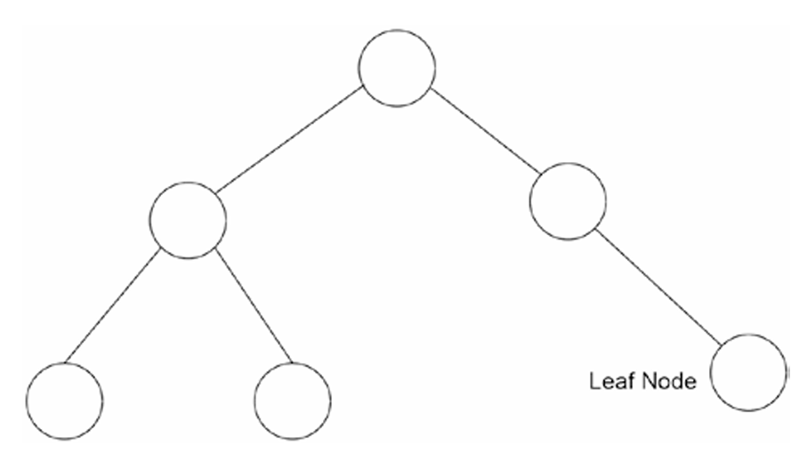

We call the link that connects the nodes as *edges*. And a tree that is child of a node is called a *subtree*.

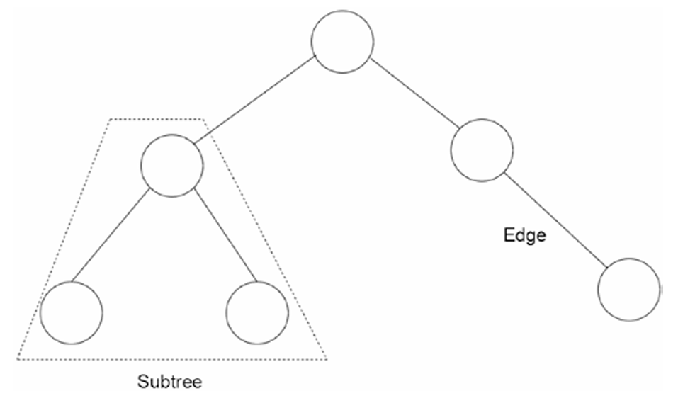

Nodes contains data in a key-value structure

The key is used to identify the node and the value is the data that is stored in the node.

The process od navigating through the tree is called *traversing*.

# Binary Trees

The most used tree data structure is the binary tree. It is a tree that each node can have at most two children.

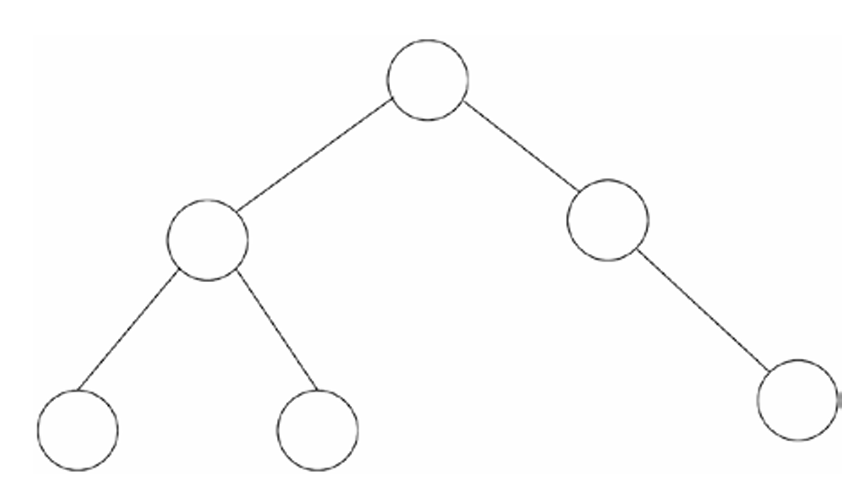

The most common binary tree is the binary search tree. It is a binary tree that the left child is smaller than the parent and the right child is greater than the parent. So it keeps its data sorted.

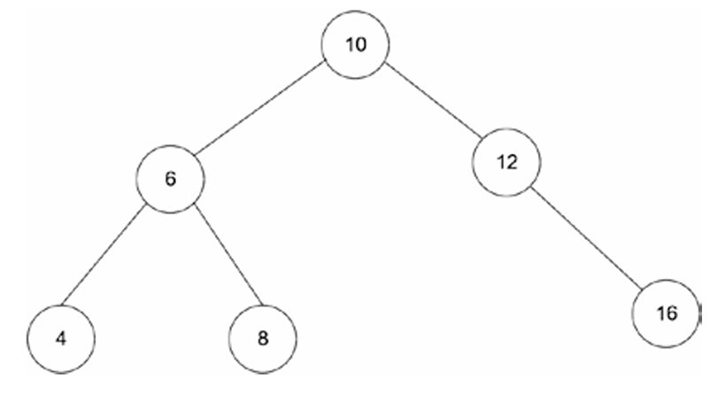

So the smallest node is the leftmost node and the largest node is the rightmost node.

# AVL Trees

For whatever reason, you may end up with an unbalanced tree. It is a tree that the left and right subtrees of a node differ in height by more than one.

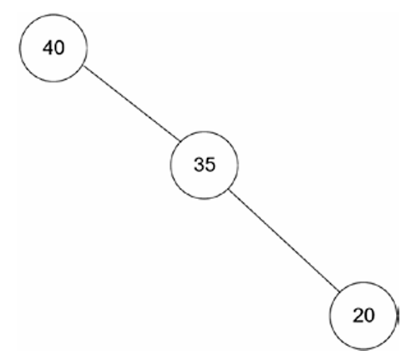

AVL trees are self-balancing binary search trees. It is a binary search tree that the difference between the heights of the left and right subtrees cannot be more than one for all nodes. (This is called balancing)

Once the AVL tree detecting difference between the heights of the left and right subtrees is more than one, i performs *tree rotations* to balance the tree. A tree rotation moves one node up in the tree and one node down.

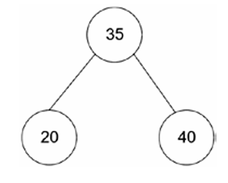

# Red-Black Trees

Red-black trees are another self-balancing binary search tree. It is a binary search tree that each node has a color either red or black with some characteristics of each color. It is similar to AVL trees but it is performs rotations more efficiently.

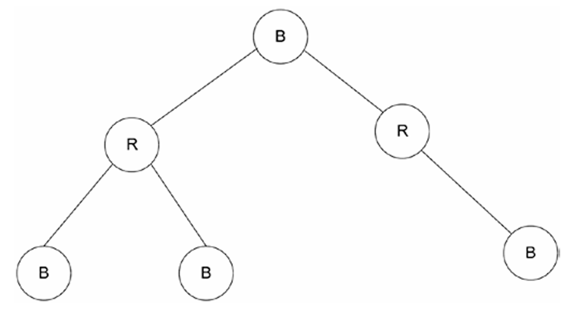

# B-Trees

B-trees are self-balancing search trees that are commonly used in databases and file systems. It is a tree that each node can have more than two children. It is a generalization of a binary search tree in that a node can have more than two children.

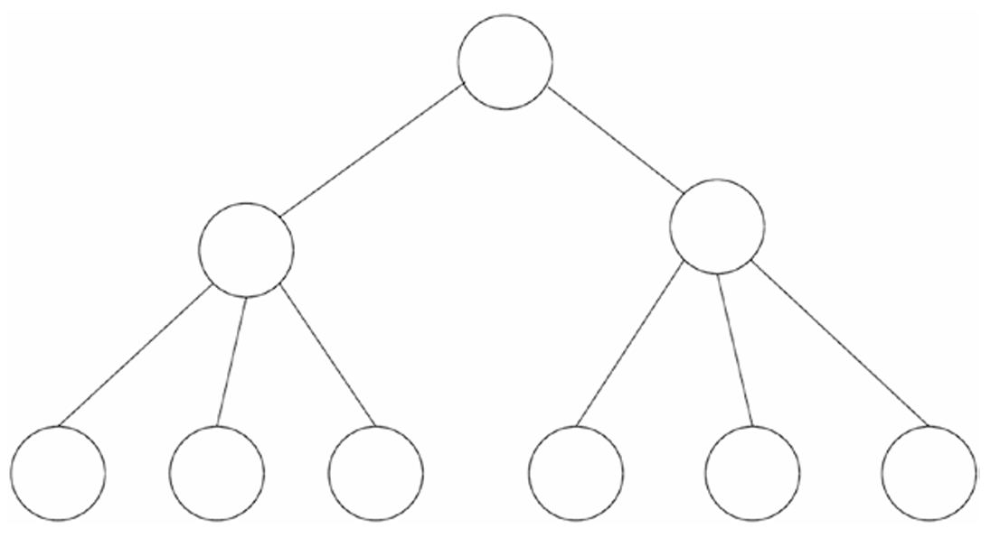

Database systems use B-trees to store data in the hard disk. It is because B-trees are optimized for systems that read and write large blocks of data. It is also used in file systems to store files in the hard disk.

# Heaps

Heaps are useful in applications where we need quick access to the maximum and minimum nodes within a tree. Heaps are a type of binary tree data structure.

To do this, the heap implements a priority queue. A priority queue is a data structure that each element has a priority and the elements with higher priority are served before the elements with lower priority.

There are two types of heaps: max heap and min heap. In a max heap, the parent node is always greater than or equal to the child nodes. In a min heap, the parent node is always less than or equal to the child nodes.

Max heap:

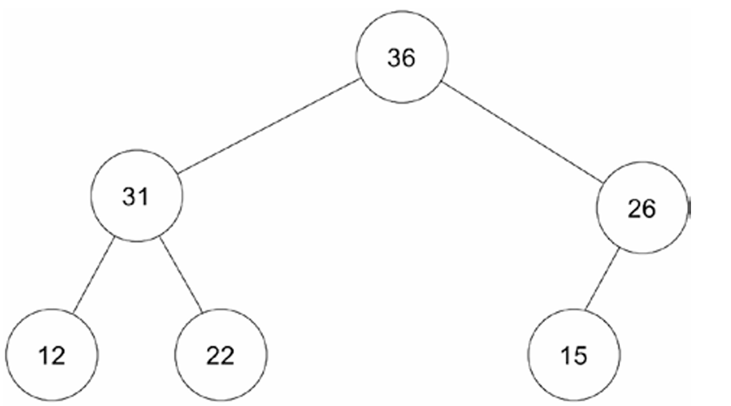

Min heap:

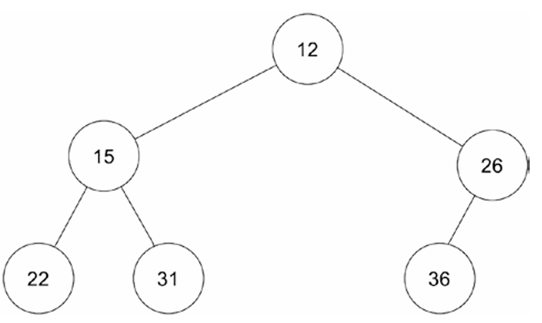

There is something you need to notice, which is that the heap data structure is not the same as heap memory. In fact, the heap memory is implemented in a much different way than the heap data structure. This is something that many programmers who are learning about heaps confuse.
