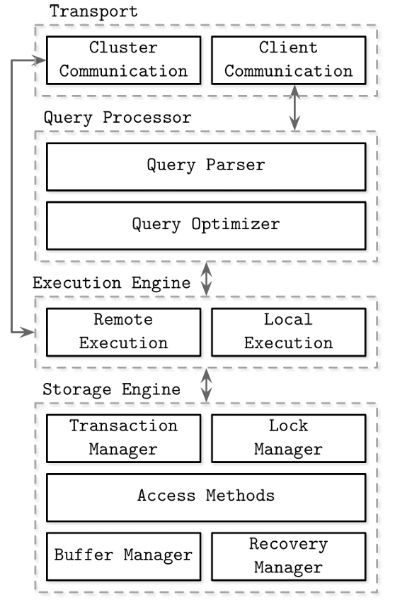

# Chapter 1 - Introduction and Overview

## DBMS Architecture

There are no common blueprint for DBMS design, every database is built slightly different, and component boundaries are somewhat hard to see and define, even if the boundaries exists on paper (in documentation), in actual code the component may be coupled to optimize performance, handle each edge case, or architectural decisions.

The following figure shows a high-level overview of common DBMS architecture:

DBMS uses a client/server model, where the database system instances (nodes) are the servers, and the clients are the applications that use the database.

The client requests arrive thought the *transport* subsystem. Requests are usually sent in the form of *queries* most ofter expressed in a *query language* such as SQL. The transport layer is responsible also for the communication with the other nodes int the database clusters.

The transport subsystem hands the query to a *query processor* which parses the query and checks it for errors (validate) Later, access control checks are performed to ensure that the user has the necessary permissions to execute the query.

The parsed query is passed to a *query optimizer*, which eliminates impossible and redundant parts of the query and attempt ti find the most efficient way to execute it based on the internal statistics and data placement.

The query is usually presented in the form of an *execution plan* or *query plan*, a sequence of operations that have to be carried out for its result to be considered complete. Since the same query can be satisfied by different execution plans, the query optimizer has to choose the best one.

The execution plan is handled by the *execution engine*, which collects the result of the execution of local and remote operations. *Remote execution* can involve writing and reducing data to and from other node in the cluster and replicas.

Queries are executed by the *storage engine*, which has many components with this responsibilities:

- *Transaction manager* : responsible for ensuring that the database remains in a consistent state despite system crashes or concurrent execution of transactions.
- *Lock manager* : responsible for managing locks, which are used to prevent concurrent transactions from interfering with each other.
- *Access methods (storage structures) : responsible for managing  access and organizing data on disk. Access methods include heaps file and storage structures such as B-trees
- *Buffer manager* : responsible for caching data pages in memory
- *Recovery manager* : responsible for database recovery after a crash, it maintains the operation logs and restore the system state after a failure.

> Note the both transaction manager and lock manager are responsible for concurrency control

## Memory vs Disk based Databases

Databases systems store data in memory and on disk. *In memory database management systems* stores data primarily in memory and uses disk for recovery and logging. *Disk based database management systems* stores data primarily on disk and uses memory for caching or as temporary storage.

Both types of systems use the disk to a certain extent, (although some memory databases store their content exclusively in RAM)

Accessing memory has been several orders of magnitude faster than accessing disk, so it is attractive to use the memory as the primary storage, and it is becoming more economical to store data in memory as the price of RAM is decreasing. However, RAM prices are still much higher than disk prices (SSDs and HDDs).

Other advantages of memory databases are that they are simpler to implement and maintain.

The limiting factor that the RAM volatility (lack of durability) and costs. RAM content are not persistent, so software errors, crashes and power outage can cause data loss. To prevent data loss, memory databases must write their content to disk, which is a slow operation.

### Durability in memory based stores

In-memory database systems maintain backups on disk to provide durability and prevent loss of the volatile data. (But some don't, they are out of the scoop of this book)

Before the operation to be considered complete, the database writes the result to a log file (see write ahead logs) and stores the data in a backup copy on disk.

The modifications to the backup are often asynchronous, so the database can continue to process queries while the backup is being updated independent of the client requests. The backup is used to restore the database after a crash. And applied in batches to reduce the number of IO operations.

During recovery, the database contents can be restored from the backup and the log file.

## Column-oriented and row-oriented storage

One of the ways to classify databases is by how the data is stored on disk: *row-oriented* or *column-oriented*. Tables can be partitioned by either horizontally (rows - storing values the belongs to the same row together) or vertically (columns - storing values that belongs to the same column together).

PostgreSQL, MySQL are examples of row-oriented databases.

## Data Files and Index Files

Database stores uses files for storing the data, bur instead of relying on the filesystem hierarchy of directories and files to locate records, they compose files using implementation specific formats. The main reasons for using special file formats are:

- *Storage efficiency*
- *Access efficiency*
- *Update efficiency*

Database often stores *data records* consistent of a sequence of *fields* (values) in table, each table is represented as a separate file. Each record in the table can be looked up using a *search key*. To locate a record, database systems uses *indexes*, a data structure that allow it to locate a record without scanning the whole table

The database usually separate *data files* and *index files*, data files stores data, where index files stores metadata and uses it to locate records in data files. Index files are typically smaller than data files.

### Data files

Data files can be implemented as *heaps files*, *hashed files* or *index organized files (IOT)*.

- Records in heap files are not required ro follow and particular order, so most of the time there are sorted by the order of insertion. So no additional work is required when a new page is appended. Heap files require additional index structures to point to the location of the records to make it searchable.
- In hashed files, records are stored in buckets based on the hash of the search key. Records in hashed files can be sorted by the insertion time or sorted by key to make the lookup faster.
- In index organized files, records are stored in the index itself.Storing data in index allows us to reduce the number of disk seeks by at least one, since the index and the data are stored in the same file so no need to locate the data file.

When records are stored in a separate file, index files hold data entries, uniquely identifying data records and containing enough information to locate them in the data file. For example, we can store file offsets (sometimes called row locators), locations of data records in the data file, or bucket IDs in the case of hash files. In index-organized tables, data entries hold actual data records.

### Index files

Index is a data structure that allows the database to locate records in a data file without scanning the whole file. Indexes are usually stored in separate files, but some databases allow indexes to be stored in the same file as the data.

An index on a primary (data) file is called *primary index*. In most cases primary index is build on top of a primary key, all other indexes are called *secondary indexes*.

Secondary indexes can point direcltly to the data record or simple store its primary key.

If the order of data records follows the sech key order, this index is called clustered index (the key order is preserved). Date records in the clustered index usually stored in the same file or clustered file. If the data is stored in a separate file, and its order does not follow the key order, the index is called unclustered index.

### Primary index as an indirection

There are different opinions in the database community on whether data records should be referenced directly (through file offset) or via the primary key index.

Both approaches have their pros and cons.

Referencing data directly can reduce the number of disk seeks, but it can also increase the updating pointers cost when the data is moved to a different location or updated.

Using indirection in for of a primary key index can reduce the cost of updating pointers, but it can also increase the number of disk seeks.

## Buffering, Immutability, and Ordering

Storage structure have three common values:

- They use buffering (or avoid it)
- use immutable files (or mutable files)
- store values in order (or out of order)

Most of distinctions and optimizations in storage structures are related to one of these values.

### Buffering

This defines whether the storage structure chooses to collet certain amount of data in memory before writing it to disk. Of course every on-disk structure has to use buffering to some degree. Here we are talking about avoidable buffering. Sometimes the storage structure choosing to do so to reduce the number of IO operations.

### Immutability (or Mutability)

This defines whether or not the storage structure reads parts of the file, updates them, and writes the updated results at the same location in the file.

Immutable structures are *append-only*, so once written, the file content can not be modified, instead modifications are appended to the end of the file.

There are other ways to implement immutability, for example, by using *copy-on-write* (COW) semantics, where the storage structure copies the file before modifying it.

### Ordering

This defines whether the storage structure stores data in order or not. If the data is stored in order, it is easier to locate it using binary search and use range queries.
