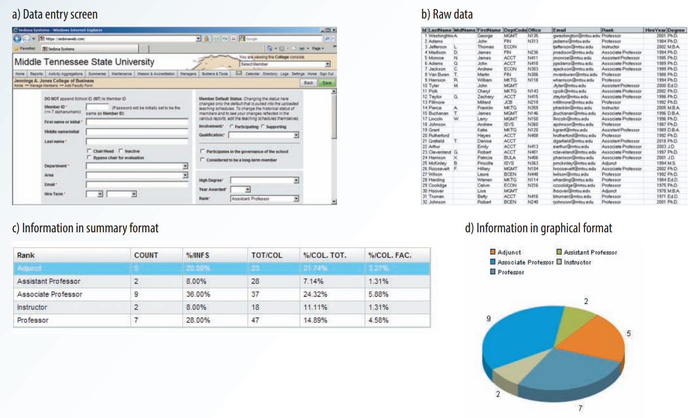
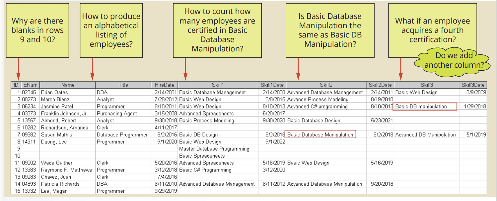
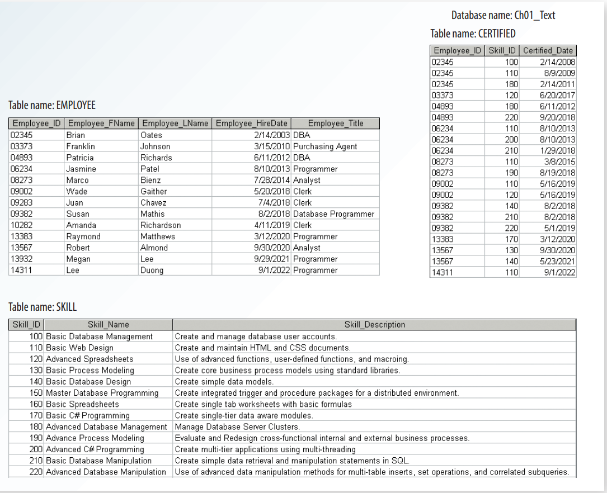

# Chapter 1 - Database systems

## Data vs Information

**Data**: Raw facts, or data that have not been processed to reveal their meaning to the end user.

**Information**: Data that have been processed into a form that is meaningful to the end user.

**Knowledge**: The awareness and understanding of a set of information and the ways that information can be made useful to support a specific task or reach a decision.



## Introducing the Database

**Database**: A shared, integrated computer structure that stores a collection of:

- End-user data: raw facts of interest to the end user.
- Metadata: data about data.

**Database management system (DBMS)**: A collection of programs that manages the database structure and controls access to the data stored in the database.

Advantages of using a DBMS:

- Improved data sharing
- Improved data security
- Better data integration
- Minimized data inconsistency (where different versions of the same data appear in different places)
- Improved data access
- Improved decision making
- Increased end-user productivity

**Query**: A specific request, question or task issued to the DBMS for data manipulation from the end user in form of sql code.

**Query result set**: The collection of data rows returned by a query.

## Types of Databases

Based on the number of users:

- Single-user database: Supports only one user at a time.
- Multiuser database: Supports multiple users at the same time.
- Workgroup database: Supports a small number of users or a specific department within an organization (typically less than 50 users).
- Enterprise database: Supports many users across many departments (typically over 50 users).

Based on the location of the database server:

- Centralized database: Supports data located at a single site.
- Distributed database: Supports data distributed across several different physical sites.
- Cloud database: Created and maintained using cloud services such as Microsoft Azure, Google Cloud, and Amazon Web Services.

Based on the type of data stored:

- General-purpose database: Contains a wide variety of data used in multiple disciplines.
- Discipline-specific database: Contains data focused on specific subject areas.

Based on how data is used:

- Operational database, transactional database, OLTP database, or production database: Designed primarily to support a company’s day-to-day operations.
- Analytical database, informational database, decision support database, or OLAP database: Stores historical data and business metrics used exclusively for tactical or strategic decision making.

Based on how data is structured:

- Unstructured data: Exists in their original, raw state; that is, in the format in which they were collected.
- Structured data: Have been formatted to facilitate storage, use, and information generation.
- Semi-structured data: Data is processed to some extent.

Based on the data model used:

- NoSQL database: A general term used to describe a database that does not use the relational model.
- SQL database: A database that uses the relational model.

## Why database design is important

**Database design**: The process of yields the description of the database structure and determines the database components.

Consider the following poorly designed database:



To solve this problem, we need to redesign the database:



With the improved database design, we can now use simple commands to retrieve the data we need:

- To produce an alphabetical list of all employees by their last name:

```sql
SELECT * FROM EMPLOYEE ORDER BY LAST_NAME;
```

- To determine how many employees are certificated in Basic Database Design:

```sql
SELECT COUNT(*)
FROM SKILL JOIN CERTIFIED ON SKILL.SKILL_ID = CERTIFIED.SKILL_ID
WHERE SKILL_NAME = 'Basic Database Design';
```

## Database Systems

**Database system**: An organization of components that defines and regulates the collection, storage, management, and use of data in a database environment.

Database system components:

- Hardware
- Software
  - OS
  - DBMS
  - Application programs
- People
  - System administrators
  - Database administrators
  - Database designers
  - System analysts and programmers
  - End users
- Date
- Procedures
- Data

### DBMS functions

- Data dictionary management

> Data dictionary: Stores definitions of the data elements and their relationships (metadata).

- Data storage management
- Data transformation and presentation
- Security management
- Multiuser access control
- Backup and recovery management
- Data integrity management
- Database access languages and application programming interfaces
- Database communication interfaces

## DBMS Challenges

- Increased cost
- Management complexity
- Maintaining currency
- Vendor dependence
- Frequent upgrade/replacement cycles

## Other Database Types

- Very large databases (VLDBs)
- Big data databases, like cassandra
- In memory databases, like redis
- Cloud databases.
