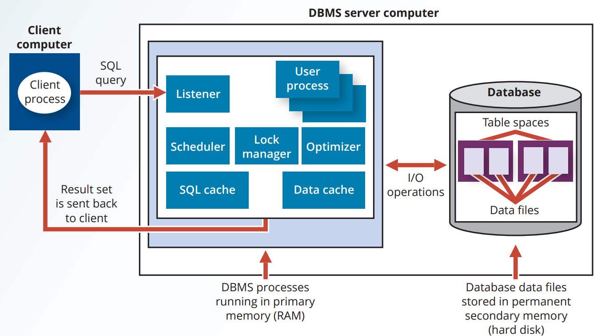
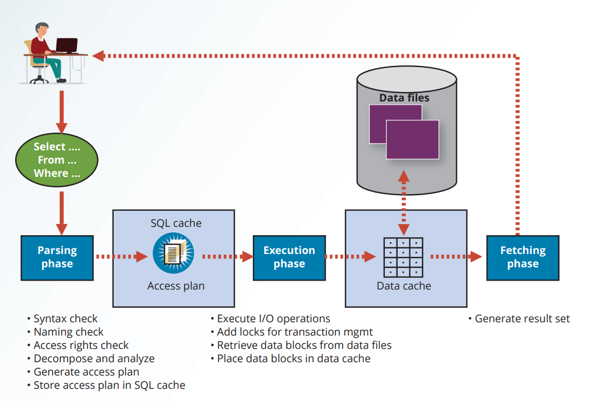

# Chapter 11 - Database Performance Tuning and Query Optimization

**Database performance tuning**: A set of activities and procedures designed to reduce the response time of a database system, to ensure that an end user query is processed by the DBMS in the minimum amount of time.

Good database performance starts with a good database design.

# Performance Tuning: Client and Server

In general the performance of a database system depends on two components:

- On the client side, the goal is to create a sql query that returns the correct result set in the minimum amount of time. *sql performance tuning*
- On the server side, the goal is to process the query in the minimum amount of time. *DBMS performance tuning*

## DBMS Architecture

- **Data files**: The physical files that store the data.
- **Data blocks**: The smallest unit of data that can be read from or written to the disk. Aka pages.
- **Extents**: A group of contiguous data blocks.
- **Table spaces**: A logical storage unit that contains one or more data files. Aka file groups.
- **Data cache**: A portion of the memory used to store frequently accessed data blocks. Aka buffer cache.
- **Sql cache**: A portion of the memory used to store frequently executed sql statements. Aka procedure cache.
- **Input/output (I/O) requests**: The process of reading data from or writing data to computer devices. (may be used to move the data from the disk to the memory or vice versa)
- The goal is to minimize the number of I/O requests.

Some typical DBMS processes:

- **Listener**: A process that listens for incoming client connection requests.
- **User process**: A process that is created when a client establishes a connection with the DBMS.
- **Scheduler**: A process that manages the concurrent execution of multiple user processes.
- **Lock manager**: A process that manages the locks on the data blocks.
- **Optimizer**: A process that analyzes sql queries and determines the most efficient way to execute a sql statement.

## Database query optimization modes

Most of the algorithms proposed for query optimization are based on two principles:

- The selection of the optimum execution order to achieve the fastest response time.
- The selection of the optimum sites accessed to reduce the communication cost.

Operation modes:

- **Automatic query optimization**: The DBMS automatically selects the optimum execution plan for a query.
- **Manual query optimization**: The DBMS allows the user to specify the execution plan for a query.

Query optimization algorithms can also be classified according to when the optimization is done:

- **Static query optimization**: The query is optimized at compile time.
- **Dynamic query optimization**: The query is optimized at execution time.

Finally, query optimization techniques can be classified according to the type of information that is used to optimize the query:

- **Statistically based query optimization**: The query is optimized based on the statistical information about the data stored in the database. (e.g. the number of rows in a table, average access time, number of requests per second, etc.)
- **Rule based query optimization**: The query is optimized based on a user-defined set of rules that specify the best execution plan for a query.

The statistical information is managed by the DBMS and is generated in one of two different modes:

- **Dynamic statistical generation mode**: The statistical information is generated automatically by the DBMS.
- **Manual statistical generation mode**: The statistical information is generated manually by the user.

# Query Processing

What happens at the DBMS server end when the client’s SQL statement is received?

- **Parsing**: The DBMS parses the SQL statement and checks the syntax of the statement and choose the most efficient execution plan.
- **Execution**: The DBMS executes the SQL statement.
- **Fetching**: The DBMS fetches the data from the database and returns the result set to the client.

## SQL Parsing Phase

**Query optimizer**: A component of the DBMS that analyzes the SQL statement and determines the most efficient way to execute the statement.

Parsing a SQL query requires several steps, in which the SQL query is:

- Validate for syntax errors.
- Validate against data dictionary to ensure that the table and column names are valid.
- Validate against the user privileges to ensure that the user has the necessary privileges to execute the query.
- Analyzed and decomposed into more atomic components.
- Transform into fully equivalent SQL but more efficient sql statements.
- The query optimizer determines the most efficient way to execute the query.

Once the SQL statement is transformed, the DBMS creates what is commonly known as an access plan or execution plan.

**Access plan**: A set of steps that the DBMS must follow to execute a SQL statement at run time.

The DBMS will check if an access plan exists in the sql cache. If it does, the DBMS will use the existing access plan to save time. If it does not, the DBMS will create a new access plan and store it in the sql cache.

## SQL Execution Phase

In this phase, all I/O operations indicated in the access plan are executed. When the execution plan is run, the proper locks if needed are acquired for the data to be accessed, and the data is retrieved from the data files and placed in the DBMS’s data cache.

## SQL Fetching Phase

After parsing and execution, are rows that math the specified conditions are retrieved, sorted, grouped, and aggregated if needed. The result set is then returned to the client.

## Query Processing Bottlenecks

**Query processing bottleneck**: A situation in which a delay introduced in I/O operations causes the overall system to slow down.

The most common query processing bottlenecks are:

- CPU
- RAM
- Hard disk
- Network
- Application code

# SQL Performance Tuning

SQL performance tuning is evaluated from the client perspective. Therefore, the goal is to illustrate some common practices used to write efficient SQL code.

## Index Selectivity

Index are used in:

- When an indexed column is used in a `WHERE`, `HAVING`, `GROUP BY`, or `ORDER BY` clause.
- When a `MIN` or `MAX` function is applied to an indexed column.
- When data sparsity is high.

Indexes are very useful when you want to select a small subset of rows from a large table based on a given condition. If an index exists for the column used in the selection, the DBMS may choose to use it. The objective is to create indexes with high selectivity. Index selectivity is a measure of the likelihood that an index will be used in query processing. Here are some general guidelines for creating and using indexes:

- Create indexes for each single attribute used in a `WHERE`, `HAVING`, `ORDER BY`, or `GROUP BY` clause.
- Don't use indexes in small tables or tables with low data sparsity.
- Declare primary and foreign key so the optimizer can use the indexes in join operations. (declaration of PK and FK automatically creates indexes)
- Declare indexes in join columns other than PK or FK

You cannot always use indexes to improve performance, for example, indexes are ignored when you use functions in the table attributes (e.g. `P_QOH > P_MIN * 1.1`)

However some database systems supports function based index which allows you to create an index on an expression or a function. (e.g. you can create in index on `YEAR(HIRE_DATE)`) This is useful when dealing with derived attributes.

How many indexes should you create? It bears repeating that you should not create an index for every column in a table. Too many indexes will slow down `INSERT`, `UPDATE`, and `DELETE` operations, especially if the table contains many thousands of rows.

## Conditional Expressions

A conditional expression is normally placed within the `WHERE` or `HAVING` clauses of a SQL statement.

The following common practices are used to write efficient conditional expressions in SQL code:

- Use simple column ar literals instead of functions (e.g. use `PRICE > 100` instead of `PRICE > MIN_PRICE * 1.1`) (e.g. `NAME = 'John'` instead of `UPPER(NAME) = 'JOHN'` if the names are stored in proper capitalization)
- Numeric comparisons are faster than character, date and NULL comparisons.
- Equality comparisons are faster than inequality comparisons. With the exception of NULL, `LIKE` comparisons with wild card are slowest. (e.g. `NAME LIKE '%John%`)
- Whenever possible use transform conditional comparisons into literal comparisons. (e.g. `PRICE = 17` instead of `PRICE > 16 AND PRICE < 18` or `PRICE - 10 = 7`)
- When using multiple conditional expression write the equality condition first
- If you use multiple `AND` conditions, write the most likely to be false condition first.
- If you use multiple `OR` conditions, write the most likely to be true condition first.
- Whenever possible try to avoid using `NOT` conditions. (e.g. `NOT (PRICE > 100)` is slower than `PRICE <= 100`)
