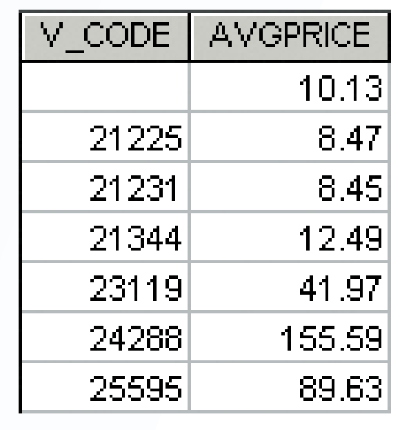

# Chapter 7 - Introduction to Structured Query Language (SQL)

SQL is composed of commands that enables users to create database and table structure, perform various types of data manipulations and data administration, and create database to extract useful information. All relational databases supports SQL, and many software vendors have developed extensions to the basic SQL command set.

## SQL Basics

SQL functions fit into several broad categories:

- Data Manipulation Language (DML): Commands that enable users to insert, update, delete, and retrieve data from a database.
- Data Definition Language (DDL): Commands that enable users to create database, table structures, indexes and views.
- Data Control Language (DCL): Commands that enable users to control access to data in the database.

### Data Types

The basic data types supported by SQL are:

- Character strings
- Numeric
- Date and time

### SQL Queries

**Query**: A request for data or information from a database table or combination of tables or an action to be performed on the data. (e.g. How many employees have been hired since January 1, 2020, by  each of the company’s departments?)

## Basic `SELECT` Queries

- `SELECT`: Specifies the attributes to be retrieved from the database.
- `FROM`: Specifies the tables from which the data will be retrieved.
- `WHERE`: Specifies the conditions that the data retrieved must satisfy. (Filtering)
- `GROUP BY`: Specifies the grouping attributes into collections based on sharing the same values in one or more attributes.
- `HAVING`: Filters the groups formed in `the GROUP` BY clause based on provided criteria.
- `ORDER BY`: Specifies the attributes used to sort the output, either ascending or descending.

## `SELECT` Clause

The `SELECT` clause specifies the attributes (columns) to be retrieved from the database. The `SELECT` clause is always the first clause in a `SELECT` statement.

Syntax:

```sql
SELECT attribute_list(column_list)
FROM table_list
```

If you want to return all attributes, you can use `*` (wildcard) to replace the attribute list.

For example:

```sql
SELECT *
FROM EMPLOYEE
```

To specify the columns to be retrieved, you can use the following syntax:

```sql
SELECT column_name1, column_name2, ...
FROM table_name
```

For example:

```sql
SELECT EMPLOYEE_ID, FIRST_NAME, LAST_NAME
FROM EMPLOYEE
```

Note that the columns are returned in the order specified in the `SELECT` clause. If you want to change the order, you can simply change the order of the column names in the `SELECT` clause.

### Using Column Aliases

**Column alias**: A temporary alternative name assigned to a column or expression in a `SELECT` statement. The column alias is used to label the output of the query.

The need of alias arises when the column name is not descriptive enough, when the column name is too long or when using formulas in the `SELECT` clause like `UNIT_PRICE * QUANTITY AS TOTAL`. The alias can be used to make the output more meaningful and readable.

Syntax:

```sql
SELECT column_name AS alias_name
FROM table_name
```

For example:

```sql
SELECT EMPLOYEE_ID , FIRST_NAME AS FIRST, LAST_NAME AS 'LAST NAME'
FROM EMPLOYEE
```

There are a few things of interest about the use of these aliases:

- Not all columns in a query must use an alias
- AS is optional, but recommended
- Aliases that contain a space must be inside a delimiter (quotes)

### Using Compound Column

Compound columns (aka calculated columns) represents derived attribute that are the result of some operation performed on one or more columns in the table. The compound column is not stored in the database, but is calculated when the query is executed.

For example:

```sql
SELECT PRODUCT_ID, UNIT_PRICE * QUANTITY AS TOTAL
FROM ORDER_LINE
```

### Date Arithmetic

Internally, the DBMS stores dates as in a numeric format represent the number of days since a fixed date. The DBMS provides functions to perform date arithmetic.

Because these values are stored as numbers, you can perform arithmetic operations on them. For example, you can add or subtract a number of days from a date.

For example, if you want to get the expire data, which is 90 days after the order date, you can use the following query:

```sql
SELECT ORDER_ID, ORDER_DATE, ORDER_DATE + 90 AS EXPIRE_DATE
FROM ORDERS
```

The DBMS also has functions to get the current date on the server. For example, `CURDATE()` in MySQL, `SYSDATE` in Oracle, `GETDATE()` in SQL Server.

For example, if you want to get the cut-off date, which is 30 days before the current date, you can use the following query:

```sql
SELECT ORDER_ID, ORDER_DATE, CURDATE() - 30 AS CUT_OFF_DATE
FROM ORDERS
```

### Listing Unique Values

To list the unique values in a column, you can use the `DISTINCT` keyword in the `SELECT` clause.

Syntax:

```sql
SELECT DISTINCT column_name
FROM table_name
```

For example:

```sql
SELECT DISTINCT STATE
FROM CUSTOMER
```

## `FROM` Clause

The `FROM` clause specifies the tables from which the data will be retrieved. The `FROM` clause is always the second clause in a `SELECT` statement.

Syntax:

```sql
SELECT attribute_list(column_list)
FROM table_list
```

For example:

```sql
SELECT EMPLOYEE_ID, FIRST_NAME, LAST_NAME
FROM EMPLOYEE
```

If you want to retrieve data from multiple tables, it is not simple as adding list of the tables in the `FROM` clause which will produce a cartesian product. You need to specify how the tables are related to each other. This is done by using the `JOIN` clause.

## `ORDER BY` Clause

The `ORDER BY` clause specifies the attributes used to sort the output, either ascending or descending.

Syntax:

```sql
SELECT attribute_list(column_list)
FROM table_list
ORDER BY attribute_list(column_list) ASC | DESC
```

Note you have the option to sort the output in ascending or descending order. The *default* is *ascending* order.

For example:

```sql
SELECT PRODUCT_ID, PRODUCT_NAME, UNIT_PRICE
FROM PRODUCT
ORDER BY UNIT_PRICE DESC
```

### Cascading Sorts

Imagine you want to sort the output by multiple attributes. For example, you want to sort the output by `UNIT_PRICE` first, then by `QUANTITY` for the products having the same unit price, then by `PRODUCT_NAME`. You can simply list the attributes in the `ORDER BY` clause in the order you want the output to be sorted.

For example:

```sql
SELECT PRODUCT_ID, PRODUCT_NAME, UNIT_PRICE, QUANTITY
FROM PRODUCT
ORDER BY UNIT_PRICE DESC, QUANTITY, PRODUCT_NAME
```

Note you can use `ORDER BY` with derived attributes. For example, you can sort the output by the compound column `TOTAL` in the following query:

```sql
SELECT PRODUCT_ID, UNIT_PRICE * QUANTITY AS TOTAL
FROM ORDER_LINE
ORDER BY TOTAL DESC
```

## `WHERE` Clause

The `WHERE` clause specifies the conditions that the data retrieved must satisfy. This filters the data retrieved from the database.

### Selecting Rows with Conditional Restrictions

Syntax:

```sql
SELECT column_list
FROM table_list
WHERE condition_list
ORDER BY column_list
```

For example:

```sql
SELECT EMPLOYEE_ID, FIRST_NAME, LAST_NAME
FROM EMPLOYEE
WHERE EMPLOYEE_ID = 100
```

### Comparison Operators

| Operator | Description |
| --- | --- |
| = | Equal to |
| <> or != | Not equal to |
| < | Less than |
| <= | Less than or equal to |
| > | Greater than |
| >= | Greater than or equal to |

### Logical Operators

| Operator | Description |
| --- | --- |
| AND | True if all conditions are true |
| OR | True if any condition is true |
| NOT | True if the condition is false and false if the condition is true |

For example:

```sql
SELECT EMPLOYEE_ID, FIRST_NAME, LAST_NAME
FROM EMPLOYEE
WHERE EMPLOYEE_ID = 100 OR EMPLOYEE_ID = 101
```

Or:

```sql
SELECT PRODUCT_ID, PRODUCT_NAME, UNIT_PRICE, QUANTITY
FROM PRODUCT
WHERE UNIT_PRICE <= 10 AND QUANTITY > 100
```

### Special Operators

- `BETWEEN`: True if the value is within a range of values, inclusive.
- `IN`: True if the value is in a list of values.
- `LIKE`: True if the value matches a pattern.
- `IS NULL`: True if the value is null.

#### `BETWEEN` Operator

Syntax:

```sql
SELECT column_list
FROM table_list
WHERE column_name BETWEEN value1 AND value2
```

For example:

```sql
SELECT PRODUCT_ID, PRODUCT_NAME, UNIT_PRICE, QUANTITY
FROM PRODUCT
WHERE UNIT_PRICE BETWEEN 10 AND 50
```

#### `IN` Operator

Syntax:

```sql
SELECT column_list
FROM table_list
WHERE column_name IN (value1, value2, ...)
```

For example:

```sql
SELECT PRODUCT_ID, PRODUCT_NAME, UNIT_PRICE, QUANTITY
FROM PRODUCT
WHERE PRODUCT_ID IN (1, 2, 3)
```

#### `LIKE` Operator

The `LIKE` operator is used to match a value to a pattern. The pattern can include wildcard characters.

- `%`: Matches any string of zero or more characters.
- `_`: Matches any single character.

So for example, 'J%' matches any string that starts with 'J', such as 'John', 'James', 'Jernigan', etc.
'Jo_' matches any string that starts with 'Jo' and is followed by any single character, such as 'Joe', 'Jon', etc.

Syntax:

```sql
SELECT column_list
FROM table_list
WHERE column_name LIKE pattern
```

For example:

```sql
SELECT PRODUCT_ID, PRODUCT_NAME, UNIT_PRICE, QUANTITY
FROM PRODUCT
WHERE PRODUCT_NAME LIKE 'Pepsi%'
```

#### `IS NULL` Operator

The `IS NULL` operator is used to match a value to a null value.

Syntax:

```sql
SELECT column_list
FROM table_list
WHERE column_name IS NULL
```

For example:

```sql
SELECT PRODUCT_ID, PRODUCT_NAME, UNIT_PRICE, QUANTITY
FROM PRODUCT
WHERE QUANTITY IS NULL
```

A common bitfall is to use `=` to match a value to a null value. This will not work because `NULL` is not a real value, it represents the absence of a value.

## `JOIN` Clause

The `JOIN` clause is used to combine rows from two or more tables, based on a related column between them.

The join condition is generally composed of an equality comparison between the foreign key and the primary key of related tables.

#### Natural Join

A natural join is a join that is based on all the columns in the two tables that have the same name. It is a join that is based on the equality comparison of all the common columns in the two tables.

Syntax:

```sql
SELECT column_list
FROM table1 NATURAL JOIN table2
```

For example:

```sql
SELECT EMPLOYEE_ID, FIRST_NAME, LAST_NAME, DEPARTMENT_ID
FROM EMPLOYEE NATURAL JOIN DEPARTMENT
```

#### `JOIN ... USING` Clause

The query returns only the rows with matching values in the column indicated in the `USING` clause and that column must exist in both tables.

Syntax:

```sql
SELECT column_list
FROM table1 JOIN table2 USING (column_name)
```

For example:

```sql
SELECT EMPLOYEE_ID, FIRST_NAME, LAST_NAME, DEPARTMENT_ID
FROM EMPLOYEE JOIN DEPARTMENT USING (DEPARTMENT_ID)
```

#### `JOIN ... ON` Clause

The `ON` clause is used to specify the join condition. This join condition is used when the tables do not have a common column name.

Syntax:

```sql
SELECT column_list
FROM table1 JOIN table2 ON table1.column_name = table2.column_name
```

For example:

```sql
SELECT EMPLOYEE_ID, FIRST_NAME, LAST_NAME, DEPARTMENT_ID
FROM EMPLOYEE JOIN DEPARTMENT ON EMPLOYEE.DEPARTMENT_ID = DEPARTMENT.ID
```

#### Common Attribute Names

One of the characteristics of a relational table that no two columns have the same name. However, when you join two tables, it is possible that the two tables have columns with the same name. In this case, you need to use the table name as a prefix to the column name to avoid ambiguity.

For example:

```sql
SELECT EMPLOYEE_ID, FIRST_NAME, LAST_NAME, DEPARTMENT_ID
FROM EMPLOYEE JOIN DEPARTMENT ON EMPLOYEE.DEPARTMENT_ID = DEPARTMENT.ID
```

#### Outer Joins

An outer join is a join that returns rows from one table both matching and do not have matching rows in the other table. There are three types of outer joins: left outer join, right outer join and full outer join.

The left and right designations reflects the order in which the tables are processed in the join. The left table is the first table listed in the `FROM` clause and the right table is the second table listed in the `FROM` clause.

**Left outer join**: Returns all rows from the left table, even if there are no matches in the right table.

Syntax:

```sql
SELECT column_list
FROM table1 
LEFT OUTER JOIN table2 ON table1.column_name = table2.column_name
```

For example:

```sql
SELECT EMPLOYEE_ID, FIRST_NAME, LAST_NAME, DEPARTMENT_ID
FROM EMPLOYEE
LEFT OUTER JOIN DEPARTMENT ON EMPLOYEE.DEPARTMENT_ID = DEPARTMENT.ID
```

In the above example, the query returns all employees, even if they do not belong to any department.

**Right outer join**: Returns all rows from the right table, even if there are no matches in the left table.

Syntax:

```sql
SELECT column_list
FROM table1
RIGHT OUTER JOIN table2 ON table1.column_name = table2.column_name
```

For example:

```sql
SELECT EMPLOYEE_ID, FIRST_NAME, LAST_NAME, DEPARTMENT_ID
FROM EMPLOYEE
RIGHT OUTER JOIN DEPARTMENT ON EMPLOYEE.DEPARTMENT_ID = DEPARTMENT.ID
```

In the above example, the query returns all departments, even if they do not have any employees.

Note that left outer join is equivalent to right outer join with the tables reversed. So no need to use right outer join, instead use left outer join with the tables reversed.

For example, let's convert the right outer join example to left outer join:

```sql
SELECT EMPLOYEE_ID, FIRST_NAME, LAST_NAME, DEPARTMENT_ID
FROM DEPARTMENT
LEFT OUTER JOIN EMPLOYEE ON EMPLOYEE.DEPARTMENT_ID = DEPARTMENT.ID
```

Outer joins are useful in many situations. For example, they can be used to help restrict results to only unmatched rows across tables. Let's find out the employees who do not belong to any department:

```sql
SELECT EMPLOYEE_ID, FIRST_NAME, LAST_NAME, DEPARTMENT_ID
FROM EMPLOYEE
LEFT OUTER JOIN DEPARTMENT ON EMPLOYEE.DEPARTMENT_ID = DEPARTMENT.ID
WHERE DEPARTMENT_ID IS NULL
```

**Full outer join**: Returns all rows from both tables, even if there are no matches in the other table.

Syntax:

```sql
SELECT column_list
FROM table1
FULL [OUTER] JOIN table2 ON table1.column_name = table2.column_name
```

For example:

```sql
SELECT EMPLOYEE_ID, FIRST_NAME, LAST_NAME, DEPARTMENT_ID
FROM EMPLOYEE
FULL OUTER JOIN DEPARTMENT ON EMPLOYEE.DEPARTMENT_ID = DEPARTMENT.ID
```

In the above example, the query returns all employees and all departments, even if they do not belong to any department or do not have any employees.

#### Cross Join

A cross join is a join that returns the Cartesian product of the two tables. It is a join that does not have a join condition.

Syntax:

```sql
SELECT column_list
FROM table1
CROSS JOIN table2
```

For example:

```sql
SELECT EMPLOYEE_ID, FIRST_NAME, LAST_NAME, DEPARTMENT_ID
FROM EMPLOYEE
CROSS JOIN DEPARTMENT
```

If the two tables have m and n rows respectively, the cross join will return m * n rows.

A more common way to write a cross join is to use a comma to separate the two tables in the `FROM` clause.

For example:

```sql
SELECT EMPLOYEE_ID, FIRST_NAME, LAST_NAME, DEPARTMENT_ID
FROM EMPLOYEE, DEPARTMENT
```

## Joining Tables with an Alias and Self-Joins

You can use an alias to rename a table in a query. This is useful when you need to join a table to itself or when you need to join a table to another table more than once.

Self-join is a join that joins a table to itself. It is useful when you need to join a table to itself to find out the relationship between rows within the same table.

Syntax:

```sql
SELECT column_list
FROM table1 AS alias1
JOIN table2 AS alias2 ON alias1.column_name = alias2.column_name
```

For example, we need to find out the manager of each employee, note that the employee table stores the manager id of each employee:

```sql
SELECT EMPLOYEE_ID, FIRST_NAME, LAST_NAME, DEPARTMENT_ID
FROM EMPLOYEE AS e1
JOIN EMPLOYEE AS e2 ON e1.MANAGER_ID = e2.EMPLOYEE_ID
```

## Aggregate Processing

Aggregate processing is the process of performing calculations on groups of rows as if they are a single unit and returning a single row of results for each group.

### Aggregate Functions

| Function | Description |
| --- | --- |
| COUNT | Returns the number of rows in the group. |
| MIN | Returns the minimum value in the group. |
| MAX | Returns the maximum value in the group. |
| SUM | Returns the sum of the values in the group. |
| AVG | Returns the average of the values in the group. |

#### `COUNT` Function

The `COUNT` function returns the number of not-null rows in the group.

Syntax:

```sql
SELECT COUNT(column_name)
FROM table_name
```

For example, to find out the number of employees:

```sql
SELECT COUNT(EMPLOYEE_ID)
FROM EMPLOYEE
```

To find the number of employees with a salary greater than 50,000:

```sql
SELECT COUNT(EMPLOYEE_ID)
FROM EMPLOYEE
WHERE SALARY > 50000
```

Note that `COUNT()` allows the asterisk (*) wildcard to be used to count all rows in a table.

For example, to find the number of employees:

```sql
SELECT COUNT(*)
FROM EMPLOYEE
```

`COUNT` can also be used with the `DISTINCT` clause, which will count only the distinct values in the column.

For example, to find the number of distinct departments:

```sql
SELECT COUNT(DISTINCT DEPARTMENT_ID)
FROM EMPLOYEE
```

#### `MIN` and `MAX` Functions

The `MIN` and `MAX` functions return the minimum and maximum values in the group.

Syntax:

```sql
SELECT MIN(column_name)
FROM table_name
```

For example, to find the minimum and maximum salary of employees:

```sql
SELECT MIN(SALARY) AS MIN_SALARY, MAX(SALARY) AS MAX_SALARY
FROM EMPLOYEE
```

#### `SUM` Function

The `SUM` function returns the sum of the values in the group.

Syntax:

```sql
SELECT SUM(column_name)
FROM table_name
```

For example, to find the total salary of all employees:

```sql
SELECT SUM(SALARY) AS TOTAL_SALARY
FROM EMPLOYEE
```

Derived attributes can also be used with aggregate functions. For example, to find the total sales of each product:

```sql
SELECT PRODUCT_ID, SUM(UNIT_PRICE * QUANTITY) AS TOTAL_SALES
FROM ORDER_LINE
GROUP BY PRODUCT_ID
```

#### `AVG` Function

The `AVG` function returns the average of the values in the group.

Syntax:

```sql
SELECT AVG(column_name)
FROM table_name
```

For example, to find the average salary of all employees:

```sql
SELECT AVG(SALARY) AS AVERAGE_SALARY
FROM EMPLOYEE
```

### Grouping Data

The `GROUP BY` clause is used to group the rows in the result set into subsets based on the values in one or more columns. The aggregate functions are then applied to each group.

Syntax:

```sql
SELECT column_list
FROM table_list
WHERE condition_list
GROUP BY column_list
```

For example, to find the average price of the products provided by each vendor:

```sql
SELECT V_CODE, AVG(P_PRICE) AS AVGPRICE
FROM PRODUCT
GROUP BY V_CODE;
```

An example result of the above query:



Instead of treating all of the PRODUCT rows as a single collection, the query separates the rows into several smaller collections, each collection based on the value of PRODUCT_ID.

### `HAVING` Clause

The `HAVING` clause is used to filter the groups formed in the `GROUP BY` clause based on provided criteria.

Syntax:

```sql
SELECT column_list
FROM table_list
WHERE condition_list
GROUP BY column_list
HAVING condition_list
```

The `HAVING` clause operates like the `WHERE` clause in the `SELECT` statement. However, the `WHERE` clause applies to columns and expressions for individual rows, whereas the `HAVING` clause is applied to the output of a `GROUP BY` operation.

For example, to find the average salary of employees in each department and only return the departments with average salary greater than 50,000:

```sql
SELECT DEPARTMENT_ID, AVG(SALARY) AS AVERAGE_SALARY
FROM EMPLOYEE
GROUP BY DEPARTMENT_ID
HAVING AVERAGE_SALARY > 50000
```

## Subqueries

A subquery is a query that is nested inside a SELECT, INSERT, UPDATE, or DELETE statement, or inside another subquery. A subquery can be used anywhere an expression can be used.

For example, suppose that you want to generate a list of vendors who do not provide products.

Using join:

```sql
SELECT V_CODE, V_NAME
FROM PRODUCT RIGHT JOIN VENDOR 
ON PRODUCT.V_CODE = VENDOR.V_CODE
WHERE P_CODE IS NULL
```

Using subquery:

```sql
SELECT V_CODE, V_NAME
FROM VENDOR
WHERE V_CODE NOT IN (SELECT V_CODE FROM PRODUCT WHERE V_CODE IS NOT NULL)
```

Another example, if you want to get all the products with price above the average price:

```sql
SELECT P_CODE, P_PRICE
FROM PRODUCT
WHERE P_PRICE >= (SELECT AVG(P_PRICE) FROM PRODUCT)
```

You should remember the following key characteristics for subqueries:

- A subquery is a query (SELECT statement) inside another query.
- A subquery is normally expressed inside parentheses.
- The first query in the SQL statement is known as the outer query.
- The query inside the SQL statement is known as the inner query.
- The inner query is executed first.
- The output of an inner query is used as the input for the outer query.
- The entire SQL statement is sometimes referred to as a nested query.

A subquery can return one or more values, either one single value (one column and one row), a list of values (one column and multiple rows) or a virtual table (multicolumn, multirow set of values)

### `WHERE` Subqueries

The most common type of subquery is the `WHERE` on the right side of a comparison operator.

For example, to find the employees who have a salary greater than the average salary:

```sql
SELECT EMPLOYEE_ID, FIRST_NAME, LAST_NAME, SALARY
FROM EMPLOYEE
WHERE SALARY > (SELECT AVG(SALARY) FROM EMPLOYEE)
```

Note that the output of the subquery must be a single value.

### `IN` Subqueries

The `IN` operator is used to determine if a value matches any value in a list or subquery. The `IN` operator is used to compare a value to a list of literal values or a subquery.

For example, to find the employees who work in the department with id 1, 2 or 3:

```sql
SELECT EMPLOYEE_ID, FIRST_NAME, LAST_NAME, DEPARTMENT_ID
FROM EMPLOYEE
WHERE DEPARTMENT_ID IN (SELECT DEPARTMENT_ID FROM DEPARTMENT WHERE DEPARTMENT_NAME IN ('Sales', 'Marketing', 'Finance'))
```

### `HAVING` Subqueries

The `HAVING` clause is used to filter the groups formed in the `GROUP BY` clause based on provided criteria. The `HAVING` clause operates like the `WHERE` clause in the `SELECT` statement. However, the `WHERE` clause applies to columns and expressions for individual rows, whereas the `HAVING` clause is applied to the output of a `GROUP BY` operation.

For example, to list all products with a total quantity sold greater than the average quantity sold, you would write the following query:

```sql
SELECT PRODUCT_ID, SUM(QUANTITY) AS TOTAL_QUANTITY
FROM ORDER_LINE
GROUP BY PRODUCT_ID
HAVING SUM(QUANTITY) > (SELECT AVG(QUANTITY) FROM ORDER_LINE)
```

### Multirow Subquery Operators: `ALL` and `ANY`

The `ALL` and `ANY` operators are used to compare a value to a list of values returned by a subquery. The `ALL` operator returns true if the comparison is true for all values in the list. The `ANY` operator returns true if the comparison is true for any value in the list.

For example, suppose you want to know which products cost more than all individual products provided by vendors from Florida:

```sql
SELECT P_CODE, P_QOH * P_PRICE AS TOTALVALUE
FROM PRODUCT
WHERE P_QOH * P_PRICE > ALL (SELECT P_QOH * P_PRICE
                             FROM PRODUCT
                             WHERE V_CODE IN (SELECT V_CODE 
                                              FROM VENDOR WHERE 
                                              V_STATE 5 'FL'))
```

For a row to appear in the result set, it must meet the criterion `P_QOH * P_PRICE` . `ALL` of the individual values returned by the subquery `SELECT P_CODE, P_QOH * P_PRICE AS TOTALVALUE ...` In fact, “greater than `ALL`” is equivalent to “greater than the highest product cost of the list.” In the same way, a condition of “less than `ALL`” is equivalent to “less than the lowest product cost of the list.”

Another powerful operator is the `ANY` multirow operator, which you can consider the cousin of the `ALL` multirow operator. The `ANY` operator allows you to compare a single value to a list of values and select only the rows for which the inventory cost is greater than or less than any value in the list. You could also use the equal to `ANY` operator, which would be the equivalent of the `IN` operator.

## Relational Set Operators

Relational set operators are used to implement the union, intersection, and difference operations on the results of two or more SELECT statements.

### `UNION` Operator

The `UNION` operator is used to combine the results of two or more `SELECT` statements into a single result set. The `UNION` operator removes duplicate rows unless the `UNION ALL` operator is used.

Syntax:

```sql
query1 UNION [ALL] query2
```

For example, if amazon bought a new company and you want to list all the products from both companies:

```sql
SELECT P_CODE, P_DESCRIPT, P_INDATE, P_QOH, P_MIN, P_PRICE, P_DISCOUNT, V_CODE
FROM AMAZON_PRODUCTS
UNION
SELECT P_CODE, P_DESCRIPT, P_INDATE, P_QOH, P_MIN, P_PRICE, P_DISCOUNT, V_CODE
FROM NEWCOMPANY_PRODUCTS
```

Note that the `UNION` operator can be used more than two `SELECT` statements.

### `INTERSECT` Operator

The `INTERSECT` operator is used to combine the results of two or more `SELECT` statements into a single result set. The `INTERSECT` operator returns only the rows that appear in both result sets.

Syntax:

```sql
query1 INTERSECT query2
```

For example, if you want to find out the products that are provided by both amazon and new company:

```sql
SELECT P_CODE, P_DESCRIPT, P_INDATE, P_QOH, P_MIN, P_PRICE, P_DISCOUNT, V_CODE
FROM AMAZON_PRODUCTS
INTERSECT
SELECT P_CODE, P_DESCRIPT, P_INDATE, P_QOH, P_MIN, P_PRICE, P_DISCOUNT, V_CODE
FROM NEWCOMPANY_PRODUCTS
```

### `EXCEPT(MINUS)` Operator

The `EXCEPT` operator is used to combine the results of two `SELECT` statements into a single result set. The `EXCEPT` operator returns only the rows that appear in the first result set but not in the second result set.

Syntax:

```sql
query1 EXCEPT query2
```

For example, if you want to find out the products that are provided by amazon but not by new company:

```sql
SELECT P_CODE, P_DESCRIPT, P_INDATE, P_QOH, P_MIN, P_PRICE, P_DISCOUNT, V_CODE
FROM AMAZON_PRODUCTS
EXCEPT
SELECT P_CODE, P_DESCRIPT, P_INDATE, P_QOH, P_MIN, P_PRICE, P_DISCOUNT, V_CODE
FROM NEWCOMPANY_PRODUCTS
```

Note that the `EXCEPT` operator is supported by (MS SQL Server). Oracle, `MINUS` operator is supported.

## Crafting `SELECT` Statements

Crafting effective and efficient SQL queries requires a great deal of skill. To successfully craft complex queries, you must understand the data you are working with and understand the problem to be solved. When struggling with the formulation of the query itself, building the query components in the order `FROM`, `WHERE`, `GROUP BY`, `HAVING`, `SELECT`, and `ORDER BY` can be helpful.
