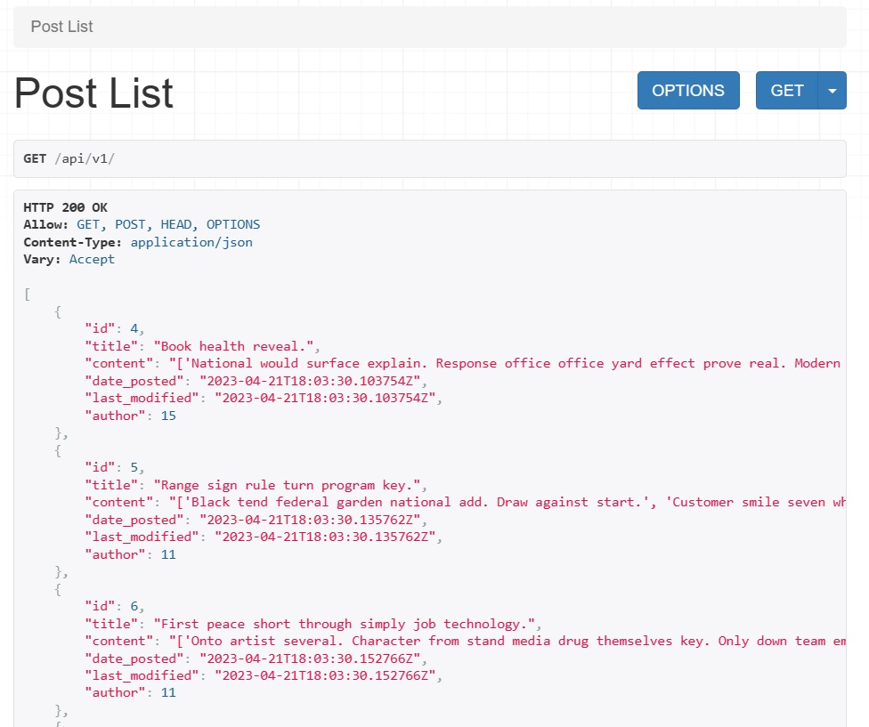
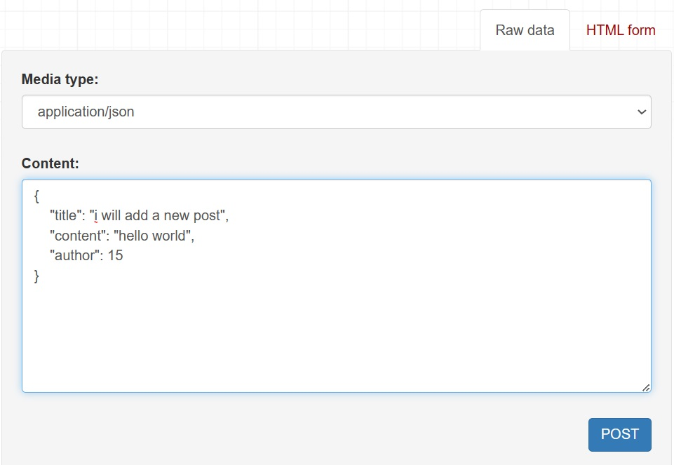
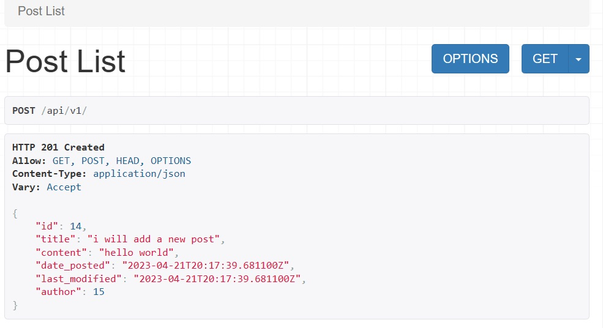
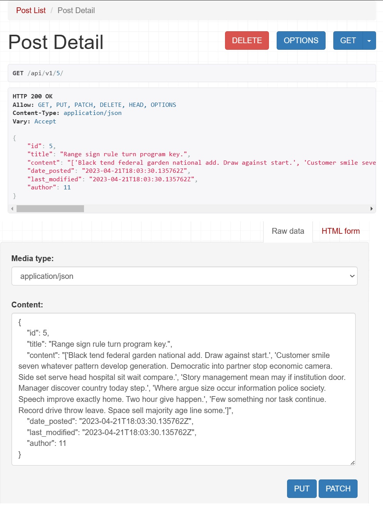
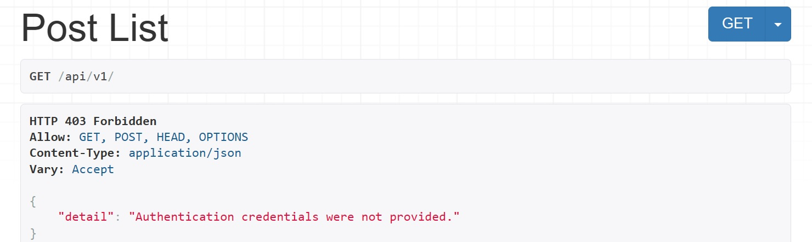
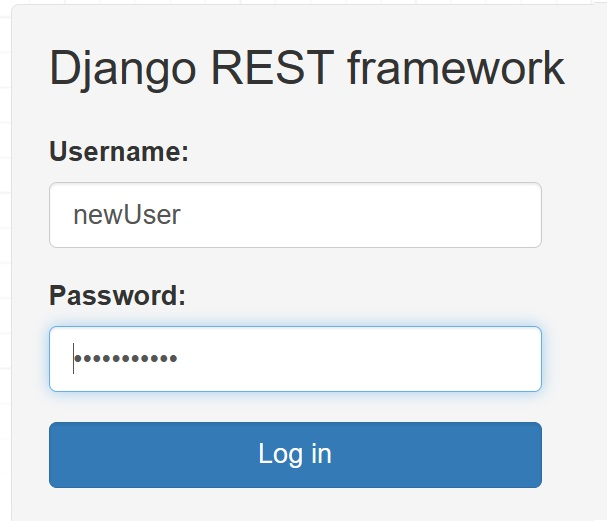
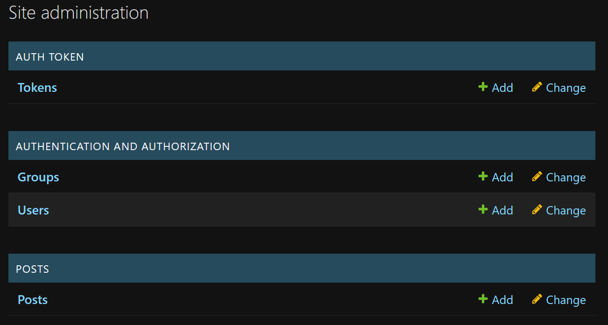
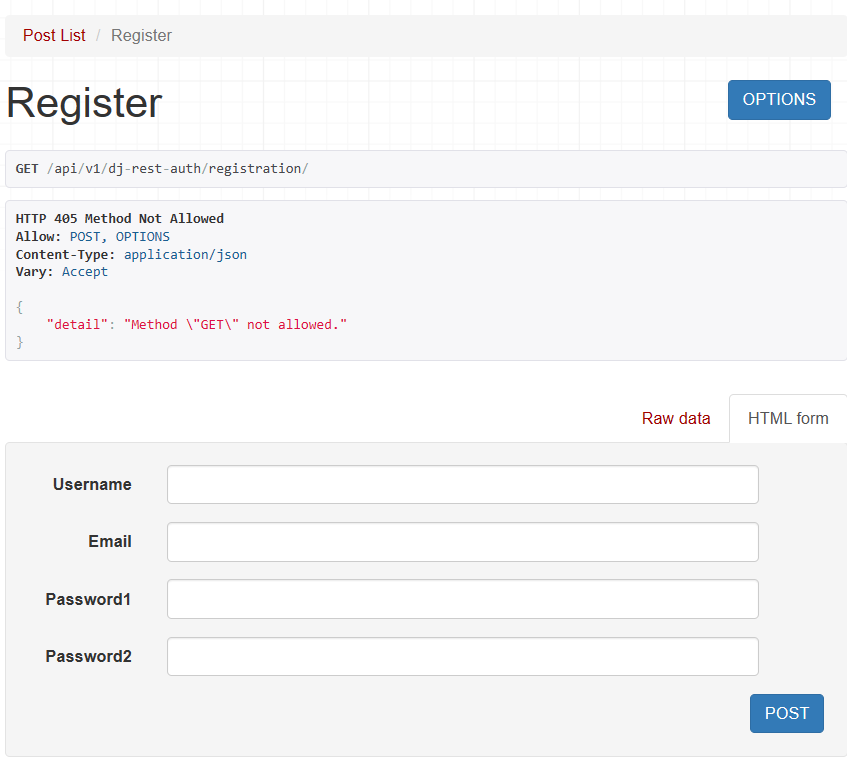

# Chapter 1 - Inital Set Up

## The Command Line

unlike the book approach, i used [cmder](https://cmder.app/)

s the computer name/username :

```bash
$ whoami
desktop-6aark50\taha
```

print hello world :

```bash
$ echo "hello world"
"hello world"
```

print working directory

```bash
$ pwd
C:\Users\Taha\Documents\GitHub\cheat-sheets\Django for apis book
```

change directory

```bash
$ cd onedrive\desktop
```

To make a new directory use the command mkdir followed by the name

```bash
$ mkdir new_directory
$ cd new_directory
```

to list the contents of a directory use the command ls

```bash
$ ls
DjangoForAPIs.md  new_directory/
```

to exit the terminal use the mouse or the command exit

```bash
$ exit
```

## Installing Python 3

To check if python is installed on your computer, open the terminal and type python3. If you see something like this, you have python installed:

```bash
$ python
Python 3.11.2 (tags/v3.11.2:878ead1, Feb  7 2023, 16:38:35) [MSC v.1934 64 bit (AMD64)] on win32
Type "help", "copyright", "credits" or "license" for more information.
>>>
```

or you can use the command python --version

```bash
$ python3 --version
Python 3.11.2
```

if not installed, download it from [here](https://www.python.org/downloads/)

## Virtual Environments

A virtual environment is a tool that helps to keep dependencies required by different projects separate by creating isolated python virtual environments for them. It solves the “Project X depends on version 1.x but, Project Y needs 4.x” dilemma, and keeps your global site-packages directory clean and manageable.

To create a virtual environment, go to the directory where you want to create it and run the command:

```bash
$ python -m venv .venv
```

To activate the virtual environment, run the command:

```bash
$ .venv\Scripts\activate.bat
```

To deactivate and leave a virtual environment type deactivate.

```bash
$ deactivate
```

to delete the virtual environment, delete the .venv folder

```bash
$ rm -rf .venv
```

## Installing Django and Django REST Framework

To install Django run the command:

```bash
$ pip install django
```

To install Django REST Framework run the command:

```bash
$ pip install djangorestframework
```

to output the installed packages, run the command:

```bash
$ pip freeze
asgiref==3.6.0
Django==4.2
djangorestframework==3.14.0
pytz==2023.3
sqlparse==0.4.3
tzdata==2023.3
```

It is a standard practice to output the contents of a virtual environment to a file called requirements.txt. This is a way to keep track of installed packaged and also lets other developers
recreate the virtual environment on different computers.

```bash
$ pip freeze > requirements.txt
```

# Chapter 2 - Web APIs

## World Wide Web

The World Wide Web (WWW) is a system of interlinked hypertext documents accessed via the Internet. It is a collection of documents and other web resources, linked by hyperlinks and URLs. Each resource is identified by a Uniform Resource Identifier (URI), and may be a web page, image, video, or other type of file.

## URLs

is the address of a resource on the internet. For example, the Google homepage lives at `https://www.google.com`

This request and response pattern is the basis of all web communication. A client (typically a web browser but also a native app or really any internet-connected device) requests information and a server responds with a response.

Since web communication occurs via HTTP these are known more formally as HTTP requests
and HTTP responses.

The google url is made up of three parts:

- scheme: `https` | `http` | `ftp` (for files) | `stmp` (for email)
- hostname: `www.google.com`: the actual name of the site
- path (optional) : `https://www.python.org/about/`. The `/about/` piece is the path.

## Internet Protocol Suite

The Internet Protocol Suite (TCP/IP) is a set of communication protocols used to interconnect network devices on the internet. It is commonly known as TCP/IP because the foundational protocols in the suite are the Transmission Control Protocol (TCP) and the Internet Protocol (IP).

when you type `www.google.com` in your browser, your computer sends a request to the DNS server (domain name service) to find the IP address of the server that hosts the google website. The DNS server then returns the IP address to your computer.

After your computer receives the IP address, it need a way to set up a consistent connection with the desired server. This happens via the Transmission Control Protocol (TCP) which provides reliable, ordered, and error-checked delivery of bytes between two application.

To establish a TCP connection between two computers, a three-way “handshake” occurs between the client and server :

1. The client sends a SYN (synchronize) packet to the server.
2. The server responds with a SYN-ACK (synchronize-acknowledge) packet amd passing a connection parameter
3. The client responds with an ACK (acknowledge) packet confirming the connection.

Once the TCP connection is established, the two computers can start communicating via HTTP.

## HTTP verbs

HTTP verbs are used to describe the action that is being performed on a resource. The most common HTTP verbs are:

- GET: Read a resource
- POST: Create a resource
- PUT: Update a resource
- DELETE: Delete a resource

## Endpoints

An endpoints contains data, typically in the `JSON` format, and also a list of available actions (HTTP verbs)

for example, the endpoint `https://api.github.com/users/` contains a list of all github users. The endpoint `https://api.github.com/users/{username}` contains the data for a specific user.

## HTTP

HTTP is the protocol that is used to send and receive data ol between two computers that have an existing TCP connection. It is a request-response protocol, which means that a client (typically a web browser) sends a request to a server and the server responds with a response.

Every HTTP message consists of

```bash
Response/request line
Headers...

(optional) Body
```

for example, the following is a HTTP request:

```bash
GET / HTTP/1.1
Host: www.google.com
Accept_Language: en-US
```

The top line is the status line, which contains the HTTP verb, the path, and the HTTP version.

The next line is the header, `Host` is the domain name and `Accept_Language` is
the language to use

example of a HTTP response:

```bash
HTTP/1.1 200 OK
Date: Mon, 24 Jan 2022 23:26:07 GMT
Server: gws
Accept-Ranges: bytes
Content-Length: 13
Content-Type: text/html; charset=UTF-8
Hello, world!
```

The top line is the status line, which contains the HTTP version, the status code `200 ok`

The next lines are the headers, after it is the body of the response. `Hello, world!`

## Status Codes

HTTP status codes are used to indicate the success or failure of an HTTP request. The most common status codes are:

- `2xx Success` - the action requested by the client was received, understood, and accepted
- `3xx Redirection` - the requested URL has moved
- `4xx Client Error` - there was an error, typically a bad URL request by the client
- `5xx Server Error` - the server failed to resolve a request

for example:

```
- 200: OK
- 201: Created
- 204: No Content
- 400: Bad Request
- 401: Unauthorized
- 403: Forbidden
- 404: Not Found
- 405: Method Not Allowed
- 500: Internal Server Error
- 502: Bad Gateway
- 503: Service Unavailable
```

## Statelessness

HTTP is a stateless protocol, which means that each request/response pair is completely independent of the previous one. There is no stored
memory of past interactions

## REST

It is an architecture approach to building APIs on top of the web, which means on top of the HTTP protocol.

For an api to be RESTful, it must follow the REST constraints:

- stateless like HTTP
- supports common HTTP verbs (GET, POST, PUT, DELETE, etc.)
- returns data in either the JSON or XML format

# Chapter 3 - Library Website - traditional django

## Create virtual environment, activate it and install django

## Create a new django project

A traditional Django website consists of a single project with multiple apps representing discrete functionality

```bash
$ django-admin startproject django_project .
```

The period at the end of the command tells Django to create the project in the current directory.

Let's use the command `migrate` to create the database tables for the project:

```bash
$ python manage.py migrate
```

start the development server:

```bash
$ python manage.py runserver
```

open the browser and go to `http://localhost:8000` to see the default django page

## Create a new app

```bash
$ python manage.py startapp book
```

Before we can use the app, we need to tell Django to include it in the project. To do this, we need to add the app to the `INSTALLED_APPS` list in the `django_project/settings.py` file.

```python
INSTALLED_APPS = [
    'django.contrib.admin',
    'django.contrib.auth',
    'django.contrib.contenttypes',
    'django.contrib.sessions',
    'django.contrib.messages',
    'django.contrib.staticfiles',
    # add the app name here
    'books.apps.BooksConfig',
]
```

## Create a model

create a new `Book` model in the `books/models.py` file:

```python
from django.db import models

class Book(models.Model):
    title = models.CharField(max_length=100)
    author = models.CharField(max_length=100)
    description = models.TextField()
    isbn = models.CharField(max_length=13)
    date_added = models.DateTimeField(auto_now_add=True)
    date_updated = models.DateTimeField(auto_now=True)

    def __str__(self):
        return self.title
```

make migrations and migrate:

```bash
$ python manage.py makemigrations
$ python manage.py migrate
```

## Admin

create a superuser:

```bash
$ python manage.py createsuperuser
```

register the `Book` model in the `books/admin.py` file:

```python
from django.contrib import admin
from .models import Book

admin.site.register(Book)
```

start the development server and go to `http://localhost:8000/admin` to see the admin page

## Create a view

the `views.py` file controls how the database model content is displayed.

create a new `BookListView` view in the `books/views.py` file:

```python
from django.views.generic import ListView
from .models import Book

class BookListView(ListView):
    model = Book
    template_name = 'books/book_list.html'
```

## Create a URL

First we configure the `urls.py` file in the `django_project` directory to point to the `books` app. Open the `django_project/urls.py` file and add the following line:

```python
from django.urls import path, include
from django.contrib import admin

urlpatterns = [
    path('admin/', admin.site.urls),
    path('', include('books.urls')),
]
```

create a new `urls.py` file in the `books` directory and add the following line:

```python
from django.urls import path
from .views import BookListView

urlpatterns = [
    path('', BookListView.as_view(), name='book_list'),
]
```

## Create a template

create a new `book_list.html` template in the `books/templates/books` directory (default template directory):

```html
<h1>Book List</h1>
<ul>
  
  <li>{{ book.title }}</li>
  <li>{{ book.author }}</li>
  <li>{{ book.description }}</li>
  <li>{{ book.isbn }}</li>
  
</ul>
```

Now we can run the development server and go to `http://localhost:8000` to see the book list page.

# Chapter 4 - Library API - django REST framework

## Install django REST framework

```bash
$ pip install djangorestframework
```

We have to notify Django that we want to use the REST framework. To do this, we need to add the `rest_framework` app to the `INSTALLED_APPS` list in the `django_project/settings.py` file.

```python
INSTALLED_APPS = [
    'django.contrib.admin',
    'django.contrib.auth',
    'django.contrib.contenttypes',
    'django.contrib.sessions',
    'django.contrib.messages',
    'django.contrib.staticfiles',
    # 3rd part
    'rest_framework',
    # local apps
    'books.apps.BooksConfig',
]
```

Many django professionals prefer include the api logic the related apps while putting URLs under an /api/ prefix. For now though, to keep the API logic clear from the traditional Django logic, we will create a dedicated apis app for our project.

```bash
$ python manage.py startapp apis
```

add the new app to the `INSTALLED_APPS` list in the `django_project/settings.py` file:

```python
INSTALLED_APPS = [
    'django.contrib.admin',
    'django.contrib.auth',
    'django.contrib.contenttypes',
    'django.contrib.sessions',
    'django.contrib.messages',
    'django.contrib.staticfiles',
    # 3rd part
    'rest_framework',
    # local apps
    'books.apps.BooksConfig',
    'apis.apps.ApisConfig',
]
```

## URLs

Let's include the `apis` app in the `django_project/urls.py` file:

```python
from django.urls import path, include
from django.contrib import admin

urlpatterns = [
    path('admin/', admin.site.urls),
    path('', include('books.urls')),
    path('api/', include('apis.urls')),
]
```

Then create a new `urls.py` file in the `apis`, this file will import a future
view called `BookAPIView` and set it to the URL route of `""` so it will appear at `api/`. As always,

we will add a name `book_list_api` to it as well, so we can refer to it later.

```python
from django.urls import path
from .views import BookAPIView

urlpatterns = [
    path('', BookAPIView.as_view(), name='book_list_api'),
]
```

## Views

Django rest framework views are similar to Django's generic views. except we thee end result is a JSON response instead of a HTML page.

There are generic django rest framework views for common cases, and we will use the `ListAPIView` view for our `BookAPIView` view.

create a new `BookAPIView` view in the `apis/views.py` file:

```python
from rest_framework import generics
from books.models import Book
from .serializers import BookSerializer

class BookAPIView(generics.ListAPIView):
    queryset = Book.objects.all()
    serializer_class = BookSerializer
```

## Serializers

The `serializers.py` file is where we define the data format that we want to return to the client. It translates complex data like querysets and model instances into a JSON format, We will use the `ModelSerializer` class to create a serializer for our `Book` model.

create a new `BookSerializer` serializer in the `apis/serializers.py` file:

```python
from rest_framework import serializers
from books.models import Book

class BookSerializer(serializers.ModelSerializer):
    class Meta:
        model = Book
        fields = '__all__'
```

We are now ready to test our API. Start the development server and go to `http://localhost:8000/api/` to see the JSON response.

# Chapter 5 - Todo API

## Initial Setup

```bash
$ mkdir todo_api
$ cd todo_api
$ python3 -m venv .venv
$ source .venv/bin/activate
$ pip install django djangorestframework
$ django-admin startproject django_project .
$ python manage.py startapp todos
$ python manage.py migrate
```

Add the new app and the `rest_framework` to the `INSTALLED_APPS` list in the `django_project/settings.py` file:

```python
INSTALLED_APPS = [
    'django.contrib.admin',
    'django.contrib.auth',
    'django.contrib.contenttypes',
    'django.contrib.sessions',
    'django.contrib.messages',
    'django.contrib.staticfiles',
    # 3rd part
    'rest_framework',
    # local apps
    'todos.apps.TodosConfig',
]
```

For starters, let’s explicitly set permissions to AllowAny for all API views. This will allow unrestricted access, so that we can test our API without having to worry about authentication. We will add the following code to the `django_project/settings.py` file:

```python
REST_FRAMEWORK = {
    'DEFAULT_PERMISSION_CLASSES': [
        'rest_framework.permissions.AllowAny',
    ]
}
```

## Models

Define the `Todo` model in the `todos/models.py` file:

```python
from django.db import models

class Todo(models.Model):
    title = models.CharField(max_length=200)
    content = models.TextField()

    def __str__(self):
        return self.title
```

make the migrations and migrate:

```bash
$ python manage.py makemigrations
$ python manage.py migrate
```

## Admin

Register the `Todo` model in the `todos/admin.py` file, as a bonus, we will also add a `list_display` attribute to the `TodoAdmin` class to display the `title` and `content` fields in the admin site:

```python
from django.contrib import admin
from .models import Todo

class TodoAdmin(admin.ModelAdmin):
    list_display = ('title', 'content')

admin.site.register(Todo, TodoAdmin)
```

Now we can create a superuser and run the development server to see the admin site:

```bash
$ python manage.py createsuperuser
$ python manage.py runserver
```

## Add todos via the terminal

```bash
$ python manage.py shell
>>> from todos.models import Todo
>>> Todo.objects.create(title='Todo 1', content='Todo 1 content')
>>> Todo.objects.create(title='Todo 2', content='Todo 2 content')
>>> todo3 = Todo(title='Todo 3', content='Todo 3 content')
>>> todo3.save()
```

Query the todos:

```bash
>>> Todo.objects.all()
<QuerySet [<Todo: Todo 1>, <Todo: Todo 2>, <Todo: Todo 3>]>
>>> Todo.objects.first()
<Todo: Todo 1>
>>> Todo.objects.last()
<Todo: Todo 3>
>>> Todo.objects.filter(title='Todo 1').first()
<Todo: Todo 1>
>>> Todo.objects.get(id=1)
<Todo: Todo 1>
>>> Todo.objects.get(id=1).content
'Todo 1 content'
```

## URLs

Let's include the `todos` app in the `django_project/urls.py` file:

```python
from django.urls import path, include
from django.contrib import admin

urlpatterns = [
    path('admin/', admin.site.urls),
    path('api/', include('todos.urls')),
]
```

Then create a new `urls.py` file in the `todos`, this file will import a future viewsx called `ListView` and `DetailView` set it to the URL route of `""` and `"<int:pk>"` so they will appear at `api/`. As always, we will add a name `todo_list` and `todo_detail` to them as well, so we can refer to them later.

```python
from django.urls import path
from .views import ListView

urlpatterns = [
    path('', ListView.as_view(), name='todo_list'),
    path('<int:pk>', DetailView.as_view(), name='todo_detail'),
]
```

## Serializers

The `serializers.py` file is where we define the data format that we want to return to the client. It translates complex data like querysets and model instances into a JSON format, We will use the `ModelSerializer` class to create a serializer for our `Todo` model.

create a new `TodoSerializer` serializer in the `todos/serializers.py` file:

```python
from rest_framework import serializers
from .models import Todo

class TodoSerializer(serializers.ModelSerializer):
    class Meta:
        model = Todo
        fields = '__all__'
```

## Views

Django rest framework views are similar to Django's generic views. except we thee end result is a JSON response instead of a HTML page.

There are generic django rest framework views for common cases, and we will use the `ListAPIView` view for our `ListView` view and the `RetrieveAPIView` view for our `DetailView` view.

```python
from rest_framework import generics
from .models import Todo

class ListView(generics.ListAPIView):
    queryset = Todo.objects.all()
    serializer_class = TodoSerializer

class DetailView(generics.RetrieveAPIView):
    queryset = Todo.objects.all()
    serializer_class = TodoSerializer
```

Now we are ready to test our API. Start the development server and go to `http://localhost:8000/api/` to see the JSON response., you can also go to `http://localhost:8000/api/1` to see the JSON response for the todo with id 1.

## CROS

CORS stands for Cross-Origin Resource Sharing. It is a mechanism that allows restricted resources on a web page to be requested from another domain outside the domain from which the first resource was served.

Install the `django-cors-headers` package:

```bash
$ pip install django-cors-headers
```

Add the `corsheaders` app to the `INSTALLED_APPS` list in the `django_project/settings.py` file:

```python
INSTALLED_APPS = [
    'django.contrib.admin',
    'django.contrib.auth',
    'django.contrib.contenttypes',
    'django.contrib.sessions',
    'django.contrib.messages',
    'django.contrib.staticfiles',
    # 3rd part
    'rest_framework',
    'corsheaders',
    # local apps
    'todos.apps.TodosConfig',
]
```

Add the `corsheaders.middleware.CorsMiddleware` middleware to the `MIDDLEWARE` list in the `django_project/settings.py` file:

```python
MIDDLEWARE = [
    'django.middleware.security.SecurityMiddleware',
    # add corsheaders middleware here
    'corsheaders.middleware.CorsMiddleware',
    'django.contrib.sessions.middleware.SessionMiddleware',
    'django.middleware.common.CommonMiddleware',
    'django.middleware.csrf.CsrfViewMiddleware',
    'django.contrib.auth.middleware.AuthenticationMiddleware',
    'django.contrib.messages.middleware.MessageMiddleware',
    'django.middleware.clickjacking.XFrameOptionsMiddleware',
]
```

Add the allowed origins to the `CORS_ALLOWED_ORIGINS` list in the `django_project/settings.py` file:

```python
CORS_ALLOWED_ORIGINS = [
    "http://localhost:3000",
    "http://localhost:8000",
]
```

## CSRF

CSRF stands for Cross-Site Request Forgery. It is an attack that forces an end user to execute unwanted actions on a web application in which they're currently authenticated. CSRF attacks specifically target state-changing requests, not theft of data, since the attacker has no way to see the response to the forged request.

Add CSRF to the `django_project/settings.py` file:

```python
CSRF_TRUSTED_ORIGINS = [
    "localhost:3000",
]
```

# Chapter 6 - Blog API

We deliberately repeate the steps in the previous chapter to make sure you understand the process, i hope reading it multiple times make you feel familiar with it and build a good muscle memory. We will create a blog API that will allow us to create, read, update, and delete blog posts.

## Initial setup

Create a new project called `django_project`:

```bash
$ django-admin startproject django_project .
```

Create a new app called `posts`:

```bash
$ python manage.py startapp posts
```

Add the `posts` app and 3rd party apps to the `INSTALLED_APPS` list in the `django_project/settings.py` file:

```python
INSTALLED_APPS = [
    'django.contrib.admin',
    'django.contrib.auth',
    'django.contrib.contenttypes',
    'django.contrib.sessions',
    'django.contrib.messages',
    'django.contrib.staticfiles',
    # local apps
    'posts.apps.PostsConfig',
    # 3rd party
    'rest_framework',
    'corsheaders',
]
```

## Post Model

Create a new model called `Post` in the `posts/models.py` file:

```python
from django.db import models
from django.contrib.auth.models import User

class Post(models.Model):
    title = models.CharField(max_length=200)
    content = models.TextField()
    date_posted = models.DateTimeField(auto_now_add=True)
    last_modified = models.DateTimeField(auto_now=True)
    author = models.ForeignKey(User, on_delete=models.CASCADE)


    def __str__(self):
        return self.title
```

Make migrations and migrate:

```bash
$ python manage.py makemigrations
$ python manage.py migrate
```

## Admin

register the `Post` model in the `posts/admin.py` file:

```python
from django.contrib import admin
from .models import Post

admin.site.register(Post)
```

Create a superuser:

```bash
$ python manage.py createsuperuser
```

launch the development server and go to `http://localhost:8000/admin/` to add some posts.

```bash
$ python manage.py runserver
```

## URLS

include the posts app urls in the `django_project/urls.py` file:

```python
from django.contrib import admin
from django.urls import path, include

urlpatterns = [
    path('admin/', admin.site.urls),
    path('api/v1/', include('posts.urls')),
]
```

it is a good practice to include the version number in the url, so if you want to change the API in the future you can create a new version and keep the old one. no breaking changes for old clients uses the old version.

Create a new file called `urls.py` in the `posts` app:

```python
from django.urls import path
from .views import PostListView, PostDetailView

urlpatterns = [
    path('', PostListView.as_view(), name='posts-list'),
    path('<int:pk>/', PostDetailView.as_view(), name='posts-detail'),
]
```

## Serializers

Create a new file called `serializers.py` in the `posts` app:

```python
from rest_framework import serializers
from .models import Post

class PostSerializer(serializers.ModelSerializer):
    class Meta:
        model = Post
        fields = '__all__'
```

## Views

Update the `posts/views.py` file:

```python
from rest_framework import generics

from .models import Post
from .serializers import PostSerializer

class PostListView(generics.ListCreateAPIView):
    queryset = Post.objects.all()
    serializer_class = PostSerializer

class PostDetailView(generics.RetrieveUpdateDestroyAPIView):
    queryset = Post.objects.all()
    serializer_class = PostSerializer
```

# CROS

CORS stands for Cross-Origin Resource Sharing. It is a mechanism that allows restricted resources on a web page to be requested from another domain outside the domain from which the first resource was served.

We added the `corsheaders` app to the `INSTALLED_APPS` list in the `django_project/settings.py` file in a previous subsection, now we can add the middleware to the `MIDDLEWARE` list in the `django_project/settings.py` file:

```python
MIDDLEWARE = [
    'django.middleware.security.SecurityMiddleware',
    # add corsheaders middleware here
    'corsheaders.middleware.CorsMiddleware',
    'django.contrib.sessions.middleware.SessionMiddleware',
    'django.middleware.common.CommonMiddleware',
    'django.middleware.csrf.CsrfViewMiddleware',
    'django.contrib.auth.middleware.AuthenticationMiddleware',
    'django.contrib.messages.middleware.MessageMiddleware',
    'django.middleware.clickjacking.XFrameOptionsMiddleware',
]
```

Add the allowed origins to the `CORS_ALLOWED_ORIGINS` list in the `django_project/settings.py` file:

```python
CORS_ALLOWED_ORIGINS = [
    "http://localhost:3000",
    "http://localhost:8000",
]
```

# CSRF

CSRF stands for Cross-Site Request Forgery. It is an attack that forces an end user to execute unwanted actions on a web application in which they're currently authenticated. CSRF attacks specifically target state-changing requests, not theft of data, since the attacker has no way to see the response to the forged request.

Add CSRF to the `django_project/settings.py` file:

```python
CSRF_TRUSTED_ORIGINS = ["http://localhost:3000"]
```

## Generate fake data

We will use the `faker` library to generate fake data for our blog posts. Install the `faker` library:

```bash
$ pip install faker
```

First we implement the logic in the `generateFakeData.py` file, the we will discuss how to run it in the context of our django project, since simply run `python generateFakeData.py` will not work. (because we need to load the django project context)

```python
from faker import Faker
from django.contrib.auth.models import User
from django.utils import timezone
from posts.models import Post


# create a faker instance
fake = Faker()

# create 10 fake users
for _ in range(10):
    # create a fake user
    user = User.objects.create_user(
        username=fake.user_name(),
        email=fake.email(),
        password='password'
    )

    # create 10 fake posts for each user
    for i in range(10):
        username = fake.user_name()
        email = fake.email()
        password = fake.password()
        user = User.objects.create_user(
            username=username,
            email=email,
            password=password
        )

    # Get all users from the database
        users = User.objects.all()

    # Create 10 fake posts
        for i in range(10):
            author = fake.random_element(users)
            title = fake.sentence()
            content = fake.paragraphs(5)
            date_posted = fake.date_time_between(
                start_date="-1y", end_date="now", tzinfo=timezone.get_current_timezone()
            )
            post = Post.objects.create(
                title=title, content=content, author=author, date_posted=date_posted
            )
```

Now lets read how to run it from django docs: [click here](https://docs.djangoproject.com/en/4.2/howto/custom-management-commands/)

> How to create custom django-admin commands
> Applications can register their own actions with manage.py. For example, you might want to add a manage.py action for a Django app that you’re distributing. In this document, we will be building a custom closepoll command for the polls application from the tutorial.
> To do this, add a management/commands directory to the application. Django will register a manage.py command for each Python module in that directory whose name doesn’t begin with an underscore. For example:

```bash
polls/
    __init__.py
    models.py
    management/
        __init__.py
        commands/
            __init__.py
            _private.py
            closepoll.py
    tests.py
    views.py
```

> In this example, the closepoll command will be made available to any project that includes the polls application in `INSTALLED_APPS`.
> The \_private.py module will not be available as a management command.
> The closepoll.py module has only one requirement – it must define a class Command that extends BaseCommand or one of its subclasses.

After reading the docs, we can create a new file called `generateFakeData.py` in the `posts/management/commands` directory:

```python
from django.core.management.base import BaseCommand

class Command(BaseCommand):
    help = "Generates fake posts and users for testing purposes."

    def handle(self, *args, **options):
        # implement th logic here
```

Therefore the whole file will be:

```python
from django.contrib.auth.models import User
from django.utils import timezone
from faker import Faker
from posts.models import Post
from django.core.management.base import BaseCommand


class Command(BaseCommand):
    help = "Generates fake posts and users for testing purposes."

    def handle(self, *args, **options):
        # Create a Faker instance
        fake = Faker()

        # Create 10 fake users
        for i in range(10):
            username = fake.user_name()
            email = fake.email()
            password = fake.password()
            user = User.objects.create_user(
                username=username, email=email, password=password
            )

        # Get all users from the database
        users = User.objects.all()

        # Create 10 fake posts
        for i in range(10):
            author = fake.random_element(users)
            title = fake.sentence()
            content = fake.paragraphs(5)
            date_posted = fake.date_time_between(
                start_date="-1y", end_date="now", tzinfo=timezone.get_current_timezone()
            )
            post = Post.objects.create(
                title=title, content=content, author=author, date_posted=date_posted
            )
```

We finised, now we can generate fake data by running the following command:

```bash
$ python manage.py generateFakeData
```

# Browsable API

Django REST framework supports generating human-friendly HTML output for each resource when the HTML format is requested. These pages allow for easy browsing of resources, as well as forms for submitting data to the resources using POST, PUT, and DELETE.

Run the development server:

```bash
$ python manage.py runserver
```

Then go to the following url: `http://localhost:8000/api/v1` to see the browsable API.



We can add new posts by clicking on the `POST` button and filling the form.



After submitting the form, we will be redirected to the new post page.



You can also see individual posts, for example, navigate to `http://localhost:8000/api/v1/5` (Note similarly you can delete or update a post by clicking on the `DELETE` or `PUT` buttons)



```python
from rest_framework import permissions
class IsAuthorOrReadOnly(permissions.BasePermission):
    def has_permission(self, request, view):
    # Authenticated users only can see list view
    if request.user.is_authenticated:
        return True
    return False

def has_object_permission(self, request, view, obj):
    # Read permissions are allowed to any request so we'll always
    # allow GET, HEAD, or OPTIONS requests
    if request.method in permissions.SAFE_METHODS:
        return True
    # Write permissions are only allowed to the author of a post
    return obj.author == request.user
```

# Chapter 7 - Permissions

In this chapter we will learn how to add permissions to our API.

## Project level permissions

There are actually four built-in project-level permissions settings we can use:

- `AllowAny` - any user, authenticated or not, has full access
- `IsAuthenticated` - only authenticated, registered users have access
- `IsAdminUser` - only admins/superusers have access
- `IsAuthenticatedOrReadOnly` - unauthorized users can view any page, but only authenticated users have write, edit, or delete privileges

Implementing any of these four settings requires updating the `DEFAULT_PERMISSION_CLASSES` setting and refreshing our web browser. That’s it!

Let’s switch to IsAuthenticated so only authenticated, or logged in, users can view the API.

Update the `django_project/settings.py` file as follows:

```python
REST_FRAMEWORK = {
    'DEFAULT_PERMISSION_CLASSES': [
        'rest_framework.permissions.IsAuthenticated',
    ],
}
```

if you logged ot or visited the API from incognito mode, you will see the following error:



Now lets create a new user via the python shell: (Note that you can also create a new user via the admin panel)

```bash
$ python manage.py shell
```

```python
>>> from django.contrib.auth.models import User
>>> newUser = User.objects.create_user('newUser', password='newPassword')
```

To log in to the browsable API, we need to update the project level url to include the login views:

```python
from django.contrib import admin
from django.urls import path, include

urlpatterns = [
    path('admin/', admin.site.urls),
    path('api/v1/', include('posts.urls')),
    path('api-auth/', include('rest_framework.urls')),
]
```

Now we can log in to the browsable API by navigating to `http://localhost:8000/api-auth/login/` and entering the username and password we created in the previous step, you can now see the posts.



## View-Level Permissions

Permissions can be added at the view-level too for more granular control. Let’s update our PostDetail view so that only admin users can view it. If we do this correctly, a logged out user can’t view the API at all, a logged-in user can view the list page, but only an admin can see the detail page.

Update the `posts/views.py` file as follows:

```python
from rest_framework import generics, permissions
from .models import Post
from .serializers import PostSerializer

class PostListView(generics.ListCreateAPIView):
    queryset = Post.objects.all()
    serializer_class = PostSerializer

class PostDetailView(generics.RetrieveUpdateDestroyAPIView):
    queryset = Post.objects.all()
    serializer_class = PostSerializer
    permission_classes = (permissions.IsAdminUser,)
```

That’s all we need. Refresh the browsable API at `http://127.0.0.1:8000/api/v1/` and the Post
List page is still viewable. However if you navigate to `http://127.0.0.1:8000/api/v1/1/` to see
the Post Detail page an HTTP 403 Forbidden status code is displayed.

If you logged out and logged in as admin, you will be able to see post detailed view.

This was only for testing, now we can remove `permissions.IsAdminUser` view-level permission.

## Custom Permissions

For our first custom permission we want to restrict access so that only the author of a blog post can edit it or delete it. The admin superuser will have access to do everything but a regular user can only update/delete their own content.

Internally, Django REST Framework relies on a `BasePermission` class from which all other permission classes inherit. All the built-in permissions settings like `AllowAny` or `IsAuthenticated`
simple extend `BasePermission`, Here is the actual source code which is available on [`Github`](https://github.com/encode/django-rest-framework/blob/38a74b42da10576857d6bf8bd82a73b15d12a7ed/rest_framework/permissions.py#L112):

```python
class BasePermission(metaclass=BasePermissionMetaclass):
    """
    A base class from which all permission classes should inherit.
    """

    def has_permission(self, request, view):
        """
        Return `True` if permission is granted, `False` otherwise.
        """
        return True

    def has_object_permission(self, request, view, obj):
        """
        Return `True` if permission is granted, `False` otherwise.
        """
        return True
```

For a custom permission class you can override one or both of these methods. `has_permission` works on list views while detail views execute both: first `has_permission` and then, if that passes, `has_object_permission`. It is strongly advised to always set both methods explicitly because each defaults to True, meaning they will allow access implicitly unless set explicitly.

Let’s create a new file called `permissions.py` in the `posts` directory and add the following code:

```python
from rest_framework import permissions

class IsAuthorOrReadOnly(permissions.BasePermission):
    """
    Custom permission to only allow authors of an object to edit it.
    """

    def has_permission(self, request, view):
        # Authenticated users only can see list view
        if request.user.is_authenticated:
            return True
        return False

    def has_object_permission(self, request, view, obj):
        # Note that detail view execute has_permission() first, if passes, then execute has_object_permission(), no need to check if user is authenticated here
        # Read permissions are allowed to any request,
        # so we'll always allow GET, HEAD or OPTIONS requests.
        if request.method in permissions.SAFE_METHODS:
            return True

        # Write permissions are only allowed to the author of the post.
        if obj.author == request.user:
            return True
```

Now we can update `posts/views.py` to use our new permission class:

```python
from rest_framework import generics
from .models import Post
from .serializers import PostSerializer
from .permissions import IsAuthorOrReadOnly

class PostListView(generics.ListCreateAPIView):
    permission_classes = (IsAuthorOrReadOnly,)
    queryset = Post.objects.all()
    serializer_class = PostSerializer

class PostDetailView(generics.RetrieveUpdateDestroyAPIView):
    permission_classes = (IsAuthorOrReadOnly,)
    queryset = Post.objects.all()
    serializer_class = PostSerializer

# RetrieveUpdateDestroyAPIView vs RetrieveAPIView
#   RetrieveUpdateDestroyAPIView: GET, PUT, PATCH, DELETE
#   RetrieveAPIView: GET

# ListAPIView vs ListCreateAPIView
#   ListAPIView: GET
#   ListCreateAPIView: GET, POST
```

We are now ready to test our new permission class. If you try to access the list view, you will get a 403 Forbidden error because we are not logged in, after logging in, you can see the list view.

If you try to access the detail view of a post you didn’t create, you will notice that you can only read it, but not to edit or delete it.

# Chapter 8: Authentication

Authentication is the process of determining the identity of a client. It is the mechanism of associating an incoming request with a set of identifying credentials, such as the user the request came from, or the token that it was signed with. The permission class then checks the user’s permissions, and decides whether or not the request should be granted.

Remember that HHTP is a stateless protocol, so there are no built in way to remember if the user is authenticated or not.

The solution is to pass alonh a unique identifier with each request. Django Rest Framework provides a number of authentication schemes out of the box, basic, session and default. And there are also third party packages like JSON Web Token (JWT) authentication.

## Basic Authentication

The most common form of HTTP authentication is known as “Basic” Authentication. When a client makes an HTTP request, it is forced to send an approved authentication credential before access is granted.

Note that the authorization credentials sent are the unencrypted base64 encoded87 version of `<username>:<password>`. So in my case, this is `wsv:password123` which with base64 encoding is `d3N2OnBhc3N3b3JkMTIz`.

The primary advantage of Basic Authentication is that it is simple to implement. The primary disadvantage is that it is not secure. The username and password are sent over the network as clear text. This means that anyone with access to a network between the client and server can intercept the request and obtain the user’s credentials. And on every single request the server must look up and verify the username and password, which is inefficient.

## Session Authentication

Session Authentication is similar to Basic Authentication in that it is stateless and uses HTTP headers, but it is more secure. Instead of sending the username and password with every request, the client sends a session ID (it received from the server) which is stored in a cookie. The server then looks up the session ID and verifies that it is valid. If it is, the request is granted.

The advantage of this approach is that it is more secure since user credentials are only sent once, not on every request/response cycle as in Basic Authentication. It is also more efficient since the server does not have to verify the user’s credentials each time, it just matches the session ID to the session object which is a fast look up.

There are several downsides however. First, a session ID is only valid within the browser where log in was performed; it will not work across multiple domains. This is an obvious problem when an API needs to support multiple front-ends such as a website and a mobile app. Second, the session object must be kept up-to-date which can be challenging in large sites with multiple servers. How do you maintain the accuracy of a session object across each server? And third, the cookie is sent out for every single request, even those that don’t require authentication, which is inefficient.

As a result, it is generally not advised to use a session-based authentication scheme for any API that will have multiple front-ends.

## Token Authentication

Token-based authentication is stateless: once a client sends the initial user credentials to the server, a unique token is generated and then stored by the client as either a cookie or in local storage89. This token is then passed in the header of each incoming HTTP request and the server uses it to verify that a user is authenticated. The server itself does not keep a record of the user, just whether a token is valid or not.

> Cookies vs Local Storage
> Cookies are used for reading server-side information. They are smaller (4KB) in size and automatically sent with each HTTP request. LocalStorage is designed for client-side information. It is much larger (5120KB) and its contents are not sent by default with each HTTP request. Tokens stored in both cookies and localStorage are vulnerable to XSS attacks. The current best practice is to store tokens in a cookie with the httpOnly and Secure cookie flags.

There are several advantages of using token authentication over session authentication:

Stateless: Token authentication is stateless, which means that the server does not need to maintain any session data on the server-side, making it more scalable and easier to manage.

Cross-domain authentication: Token authentication allows for cross-domain authentication, which is not possible with session authentication. Tokens can be used to authenticate users across different domains or subdomains without the need to share session data between them.

Performance: Token authentication can offer better performance compared to session authentication because there is no need to query a database or cache on every request to retrieve session data. The token contains all the necessary information, reducing the number of server requests needed to authenticate the user.

Security: Token authentication is considered more secure than session authentication because tokens are usually encrypted and signed, making them less susceptible to attacks such as session hijacking. In contrast, session IDs are often stored in cookies, which can be susceptible to cookie stealing attacks.

Mobile-friendly: Token authentication is more mobile-friendly than session authentication because it allows for authentication without the need for cookies. Cookies may not always be supported on mobile devices or may be blocked by privacy settings, making it difficult to use session authentication on mobile devices.

## Default Authentication

The default authentication schemes may be set globally, using the `DEFAULT_AUTHENTICATION_CLASSES` setting. For example.

```python
REST_FRAMEWORK = {
    'DEFAULT_AUTHENTICATION_CLASSES': (
        'rest_framework.authentication.BasicAuthentication',
        'rest_framework.authentication.SessionAuthentication',
    )
}
```

## Implementing Token Authentication

Now we need to update our authentication system to use tokens. The first step is to update our `DEFAULT_AUTHENTICATION_CLASSES` setting to use `TokenAuthentication` as follows:

```python
REST_FRAMEWORK = {
    'DEFAULT_AUTHENTICATION_CLASSES': (
        'rest_framework.authentication.TokenAuthentication',
        'rest_framework.authentication.SessionAuthentication',
    )
}
```

We keep SessionAuthentication since we still need it for our Browsable API, but now use tokens to pass authentication credentials back and forth in our HTTP headers. We also need to add the `authtoken` app which generates the tokens on the server. It comes included with Django REST Framework but must be added to our `INSTALLED_APPS` setting:

```python
INSTALLED_APPS = [
    'django.contrib.admin',
    'django.contrib.auth',
    'django.contrib.contenttypes',
    'django.contrib.sessions',
    'django.contrib.messages',
    'django.contrib.staticfiles',
    # local apps
    'posts.apps.PostsConfig',
    # 3rd party
    'rest_framework',
    'corsheaders',
    'rest_framework.authtoken',
    ]
```

Since we changed installed apps, we need to run `python manage.py migrate` to update our database.

```bash
$ python manage.py migrate
```

if you run the server and visited the admin page, you will see that a new table has been added to the database called `Tokens`. This is where the tokens are stored.



## Endpoints

We also need to create endpoints so users can log in and log out. We could create a dedicated users app for this purpose and then add our own urls, views, and serializers. However user authentication is an area where we really do not want to make a mistake. And since almost all APIs require this functionality, it makes sense that there are several excellent and tested third-party packages we can use instead. 

Notably we will use dj-rest-auth in combination with django-allauth to simplify things. Don’t feel bad about using third-party packages. They exist for a reason and even the best Django professionals rely on them all the time. There is no point in reinventing the wheel if you don’t have to!

## dj-rest-auth

To add login, logout, and password reset functionality to our API, we will use the dj-rest-auth package. 

To install it, run the following command:

```bash
$ pip install dj-rest-auth
```

Then add it to our `INSTALLED_APPS` setting:

```python
INSTALLED_APPS = [
    'django.contrib.admin',
    'django.contrib.auth',
    'django.contrib.contenttypes',
    'django.contrib.sessions',
    'django.contrib.messages',
    'django.contrib.staticfiles',
    # local apps
    'posts.apps.PostsConfig',
    # 3rd party
    'rest_framework',
    'corsheaders',
    'rest_framework.authtoken',
    'dj_rest_auth',
    ]
```

update our ` django_project/urls.py` file to include the urls from dj-rest-auth:

```python
from django.contrib import admin
from django.urls import path, include

urlpatterns = [
    path("admin/", admin.site.urls),
    path("api/v1/", include("posts.urls")),
    path("api-auth/", include("rest_framework.urls")),
    path("api/v1/dj-rest-auth/", include("dj_rest_auth.urls")),
]
```

We are done! Now we can test our endpoints. visit the following urls in your browser:


- http://127.0.0.1:8000/api/v1/dj-rest-auth/login/
- http://127.0.0.1:8000/api/v1/dj-rest-auth/logout/
- http://127.0.0.1:8000/api/v1/dj-rest-auth/password/reset
- http://127.0.0.1:8000/api/v1/dj-rest-auth/password/reset/confirm

## User Registration

We can also add user registration functionality to our API. To do this, we will use the `django-allauth` package which comes with user registration as well as a number of additional features to the Django auth system such as social authentication via Facebook, Google, Twitter, etc.

To install it, run the following command:

```bash
$ pip install django-allauth
```

Then add several new apps to our `INSTALLED_APPS` setting:

```python
INSTALLED_APPS = [
    'django.contrib.admin',
    'django.contrib.auth',
    'django.contrib.contenttypes',
    'django.contrib.sessions',
    'django.contrib.messages',
    'django.contrib.staticfiles',
    # local apps
    'posts.apps.PostsConfig',
    # 3rd party
    'rest_framework',
    'corsheaders',
    'rest_framework.authtoken',
    'dj_rest_auth',
    'allauth', # new
    'allauth.account', # new
    'allauth.socialaccount', # new
    'dj_rest_auth.registration', # new
    ]
```

We also need to add the following settings to our `settings.py` file:

```python

TEMPLATES = [
    {
        "BACKEND": "django.template.backends.django.DjangoTemplates",
        "DIRS": [],
        "APP_DIRS": True,
        "OPTIONS": {
            "context_processors": [
                "django.template.context_processors.debug",
                "django.template.context_processors.request",
                "django.contrib.auth.context_processors.auth",
                "django.contrib.messages.context_processors.messages",
                "django.template.context_processors.request" 
            ],
        },
    },
]

EMAIL_BACKEND = "django.core.mail.backends.console.EmailBackend"

SITE_ID = 1 
```

We include the `django.template.context_processors.request` context processor so we can access the request object in our templates. We also set the `EMAIL_BACKEND` setting to `django.core.mail.backends.console.EmailBackend` so we can see emails in the console. Finally, we set the `SITE_ID` setting to 1. This is required by django-allauth.

We also need to add the following urls to our `django_project/urls.py` file:

```python
from django.contrib import admin
from django.urls import path, include

urlpatterns = [
    path("admin/", admin.site.urls),
    path("api/v1/", include("posts.urls")),
    path("api-auth/", include("rest_framework.urls")),
    path("api/v1/dj-rest-auth/", include("dj_rest_auth.urls")),
    path("api/v1/dj-rest-auth/registration/", include("dj_rest_auth.registration.urls")),
]
```

If you visit the following url in your browser, you will see a registration form:

http://127.0.0.1:8000/api/v1/dj-rest-auth/registration/




# Chapter 9: Viewsets and Routers

Viewsets and routers are two additional features of the Django REST Framework that we can use to simplify and speedup our API development.

Single viewsets can be used to replace multiple views. Routers can be used to automatically generate URLs for our viewsets.

## Create user endpoint

Create user serializer in `posts/serializers.py`:

```python
from rest_framework import serializers
from django.contrib.auth.models import User
from .models import Post

class PostSerializer(serializers.ModelSerializer):
    class Meta:
        model = Post
        fields = '__all__'

class UserSerializer(serializers.ModelSerializer):
    class Meta:
        model = User
        fields = '__all__'
```

Create user viewset in `posts/views.py`:

```python
from rest_framework import viewsets
from rest_framework.permissions import IsAdminUser
from django.contrib.auth.models import User
from .serializers import PostSerializer, UserSerializer
from .models import Post
from .permissions import IsAuthorOrReadOnly

class PostViewSet(viewsets.ModelViewSet):
    permission_classes = (IsAuthorOrReadOnly,)
    queryset = Post.objects.all()
    serializer_class = PostSerializer

class UserViewSet(viewsets.ModelViewSet):
    permission_classes = (IsAdminUser,)
    queryset = User.objects.all()
    serializer_class = UserSerializer
```

We are using the `ModelViewSet` class which provides the `list()`, `retrieve()`, `create()`, `update()`, and `destroy()` actions. (both list view and detail view)

Create router in `posts/urls.py`:

```python
from django.urls import path
from .views import PostViewSet, UserViewSet
from rest_framework import SimpleRouter

router = SimpleRouter()
router.register("", PostViewSet, basename="post")
router.register("users", UserViewSet, basename="user")

urlpatterns = router.urls
```

We are done! Now we can test our endpoints. visit the following urls in your browser:

- http://127.0.0.1:8000/api/v1/users/ (users - only shows if you are admin user)
- http://127.0.0.1:8000/api/v1/ (posts)
