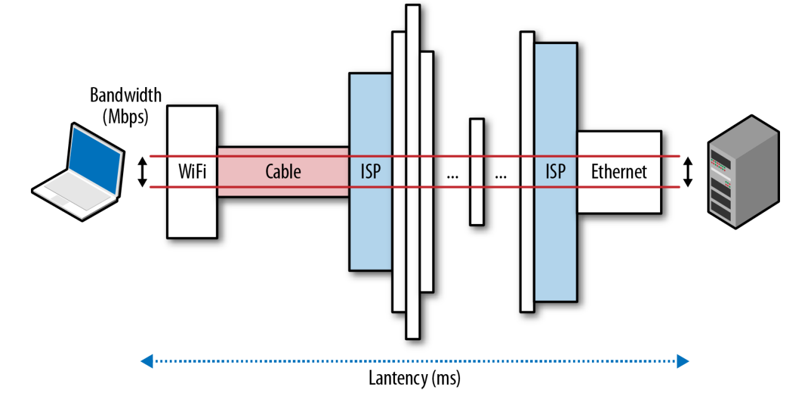

# Chapter 1 - Primer on Latency and Bandwidth

# Speed Is a Feature

- Faster sites lead to better user engagement, retention, and conversions.

To deliver higher performant websites, we need to understand the many factors and fundamental limitations that are at play.

In this chapter, we will focus on the two critical components that dictate the performance of all network traffic: latency and bandwidth

## Latency

- The time from the source sending a packet to the destination receiving it.

### The Many Components of Latency

Every system contains multiple sources, or components, contributing to the overall time it takes for a message to be delivered, let's take a look at some of the most common components contributing to latency:

- **Propagation delay**: The time it takes for a packet to travel from the sender to the receiver. This is a function of the distance between the two points and the speed of the medium (light, copper, etc.).

Usually a small factor of the speed of light, but can be significant for long-distance communications. (e.g. user from Australia accessing a server in the US)

> Content Delivery Networks (CDNs) are a common solution to this problem. CDNs are a network of servers distributed around the world that cache content from your site and serve it to users from the server closest to them. If you can't make the packets travel faster, just make them travel less distance.

- **Transmission delay**: The time it takes to push all of the packet's bits into the wire. This is a function of the number of bits and the bandwidth of the link.

For example, if we want to transmit a 10 Mbps file over two links: a 10 Mbps link and 100 Mbps link, it will take 1 second and 0.1 seconds respectively.

- **Processing delay**: The time it takes for the router to process the packet header. This is a function of the amount of work the router needs to do given the router's current load.

- **Queuing delay**: The time the packet sits in the router's queue waiting to be processed if the packets are arriving at a rate faster than the router can process. This is a function of the number of packets already in the queue and the traffic load on the router.

## Bandwidth

Maximum throughput of a logical or physical communication path

