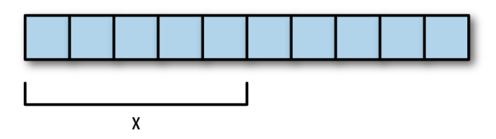

# Chapter 1: Getting Started

Go is a general-purpose language designed with systems programming in mind. It is strongly typed and garbage-collected and has explicit support for concurrent programming. Programs are constructed from packages, whose properties allow efficient management of dependencies. The existing implementations use a traditional compile/link model to generate executable binaries.

## Machine Setup

### Install Visual Studio Code

You can download Visual Studio Code from [here](https://code.visualstudio.com/).

Install the Go extension for Visual Studio Code.

### Install Go

You can download Go from [here](https://golang.org/dl/).

run the installer, to make sure Go is installed correctly, open a new terminal window and type the following command:

```bash
$ go version
go version go1.20.3 windows/amd64
```

The Go toolset is made up of several different commands and subcommands. You can pull up a list of those commands by typing:

```bash
$ go help
```

## Your First Program

To keep things organized, create a folder named `go-workspace` wherever you like. This is where you will store all your Go code, inside it, create your first Go file, `hello.go`:

You can do this via the file explorerm but i prefere you try doing it via the terminal: (for sake of learning)

```bash
$ mkdir go-workspace
$ cd go-workspace
$ touch hello.go
$ code .
```

The last command will open Visual Studio Code in the current directory.

Now, type the following code into `hello.go`:

```go
package main

import "fmt"

// This is a comment

func main(){
    fmt.Println("Hello world")
}
```

To run the program, type the following command in the terminal (to open the terminal in vscode press `ctrl + ~`):


```bash
$ go run hello.go
Hello world
```

## How to Read Go Program

```go
package main
```

Every Go program must start with a package declaration. Packages are Go's way of organizing and reusing code. There are two types of Go programs: executables and libraries. Executable applications are the kinds of programs that we can run directly from the terminal. Libraries are collections of code that we package together so that we can use them in other programs.

```go
import "fmt"
```

The import keyword is how we include code from other packages to use with our program. The `fmt` package (shorthand for format) implements formatting for input and output. Given what we just learned about packages, what do you think the `fmt` package’s files would contain at the top of them?

Files in the `fmt` package start with package `fmt`

```go
// This is a comment
```

Comments in Go start with `//` and go until the end of the line. Comments are ignored by the Go compiler.

For multi-line comments, we use `/*` and `*/` to start and end the comment block.

```go
/*
This is a multi-line comment
I can write as much as I want here 
*/
```

```go
func main(){
    fmt.Println("Hello world")
}
```

The `func` keyword is used to define functions. A function is a collection of statements that execute sequentially, they are the building blocks of any go program.

All functions start with the keyword func followed by the name of the function (`main`, in this case), a list of zero or more parameters surrounded by parentheses, an optional return type, and a body which is surrounded by curly braces. This function has no parameters, doesn’t return anything, and has only one statement. The name main is special because it’s the function that gets called when you execute the program

Every Go program has a `main` function. In this case, the `main` function calls the `Println` function from the `fmt` package. `Println` is a function that takes a string as an argument and displays it to the screen.

The Println function does the real work in this program. You can find out more about it by typing the following in your terminal:

```bash
$ go doc fmt.Println

func Println(a ...any) (n int, err error)
    Println formats using the default formats for its operands and writes to
    standard output. Spaces are always added between operands and a newline
    is appended. It returns the number of bytes written and any write error
    encountered.

```

# Chapter 2: Types

Go is a statically typed language. This means that variables always have a specific type and that type cannot change. Go is also a strongly typed language, which means that variables retain their type throughout their lifetime. The compiler will throw an error if you try to assign a value of the wrong type to a variable.

I can't explain this better than this one here [What is the difference between a strongly typed language and a statically typed language?](https://stackoverflow.com/questions/2690544/what-is-the-difference-between-a-strongly-typed-language-and-a-statically-typed#:~:text=Strongly%20typed%20means%20that%20there,once%20it%20has%20been%20created.) 

## Numbers

### Integers

I suppose you know what integers are, if not use google or read this section from the book.

Go's integer types are:

- `uint8` (unsigned 8-bit integers)
- `uint16` (unsigned 16-bit integers)
- `uint32` (unsigned 32-bit integers)
- `uint64` (unsigned 64-bit integers)
- `int8` (signed 8-bit integers)
- `int16` (signed 16-bit integers)
- `int32` (signed 32-bit integers)
- `int64` (signed 64-bit integers)


### Floating-Point Numbers

I suppose you know what floating-point numbers are, if not use google or read this section from the book.

Go's floating-point types are :
- `float32` (32-bit floating-point numbers)
- `float64` (64-bit floating-point numbers)

It also has two additional types for representing complex numbers (numbers with imaginary parts): `complex64` and `complex128`. Generally, we should stick with `float64` when working with floating point numbers.

### Arithmetic Operators

Go supports the following arithmetic operators:

- `+` (addition)
- `-` (subtraction)
- `*` (multiplication)
- `/` (division)
- `%` (remainder)

For more math operations, we can use the `math` package.

## Strings

String literals can be created using double quotes `"Hello, World"` or backticks `` `Hello, World` ``. The difference between these is that double-quoted strings cannot contain newlines and they allow special escape sequences. For example, `\n` gets replaced with a newline and `\t` gets replaced with a tab character.

The following are some common operations on strings:

```go
len("Hello, World") // returns 12
"Hello, " + "World" // returns "Hello, World"
"Hello, World"[1] // returns 101 (the ASCII decimal value for "e"), Notice that indexing starts at 0
```

## Booleans

A boolean value is either true or false. Go has a bool type that has two possible values, true and false. Boolean expressions are used in control flow statements to decide whether to execute certain blocks of code or not, depending on whether the expression evaluates to true or false.

Three basic logical operators are used with boolean
values:

- `&&` (AND)
- `||` (OR)
- `!` (NOT)

# Chapter 3: Variables

A variable is a storage location, with a specific type and an associated name.

let's change the hello world program to use variables:

```go
package main
import "fmt"
func main() {
    var message string = "Hello, World"
    fmt.Println(message)
}
```

Assigning a variable after declaring it is optional. So we can use two statements to declare and initialize a variable:

```go
package main
import "fmt"
func main() {
    var message string
    message = "Hello World!"
    fmt.Println(message)
}
```

Test the equality of two strings using the `==` operator. The `!=` operator is used to test inequality. (Note how we declare multiple variables in one statement.)

```go
package main
import "fmt"
func main() {
    var message1, message2 string
    message1 = "Hello World!"
    message2 = "Hello World!"
    fmt.Println(message1 == message2) // prints true
}
```

Because creating a new variable with a starting value is so common, Go also supports a shorter statement:

```go
message := "Hello World!"
```

Notice the : before the = and that no type was specified. The type is not necessary because the Go compiler is able to infer the type based on the literal value you assign the variable

The compiler can also do inference with the `var` statement:

```go
var message = "Hello World!"
```

Preferring the `:=` style is encouraged because it makes the code shorter and more readable.

## Scope

According to the language specification, “Go is lexically scoped using blocks.” Basically, this means that the variable exists within the nearest curly braces `({ })`, or block, including any nested curly braces (blocks), but not outside of them.

```go
package main
import "fmt"
var message1 string = "Hello, World"
func main() {
    fmt.Println(message1) // prints "Hello, World"
    message2 := "Hello, Go"
}

func foo() {
    fmt.Println(message2) // compiler error: undefined: message2
}
```

## Constants

Constants are like variables, except that their values cannot be changed after they are set. They are created in the same way you create variables, but instead of using the `var` keyword we use the `const` keyword.

```go
package main
import "fmt"
func main() {
    const message string = "Hello, World"
    fmt.Println(message)
}   message = "Hello, Go" // compiler error: cannot assign to message
```

## Define multiple variables

We can define multiple variables in one statement:

```go
package main
import "fmt"
func main() {
    var (
        message string
        age     int
        price   float64
        inStock bool
        a = 5
        b = 10
    )
    fmt.Println(message, age, price, inStock, a, b) // prints " 0 0 false 5 10"
}
```

## Example program

Here’s an example program that takes in a number entered by the user and doubles it:

```go
package main
import "fmt"
func main() {
    fmt.Printf("Enter a number : ")
    var input float64;
    fmt.Scanf("%f", &input)
    fmt.Printf("Output = %f", input * 2)
}
```

# Chapter 4: Control Structures

## for loop

let's write a program that prints the numbers from 1 to 10:

```go
package main
import "fmt"
func main() {
    for i := 1; i <= 10; i++ {
        fmt.Println(i)
    }
}
```

Now the conditional expression also contains two other statements with semicolons between them. First, we have the variable initialization, then we have the condition to check each time, and finally, we increment the variable. Adding 1 to a variable is so common that we have a special operator (++); similarly, subtracting 1 can be done
with --.


Unlike other programming languages, Go has no `while` keyword. Instead, we can use the `for` keyword to do the same thing:

```go
package main
import "fmt"
func main() {
    i := 1
    for i <= 10 {
        fmt.Println(i)
        i = i + 1
    }
}
```


I read something interesting on stackoverflow about the post increment, find it [here](https://stackoverflow.com/questions/23256672/post-increment-operator-in-function-argument-in-go-not-possible)

> In Go, `i++` is a statement, not an expression. So you can't use its value in another expression such as a function call.
This eliminates the distinction between post-increment and pre-increment, which is a source of confusion and bugs.

## if statement

The if statement is used to execute a block of code if a certain condition is true. Here’s an example to print even and odd numbers between 0 and 10:

```go
package main
import "fmt"
func main() {
    for i := 0; i <= 10; i++ {
        if i % 2 == 0 {
            fmt.Println(i, "even")
        } else {
            fmt.Println(i, "odd")
        }
    }
}
```

## switch statement

The switch statement is used to execute one of the many blocks of code. Here’s an example to print the day of the week based on the number:

```go
package main
import "fmt"
func main() {
    day := 4
    switch day {
    case 1:
        fmt.Println("Monday")
    case 2:
        fmt.Println("Tuesday")
    case 3:
        fmt.Println("Wednesday")
    case 4:
        fmt.Println("Thursday")
    case 5:
        fmt.Println("Friday")
    case 6:
        fmt.Println("Saturday")
    case 7:
        fmt.Println("Sunday")
    default:
        fmt.Println("Invalid day")
    }
}
```

# Chapter 5: Arrays, Slices and Maps

## Arrays

An array is a numbered sequence of elements of a single type with a fixed length. In Go, they look like this:

```go
var x [5]int
```

This creates an array called `x` that can hold 5 integers. By default an array is zero-valued, which for ints means 0s:

```go
package main
import "fmt"
func main() {
    var x [5]int
    x[4] = 100
    fmt.Println(x) // prints [0 0 0 0 100]
}
```

We can also use an array literal to initialize an array:

```go
x := [5]float64{ 98, 93, 77, 82, 83 }
```

Let's write a program that finds the average of a list of numbers:

```go
package main
import "fmt"
func main() {
    x := [5]float64{ 98, 93, 77, 82, 83 }
    var total float64 = 0
    for i := 0; i < len(x); i++ {
        total += x[i]
    }
    fmt.Println(total / float64(len(x))) // prints 86.6
}
```

We can also use the `range` form of the `for` loop to iterate over an array:

```go
package main
import "fmt"
func main() {
    x := [5]float64{ 98, 93, 77, 82, 83 }
    var total float64 = 0
    for i, value := range x {
        total += value
        fmt.Println(i)
    }
    fmt.Println(total / float64(len(x))) // prints 86.6
}
```

Of course there are no reason to use the index if we don't need it, removing the `fmt.Println(i)` line will throw an error (unused variable i), so we can use the blank identifier `_` to ignore it:

```go
package main
import "fmt"
func main() {
    x := [5]float64{ 98, 93, 77, 82, 83 }
    var total float64 = 0
    for _, value := range x {
        total += value
    }
    fmt.Println(total / float64(len(x))) // prints 86.6
}
```

Because the length of an array is part of its type name, working with arrays can be a little cumbersome. Adding or removing elements as we did here requires also changing the length inside the brackets. Because of this and other limitations, you rarely see arrays used directly in Go code. Instead, you will usually use a slice, which is a type built on top of an array.

## Slices

A slice is a segment of an array. Like arrays slices are indexable and have a length. Unlike arrays this length is allowed to change. Here’s an example of a slice:

```go
var x []float64
```

This creates a slice that is associated with an underlying float64 array of length 0. To create a slice with a length of 5 elements but a capacity of 10 you can use the `make` function:

```go
x := make([]float64, 5, 10)
```

As illustrated in the following 10 represents the capacity of the underlying array that the
slice points to:



Another way to create slices is to use the `[low : high]` expression:

```go
arr := [5]float64{1,2,3,4,5}
x := arr[0:5]
```

low is the index of where to start the slice and high is the index of where to end it (but not including the index itself). For example, while `arr[0:5]` returns
`[1,2,3,4,5]`, `arr[1:4]` returns `[2,3,4]`.

For convenience, we are also allowed to omit low, high, or even both low and high. `arr[0:]` is the same as `arr[0:len(arr)]`, `arr[:5]` is the same as `arr[0:5]`, and `arr[:]` is the same as `arr[0:len(arr)]`.

In addition to the indexing operator, Go includes two built-in functions to assist with slices: `append` and `copy`.

## append

`append` adds elements onto the end of a slice. If there’s sufficient capacity in the underlying array, the element is placed after the last element and the length is incremented. However, if there is not sufficient capacity, a new array is created, all of the existing elements are copied over, the new element is added onto the end, and the new slice is returned.

```go
package main
import "fmt"
func main() {
    slice1 := []int{1,2,3}
    slice2 := append(slice1, 4, 5)
    fmt.Println(slice1, slice2) // prints [1 2 3] [1 2 3 4 5]
}
```

## copy

`copy` copies elements from a source slice into a destination slice. The return value specifies the number of elements copied. If the destination slice is smaller than the source slice, only the first source elements are copied.

```go
package main
import "fmt"
func main() {
    slice1 := []int{1,2,3}
    slice2 := make([]int, 1)
    a := copy(slice2, slice1) 
    slice1[0] = 10
    fmt.Println(slice1, slice2, a) // prints [10 2 3] [1] 1
}
```

This is called deep copy, because we are copying the values of the array, not the array reference. If we had used `slice2 := slice1` instead, we would have created a shallow copy. In this case, modifying `slice1` would also modify `slice2`:

```go
package main
import "fmt"
func main() {
    slice1 := []int{1,2,3}
    slice2 := slice1
    slice1[0] = 10
    fmt.Println(slice1, slice2) // prints [10 2 3] [10 2 3]
}
```

## Maps

A map is an unordered collection of key-value pairs. Also known as an associative array, a hash table or a dictionary, maps are used to look up a value by its associated key. Here’s an example of a map in Go:

```go
var x map[string]int
```

This creates a map called `x` that maps strings to integers. Maps are unordered, so the order that the key-value pairs are stored in is not defined. We can create an empty map by using the built-in `make` function:

```go
x := make(map[string]int)
x["key"] = 10
fmt.Println(x["key"]) // prints 10
```

We can also delete items from a map using the built-in `delete` function:

```go
x := make(map[string]int)
x["key"] = 10
delete(x, "key")
fmt.Println(x["key"]) // prints 0
```
To check if a key is in a map, we can use the following form:

```go
x := make(map[string]int)
x["key"] = 10
if name, ok := x["key"]; ok {
    fmt.Println(name, ok) // prints 10 true
}
delete(x, "key")
if name, ok := x["key"]; ok {
    fmt.Println(name, ok) // prints 0 false
}
```

Like we saw with arrays, there is also a shorter way to create maps:

```go
elements := map[string]string{
    "H": "Hydrogen",
    "He": "Helium",
    "Li": "Lithium",
    "Be": "Beryllium",
    "B": "Boron",
    "C": "Carbon",
    "N": "Nitrogen",
    "O": "Oxygen",
    "F": "Fluorine",
    "Ne": "Neon",
}
```


# Chapter 6 - Functions

Create a function that returns the average of a float64 slice:

```go
func average(numbers []float64) float64 {
    total := 0.0
    for _, element := range numbers {
        total += element
    }
    return total / float64(len(numbers))
}
```

Return types can be named:

```go
func average(numbers []float64) (average float64) {
    total := 0.0
    for _, element := range numbers {
        total += element
    }
    average = total / float64(len(numbers))
    return 
}
```

Multiple return values:

```go
func average(numbers []float64) (total, average float64) {
    total = 0.0
    for _, element := range numbers {
        total += element
    }
    average = total / float64(len(numbers))
    return 
}
```

Variadic functions:

```go
func average(numbers ...float64) (total, average float64) {
    total = 0.0
    for _, element := range numbers {
        total += element
    }
    average = total / float64(len(numbers))
    return 
}
```

this function can be called with any number of arguments:

```go
fmt.Println(average(1,2,3,4,5)) // prints 3 3
```

you can also pass a slice of float64 using the `...` (ellipsis) operator:

```go
data := []float64{1,2,3,4,5}
fmt.Println(average(data...)) // prints 3 3
```

## defer

`defer` is used to ensure that a function call is performed later in a program’s execution, usually for purposes of cleanup.

```go
package main
import "fmt"
func first() {
    fmt.Println("1st")
}
func second() {
    fmt.Println("2nd")
}
func main() {
    defer second()
    first()
}
```

This program will print `1st` then `2nd`. `defer` is often used when resources need to be freed in some way. For example, when we open a file, we need to make sure to close it later. With `defer`:

```go
package main
import (
    "fmt"
    "os"
)
func main() {
    f, _ := os.Open("filename.ext")
    defer f.Close()
}
```

This has three advantages:
• It keeps our `Close` call near our `Open` call so it’s easier to understand.
• If our function had multiple return statements (perhaps one in an `if` and one in an `else`), `Close` will happen before both of them.
• Deferred functions are run even if a runtime `panic` occurs.

## panic and recover


In Go, `panic` and `recover` are mechanisms for handling unexpected errors or exceptional conditions.

`panic` is used to indicate that something unexpected has happened in the program, such as a runtime error or a violation of an assumption. When a `panic` occurs, the program stops executing the current function and starts unwinding the stack, which means that it will return to each calling function in turn until it finds a function that can `recover` from the `panic`.

`recover` is a function that can be used to `recover` from a `panic`. It can only be called from within a deferred function, which is a function that is scheduled to run after the current function has returned. When `recover` is called within a deferred function and a `panic` has occurred, it returns the value that was passed to `panic`. If `recover` is called outside of a deferred function, or if no `panic` has occurred, it returns nil.

Here's an example of how `panic` and `recover` can be used:

```go
package main

import (
    "fmt"
    "os"
)

func processFile(filename string) {
    defer func() {
        if err := recover(); err != nil {
            fmt.Printf("recovered from panic: %v", err)
        } else if err == nil {
            fmt.Printf("No panic")
        }
    }()

    f, err := os.Open(filename)
    if err != nil {
        panic(err)
    }

    fmt.Println(f)
}

func main() {
    processFile("example.txt")
}
```

In this example, the `processFile` function opens a file and processes its contents. If there's an error opening the file, it calls `panic` with the error. In the `defer` block, we call `recover` to recover from any `panic`s that may occur. If a `panic` occurs, we log the error and continue executing the program.

Using `panic` and `recover` should be done with caution, as they can be abused and lead to code that is hard to reason about. In general, it's best to use them sparingly and only in cases where they are truly necessary for handling unexpected errors or exceptional conditions.

## Pointers 

When we call a function that takes an argument, that argument is copied to the function:

```go
func zero(x int) {
	x = 0
}
func main() {
	x := 5
	zero(x)
	fmt.Println(x) // x is still 5
}
```

In this program, the zero function will not modify the original `x` variable in the main function. But what if we wanted to? One way to do this is to use a special data type known as a pointer:

```go
func zero(xPtr *int) {
    *xPtr = 0
}
func main() {
    x := 5
    zero(&x)
    fmt.Println(x) // x is 0
}
```

The `*` and `&` operators

`*` is used to dereference pointer variables. Dereferencing a pointer gives us access to the value the pointer points to.

`&` is used to get the address of a variable. The address of a variable is where the variable is stored in memory.

## new

Another way to get a pointer is to use the built-in new function:

```go
func one(xPtr *int) {
    *xPtr = 1
}
func main() {
    xPtr := new(int)
    one(xPtr)
    fmt.Println(*xPtr) // x is 1
}
```

new takes a type as an argument, allocates enough memory to fit a value of that type, and returns a pointer to it.

Note that go has garbage collection, so unlike C, we don't need to worry about freeing memory.

