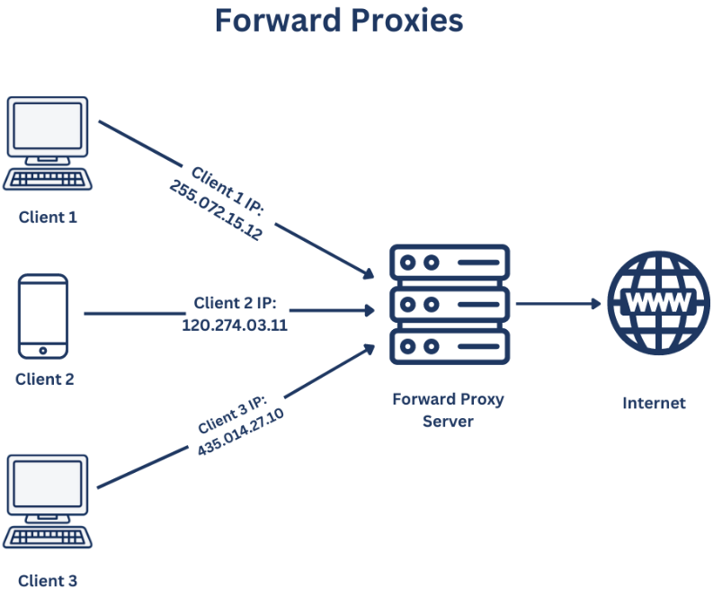
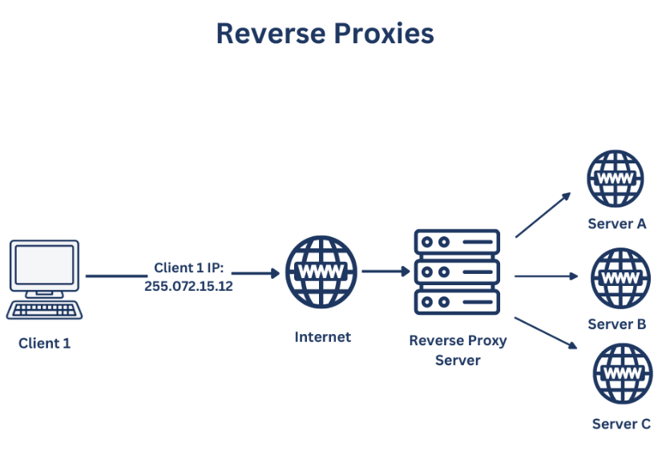

# Proxy vs Reverse Proxy

## Proxy

A proxy server is a server that sits between a client application, such as a Web browser, and a real server. It hides the identity of the client. It intercepts all requests to the real server to see if it can fulfill the requests itself. If not, it forwards the request to the real server.

### Benefits of using a proxy server

- Anonymity: By using a proxy server, the client's IP address is hidden from the server. This can provide anonymity for certain clients.
- Caching: A proxy server can act as a cache server. This means that it can store frequently accessed Web pages. This can save time in retrieving Web pages that are accessed often.
- Blocking unwanted sites: A proxy server can be used to block out certain sites that are deemed unsuitable for client access. This is often used in a corporate environment to prevent access to certain sites.
- GeoFencing: A proxy server can be used to restrict access to certain geographical locations. This is often used to prevent access to certain sites in certain countries or show them different content based on their location.

## Reverse Proxy

A reverse proxy is a server that sits in front of one or more web servers, intercepting requests from clients. This is different from a forward proxy, where the proxy sits in front of the clients. With a reverse proxy, when clients send requests to the origin server of a website, those requests are intercepted at the network edge by the reverse proxy server. The reverse proxy server will then send requests to and receive responses from the origin servers. The client will never directly communicate with the origin server. The reverse proxy server will handle all communication with the origin server.

### Benefits of using a reverse proxy server

- Load balancing: A reverse proxy server can be used to distribute the load of incoming requests to several servers. This can help to improve the performance of the servers by distributing the load.
- Cache: A reverse proxy server can be used to cache frequently accessed content. This can help to improve the performance of the servers by reducing the load on the servers.
- Logging: A reverse proxy server can be used to log requests and responses. This can help to  provide a record of all requests and responses.
- Canary deployment: A reverse proxy server can be used to route a small percentage of traffic to a new version of a website. This can help to test the new version of the website before rolling it out to all users.