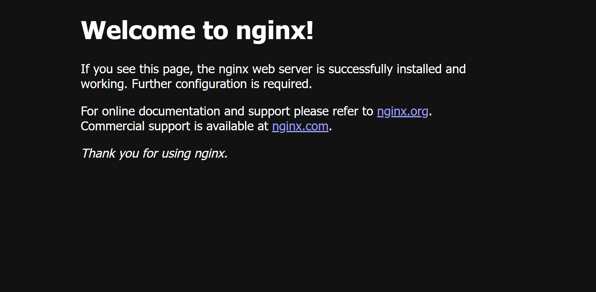
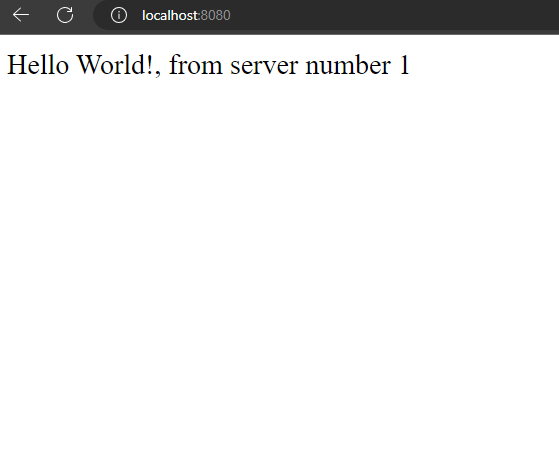
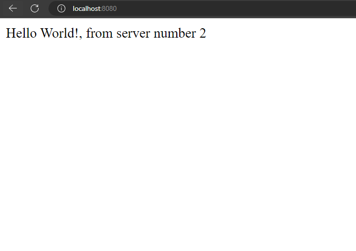

# Nginx 

Nginx is a web server which can also be used as a reverse proxy, load balancer, mail proxy and HTTP cache.

Before proceeding, you can take a look at my summary on [proxy vs reverse proxy](https://github.com/taham8875/til/blob/main/Network%20Engineering/proxy%20vs%20reverse%20proxy.md)


## Installation

You can search how to install nginx on your OS. After a successful installation, you can check the version of nginx by running the following command:

```bash
$ nginx -v
```

## Starting nginx

To start nginx, run the following command:

```bash
$ nginx
```

Now navigate to `http://localhost:80` and you should see the following page:



To stop nginx, run the following command:

```bash
$ nginx -s stop
```

## Configuration

The configuration file of nginx is located at `/nginx/conf/nginx.conf`. You can open it with your favorite text editor. Let's get familiar with the terminology used in the configuration file:

- **Directive**: A directive is a configuration parameter. It consists of the name of the parameter and its value. For example, `worker_processes 1;` is a directive which sets the number of worker processes to 1.
- **Context**: A context is a block that groups directives. For example, `events {}` is a context which groups directives related to events.


## Get started - Serve static content

Let's start with a simple example. We want to serve static content. To do so:

1. Delete the contents of the `nginx.conf` file. We will start from scratch.
2. Make a new directory wherever you want. I will make a directory named `my-website` in my desktop directory.
3. open the directory and make a new file named `index.html` and put some content in it. I will put the following content in it:

```html
<!DOCTYPE html>
<html>
  <head>
    <title>My Website</title>
  </head>
  <body>
    <h1>Hello World! I am served from Nginx</h1>
  </body>
</html>
```

4. Now open the `nginx.conf` file and add the following content to it:

```nginx
events {}

http {
    server {
        listen 80;
        root C:/Users/taha/Desktop/my-website; # Don't add index.html at the end
    }
}
```
> Leave the events block empty even if you don't need it. It is required for nginx to work.


5. Now start nginx by running the following command:

```bash
$ nginx
```

6. Now navigate to `http://localhost:80` and you should see the following page:


> If you failed to see the page, it is likely that nginx is running and you need to restart it. via `nginx -s stop` and `nginx`, if it is still not running, check the errors logs located in `logs/error.log`, (for me, using `\` instead of `/` in the `root` directive caused the problem)


## MIME types

MIME types are used to tell the browser how to handle files. For example, if the browser sees a file with `text/html` MIME type, it will render it as HTML. If it sees a file with `image/png` MIME type, it will render it as an image. You can see a list of MIME types [here](https://developer.mozilla.org/en-US/docs/Web/HTTP/Basics_of_HTTP/MIME_types/Common_types).

Now let's add some styling to our website. To do so:

1. Open the `index.html` file and add the following line to the `head` tag:

```html
<link rel="stylesheet" href="style.css">
```

2. Now make a new file named `style.css` and put some styling in it. I will put the following content in it:

```css
body {
    background-color: #f1f1f1;
}

h1 {
    color: green;
}
```

If you navigate to `http://localhost:80` now, you will see that the styling is not applied. This is because the browser doesn't know how to handle the `style.css` file. If you inspected th network tab of the developer tools, you would see that the `style.css` file has `text/plain` MIME type.

To fix this, we need to add the `text/css` MIME type to the `style.css` file. To do so:

1. Open the `nginx.conf` file and add the following line to the `http` block:

```nginx
http {
    types {
        text/css css;
    }
}
```

2. Now restart nginx by running the following command:

```bash
$ nginx -s reload
```

3. Now navigate to `http://localhost:80` and you should see the following page:


Adding every MIME type manually is not practical. Luckily, nginx comes with a list of common MIME types. To use it:

5. Open the `nginx.conf` file and add the following line to the `http` block:

```nginx
http {
    include mime.types;
    # ...
}
```

6. Now restart nginx by running the following command:

```bash
$ nginx -s reload
```

7. Now navigate to `http://localhost:80` and you should see the page displayed correctly.


## Location block

The `location` block is used to match a location. For example, if you want to match the `/about` location, create a new directory named `about` in the `my-website` directory and put an `index.html` file in it.

Then you can use the following location block:

```nginx
location /about {
    root C:/Users/taha/Desktop/my-website;
}
```

Now if you navigate to `http://localhost:80/about`, you should see the content of the `index.html` file.

If you want to match a location with different name but same content, you can use the following location block:

```nginx
location /about-me {
    alias C:/Users/taha/Desktop/my-website/about;
}
```

If you navigate to `http://localhost:80/about-me`, you should see the content of the `index.html` file.

If you want to match a location but its html files is not named `index.html`, you can use the following location block:

```nginx
location /contact {
    root C:/Users/taha/Desktop/my-website;
    try_files /contact-us/contact.html index.html =404; # This will try to find these in order, if none of them is found, it will return 404 page
}
```

You can use regular expressions in the `location` block. For example, if you want to match `/count/1`, `/count/2`, `/count/3`, etc. you can use the following location block:


```nginx
location ~ /count/[0-9]+ {
    root C:/Users/taha/Desktop/my-website;
    try_files /count/count.html index.html =404;
}
```

## Redirects

You can redirect a request to another location using the `return` directive. For example, if you want to redirect `/about` to `/about-me`, you can use the following location block:

```nginx
location /about {
    return 301 /about-me;
}
```

You can also redirect a request to another domain. For example, if you want to redirect `/about` to `https://google.com`, you can use the following location block:

```nginx
location /about {
    return 301 https://google.com;
}
```


## Load balancing

Load balancing is a technique used to distribute the load across multiple servers. It is used to improve the performance and reliability of the application. 

Let's create simple load balancer. To do so:

1. create two express apps. You can use the following code:


First app located in `server1/index.js`:


```js
import express from 'express'
const app = express()
const port = 3000

app.get('/', (req, res) => res.send('Hello World!, from server number 1'))
app.listen(port, () => console.log(`Example app listening on port ${port}!`))
```

Second app located in `server2/index.js`  

```js
import express from 'express'
const app = express()
const port = 3000

app.get('/', (req, res) => res.send('Hello World!, from server number 2'))
app.listen(port, () => console.log(`Example app listening on port ${port}!`))
```

2. Dockerize the two applications:

Navigate to `server1/index.js` and create the following `Dockerfile`:

```dockerfile
FROM node:18-alpine
# Create app directory
WORKDIR /usr/src/app
# Install app dependencies
# A wildcard is used to ensure both package.json AND package-lock.json are copied
# where available (npm@5+)
COPY package*.json ./
RUN npm install
# If you are building your code for production
# RUN npm ci --omit=dev
# Bundle app source
COPY . .
EXPOSE 3000
CMD ["npm",  "run", "dev"]
```

then run the following command:

```bash
$ docker build -t server1 .
```

Navigate to `server2/index.js` and create the same `Dockerfile`, then run:

```bash
$ docker build -t server2 .
```

Run the two containers:

```bash
$ docker run -p 1111:3000 server1
$ docker run -p 1111:3000 server2
```

1. Put the following content in nginx configuration file:

```nginx
events {  }

http {
    upstream backendserver {
        server 127.0.0.1:1111;
        server 127.0.0.1:2222;
    }

    server {
        listen 8080;
        server_name localhost;
        location / {
            proxy_pass http://backendserver/;
        }
    }
}
```

4. Run the following command to start nginx:

```bash
$ nginx
```

5. Navigate to `http://localhost:8080` and you should see the following page:



try to refresh the page multiple times (press `F5`) and you will see that the content changes every time, this means that the requests are distributed between the two servers.



> Note: This load balancing algorithms is called round robin. It is the default algorithm used by nginx. You can read more about it [here](https://www.nginx.com/resources/glossary/round-robin-load-balancing/).


