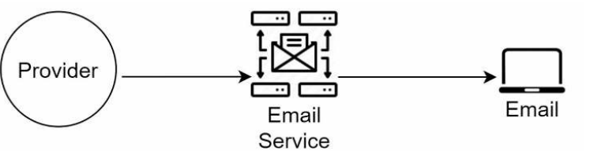

# Chapter 10 - Design a Notification System

# Step 1 - Understand the problem and establish a design scope

After a discussion between you and your interviewer, here is the requirements:

- Push notifications, email, sms messages are supported
- It is a soft real-time system, we wish that the user gets the as soon as possible but under a high load, small delay is acceptable
- ios, android, desktop are supported
- Notifications can be triggered by client application. They can be also scheduled on the server side.
- users are able to opt-out of receiving notifications, afterwards they will not receive any notifications
- 10 million push notifications, 5 million emails, 1 million sms messages are sent per day

# Step 2 - Propose high-level design and get buy-in

## Different types of notifications

### ios push notifications


We need three components to send ios push notifications:

- Provider API: the provider API is used to send push notifications to the Apple Push Notification service (APNs). To construct a push notification, we need to provide the device token, the payload, APNS and the ios device (receiver).

### Android push notifications

Android adopts similar flow, instead of using APNS, Firebase Cloud Messaging (FCM) is used to send push notifications to the Android device.


### SMS messages

For SMS messages, we need to use a third-party SMS gateway to send SMS messages to the receiver like Twilio or Vonage.


### Email

Although we can setup our own email server. We can use a third-party email service provider like SendGrid or Mailgun to send emails. Which offers better delivery rate and analytics.



The following figure shows the overall architecture of the notification system:


## Contact info gathering flow

To send notifications, we need to gather the contact info from the user. When a user installs our app or signs up for our service, we need to ask for their contact info and store it in a database. The following figure shows the contact info gathering flow:


The following figure shows a simplified database tables to store contact info:


## Notification sending/receiving flow

### High level design


- Service 1 to N: A service can be a micro-service, a cron job, or a distributed system that triggers notification sending events. For example, a payment service can trigger a payment notification event when a payment is received or a e-commerce service can trigger a shipping notification event when a product is shipped.
- Notification Service: The notification service is centerpiece of sending/receiving
notifications.
- Third-party services: The third-party services are used to send notifications to the receiver. For example, APNS, FCM, Twilio, SendGrid, Mailgun, etc.
- ios, Android, Desktop: The receiver devices.

There are some problems with the high level design:

- Single point of failure: We use one notification server. If the notification service is down, no notifications can be sent.
- Hard to scale
- Performance bottleneck

### Improved design

- Move the database and cache out of the notification service. The notification service only handles the notification sending/receiving logic.
- Add more notification servers and setup automatic scaling.
- Introduce message queue to decouple the service components.


# Step 3 - Design deep dive

## Reliability

**How to prevent data loss?**

Notifications can usually be delayed or re-ordered but never lost. To satisfy this requirement, we need to store the notification data in a database and implement a retry mechanism.


**Will recipients receive a notification exactly once?**

We need to make sure that the notification is sent exactly once. The distributed nature could result in a duplicate notification. We introduce deduplication tmechanism to prevent duplicate notifications:

When a notification arrives, we check if it seen before by checking the event id. If the event id is seen before, we discard the notification. Otherwise, we process the notification and store the event id in the database.

## Additional components

### Notification template

We can use a template to construct the notification content. The template can be stored in a database or a file system. The template can be customized based on the user's locale, device type, etc. So instead of building every notification from scratch, we can use a template to construct the notification content.

For example, we can use the following template to construct a payment notification:

```
{
    "title": "Payment received",
    "body": "You have received a payment of $<amount> from <sender>."
}
```

### Notification settings

We can allow users to customize their notification settings. For example, they can choose to receive notifications via email, sms, or push notifications. They can also choose to receive notifications for certain events or not to receive notifications at all.

### Rate limiting

To avoid overwhelming the user, we can limit the number of notifications sent to the user. For example, we can limit the number of notifications sent to the user to 1 per minute.

There are some additional component, like security, analytics (open rate, click rate), monitoring, logging etc. We will not cover them in this chapter.

## Updated design


