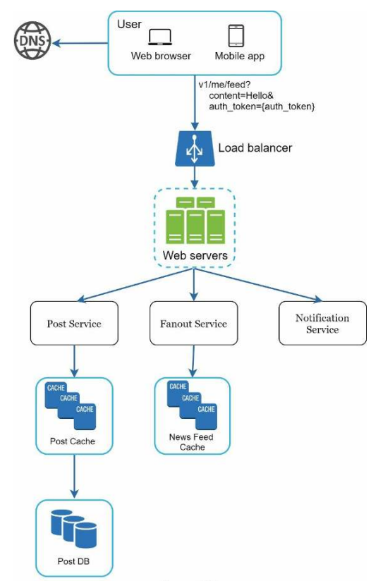
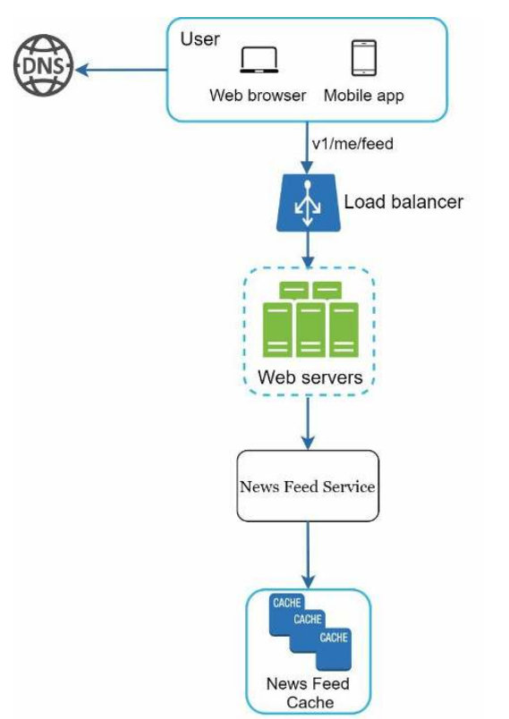
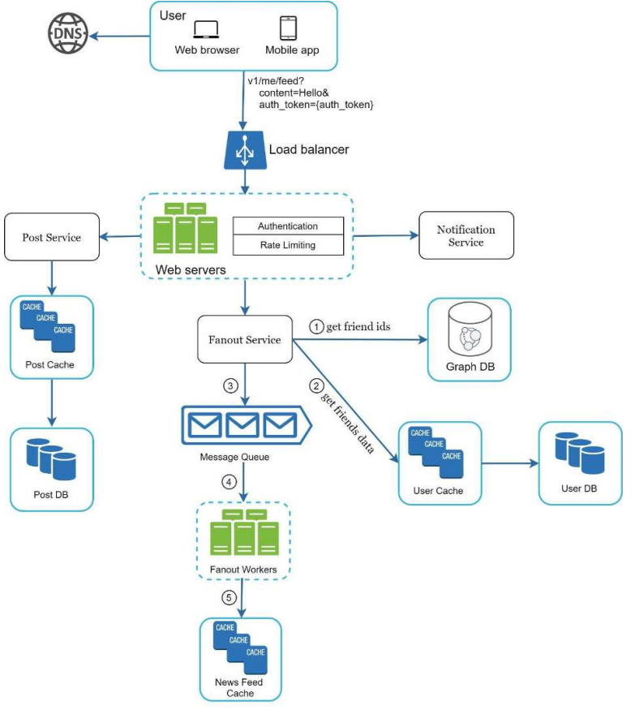
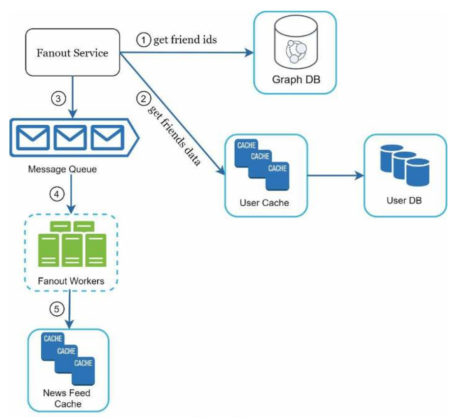
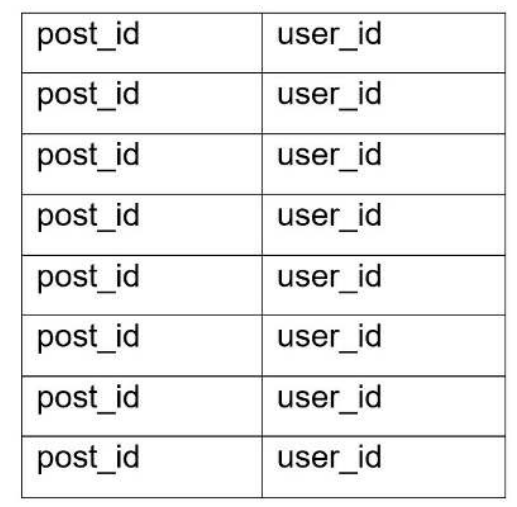
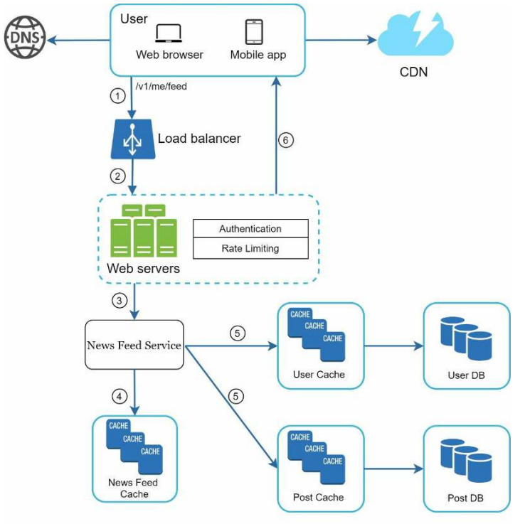
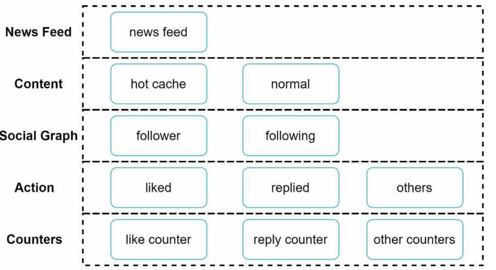

# Chapter 11 - Design a News Feed System

Quoted from facebook help page:

"News Feed is the constantly updating list of stories in the middle of your home page. News Feed includes status updates, photos, videos, links, app activity and likes from people, Pages and groups that you follow on Facebook."

# Step 1 - Understand the problem and establish a design scope

After a discussion between you and your interviewer, here is the requirements:

- Both mobile and web clients are supported
- User can publish a post to his/her timeline and see his/her friends' posts
- Too keep things simple, posts are sorted by reverse chronological order
- User can have up to 5000 friends
- 10 million users are active per day
- Feed can contain media content like photos and videos

# Step 2 - Propose high-level design and get buy-in

The design in divided into two flows, feed publishing and feed building.

## News feed api

The news feed api is the primary way for the client to communicate with the news feed system. It is a restful api, the client can send `GET` request to `/api/v1/feed` to get the feed with the param `auth_token` to authenticate the request, , and send `POST` request to `/api/v1/feed` with the param `auth_token` and `content` to publish a new post.

## Feed publishing

- **User**: User cam view news feed and post new content
- **Load balancer**: Distribute traffic to web servers
- **Web servers**: Redirect traffic to internal servers
- **Post service**: Persist post in database of cache
- **Fanout service**: Push new content to friends news feed. News feed data is stored in cache for faster access
- **Notification service**:  Inform friends that new content is available

## News feed building

- **User**: user sends a request to retrieve new feed
- **Load balancer**: Distribute traffic to news feed servers
- **News feed servers**: Redirect traffic to news feed service
- **News feed cache**

# Step 3 - design deep dive

## Feed publishing deep dive

We discussed most of the components in the high level design, we now focus in web servers and fanout service.

### Web servers

Besides communication with the client, web servers enforce authentication and rate limiting.

### Fanout service

Fanout is the process of pushing new content to friends news feed. There are two fanout models, fanout on write (push model) and fanout on read (pull model). Both have their pros and cons.

#### Fanout on write

News feed is pre-compiled during write time, A new feed is delivered to friends cache immediately after it is published.

**Pros** :

- Fetching feed is fast, since the feed is already pre-compiled

**Cons** :

- If user has many friends, fetching the friends list and generating the feed be slow and time consuming
- For inactive users or they hoe login infrequently, generating the feed is wasted effort

#### Fanout on read

News feed is compiled during read time, this is on-demand model.

**Pros** :

- For inactive users, generating the feed is not wasted effort
- Data is not pushed to the friends so there are no hotkey problem

**Cons** :

- Fetching feed is slow, since the feed is not pre-compiled

We adopt a hybrid approach to get benefits of both approaches and avoid pitfalls in them. Since fetching the news feed fast is crucial, we use a push model for the majority of users. For celebrities or users who have many friends/followers, we let followers pull news content on-demand to avoid system overload.

Let us take a close look at the fanout service

The fanout service works as follows:

- Fetch friend IDs from the graph database.
- Get friends info from the user cache. Filter out friends based on the user settings, for example, if the user has muted a friend, we do not send the new content to the friend.
- Send friends list and new post ID to the message queue.
- Fanout workers will fetch the data from the message queue and store the feed in the news feed cache <post_id, user_id> inly to reduce the storage (no need to store the post content in the news feed cache), to keep memory size small, we set configuration limit, since it is unlikely that a user will scroll down to see thousands of posts, cache miss is infrequent.

## News feed building deep dive

As shown in the figure, media content is stored in a cdn for faster access.

1. User sends a request to retrieve new feed
2. The load balancer distributes the traffic to news feed servers
3. Web servers redirect the traffic to news feed service
4. News feed service get a list post IDs from the news feed cache
5. News feed service fetch the post content from the post cache (and its relevant content like profile name, avatar, date, media content, etc) and return the feed to the user
6. Our hybrid news feed service will be returned to the client in the JSON format

## Cache architecture

Cache is extremely important for a news feed system. We divide the cache tier into 5 layers

- **News Feed Cache**: Store the IDs of news feed
- **Content**: Post content, popular content is stored in the cache
- **Social graph**: users relationships
- **Actions**: user actions like like, comment, share, etc
- **Counters**: number of likes, comments, shares, etc

# Step 4 - wrap up

In this chapter, we designed a news feed system. We discussed the high level design and the low level design. We also discussed the cache architecture. We also discussed the fanout model and the hybrid approach to get the benefits of both approaches.

There are more to discuss with your interviewer:

- Vertical vs horizontal scaling
- SQL vs NoSQL
- Master slave replication
- Read replicas
- Consistency
- Database sharding
- Stateless vs stateful servers
- More about cache
- decouple the system components using message queue
- Monitoring
