# Chapter 12 - Design a Chat System

# Step 1 - Understand the problem and establish design scope

After a discursion with the interviewer, here's the requirements I've gathered:

- Both 1 on 1 and group chat
- Both mobile and web
- User can login to multiple devices
- It should support 50 million daily active users
- In a group chat, a maximum of 100 users can participate
- Online indicator is required
- System supports only text messages
- Text length should be limited to 100000 characters
- We should store the chat history forever
- We should support push notifications

# Step 2 - Propose high-level design and get buy-in

Client does not communicate with each other directly, instead they communicate through a chat server, the chat server support the following features:

- Receive messages from clients and
- Find the right recipient(s) and send the message to them
- If the recipient is offline, hold the messages on the server until the recipient is online

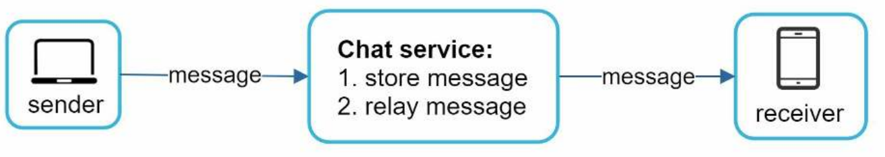

For the sender side, requests are initiated by the client and sent to the server using the HTTP protocol, client open a HTTP connection to the server and send the message, `keep-alive` header is used to allow the a client to maintain a persistent connection with the server, this is to avoid the overhead of opening a new connection for each message and reduces the number of TCP handshakes.

The receiver side is more complicated. Since HTTP is client initiated, it is not possible for the server to send a message to the client, instead there are many techniques are used to simulate a server initiated request, such as:

- Polling
- Long polling
- WebSockets

## Polling

Polling is  technique where the client periodically asks the server if there are any new messages, if there are no new messages, the server responds with an empty response, the client then waits for a few seconds and then sends another request to the server, this process is repeated until the server has a new message to send to the client.

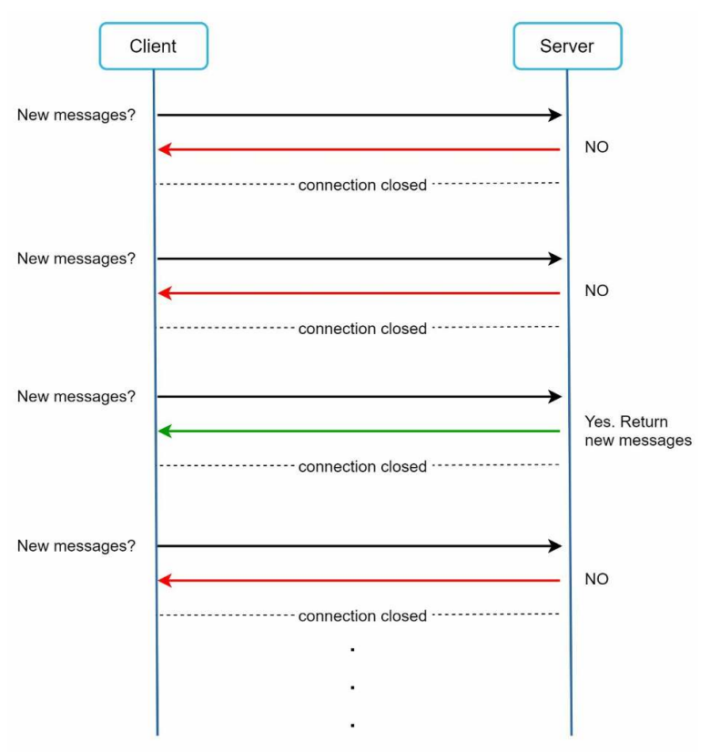

Depending on the polling interval, this technique can be very costly, it consumes a lot of bandwidth and server resources, to answer a question that most likely will be empty most of the time.

## Long Polling

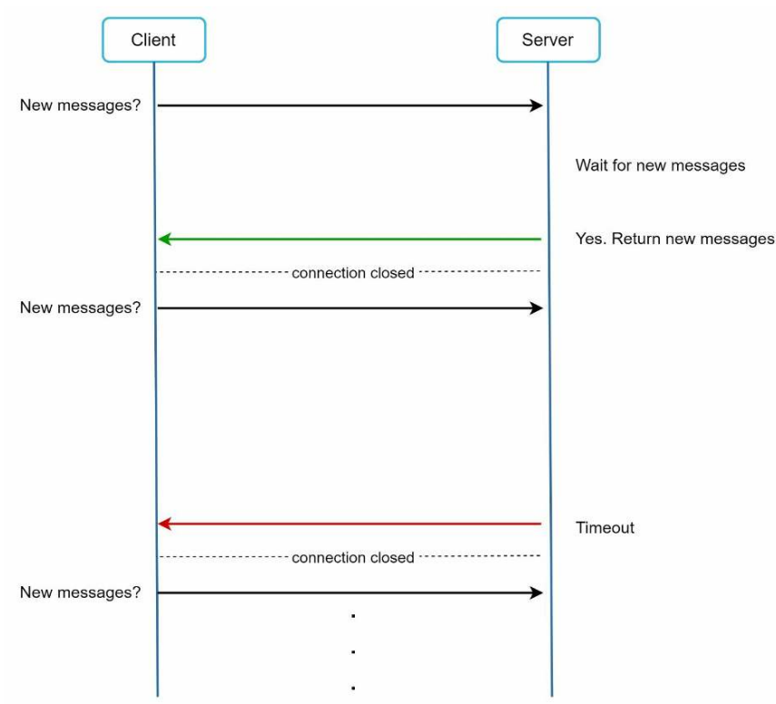

In long polling, a client holds the connection open until the server has a new message to send or a timeout reached, once the client receives a response, it immediately sends another request to the server, this process is repeated until the client disconnects.

Long polling is more efficient than polling, but it still has some drawbacks:

- Sender and receiver may not be connected to the same chat server. HTTP is stateless, so if we for example used round robin load balancing, the server that receives the message may not the the same the client is connected to.
- A server has no way to say if a the user is disconnected.
- Inefficient. If a user does not chat much, the server will have to hold the connection open for a long time, this is a waste of resources.

## WebSockets

Websockets is the most common technique used today, it is a full-duplex communication protocol over a single TCP connection, it allows the server to send messages to the client without the client having to request them, it also allows the server to send messages to the client at any time, even if the client is not connected.

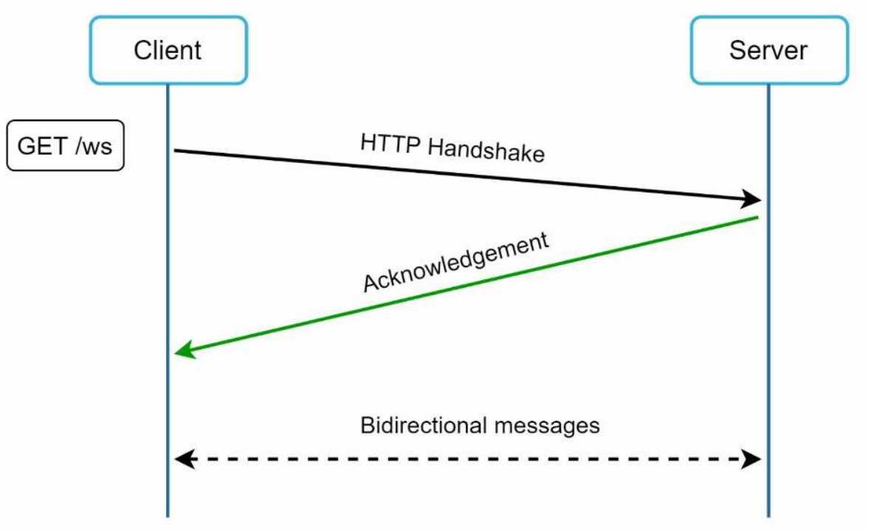

Although we said the HTTP is fine for the client to server communication, WebSockets is still a better choice since it is bi-directional. The following figure shoes how WebSockets (ws) is used for both client and receiver communication.

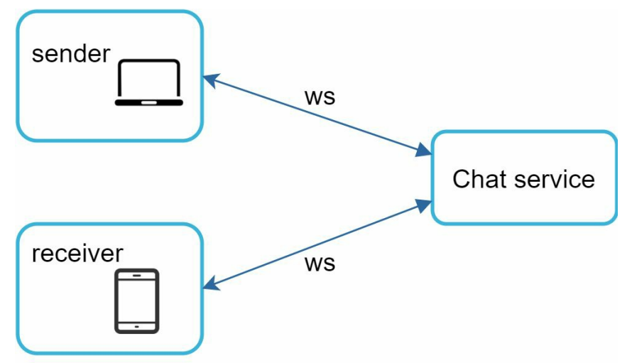

Using WebSockets for both client and receiver makes the implementation on both sides is straight forward.

## High Level Design

Although we choice to use WebSockets for both client and receiver communication, everything else does not have to be ws, in fact, most features (sign up, login, user profile, etc) can be implemented using request response model over HTTP.

The following figure shows the high level design of the chat system. It is broken down into three major categories: Stateless services, stateful services and third party integrations.

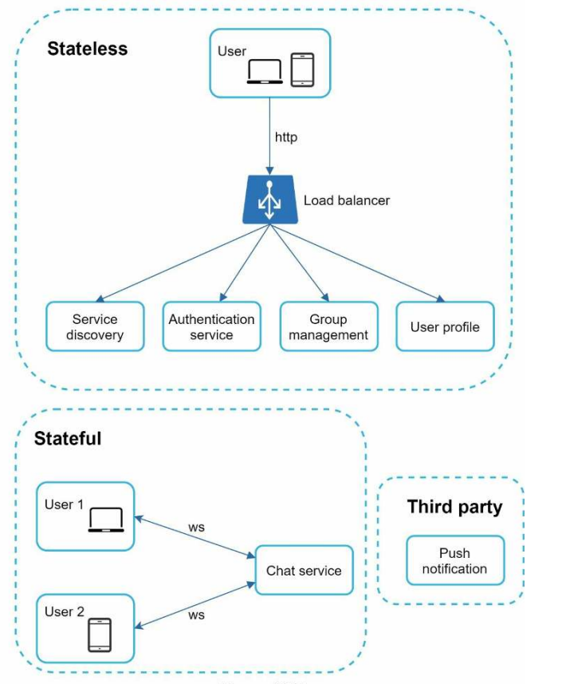

### Stateless Services

Stateless services are traditional request response service for sign up, login, user profile, etc.

These servers sits behind a load balancer, the load balancer is responsible for distributing the requests to the servers.

The one service that will be discussed in more details is the service directory. Its primary job is to give the client a list of DNS host names of chat servers.

### Stateful Services

The only stateful service is the chat server, it is stateful because each client maintains a persistance connection to a chat server. Client normally does not switch to another service as long as the server is still available. The server directory responsible for distributing the clients to the chat servers to avoid overloading a single server.

### Third Party Integrations

Third party integrations are used for push notifications, it is used to send push notifications to the client when the client is offline. refer to chapter 10 for more details about push notifications.

### Scalability

All services listed can fit in one single server, but it is not advisable to do so for many reasons (single point of failure is the biggest). However, it is fine to start from a single server for the interview sake, the following figure shows the high level design of a single server.

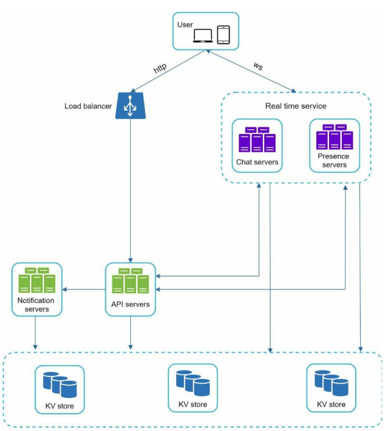

In the previous figure, the client maintains a persistent ws connection with the chat server for real time communication.

- Chat server facilitates sending/receiving messages between clients
- Presence servers manage online/offline status of users
- API services handle everything including sign up, login, user profile, etc
- Notification service is used to send push notifications to the client
- The key value stores stores the chat history so that offline users can retrieve it later

### Storage

Two types of data exist in a typical chat system. The first is generic data, such as user profile, setting, user friends list. This data can be stored in a relational database such as MySQL or PostgreSQL.

The second is the chat history with the following characteristics:

- The amount of data is huge (Facebook messenger and whatsapp process 60 billion messages per day)
- Only recent chat users are interested in, old messages are rarely accessed
- Although users are interested in recent messages, users may use features that requires random access to old messages, such as search, view your mentions, jump to a specific message, etc
- The read to write ratio is 1:1, this is not what happens in most system.

Selecting the correct database that supports all the use cases is not easy, we recommend key value stores for the following reasons:

- Easy horizontal scaling
- Low latency
- Relational database does not handle long tail of data well, when the indexed grows large, the performance degrades and random access is expensive
- It is adopted by successful chat systems such as Facebook messenger and discord

## Data Models

### Message table for 1 on 1 chat

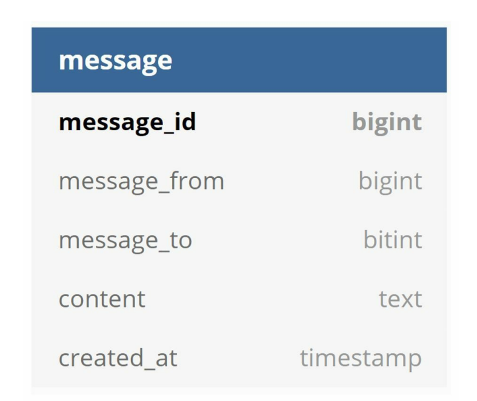

Note that the primary key is the `message_id` which helps to decide the messages sequence, we cannot rely on `created_at` because it is possible for two messages to have the same timestamp.

### Message table for group chat

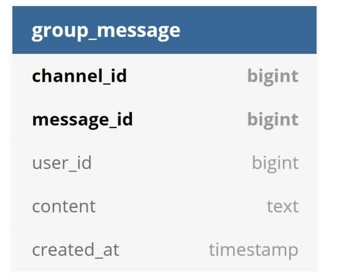

The composite primary key is (`channel_id`, `message_id`).

### Message id

How to generate the `message_id`? is an interesting question. `message_id` should be unique and sortable by time, as discussed in chapter 7, auto increment is not a great choice, the choice we adapt is twitter snowflake.

# Step 3 - Design deep dive

## Service discovery

The primary rule for service discovery is to recommend the best chat server based on the criteria like geographical location, server load, etc. Apache zookeeper is a popular open source service discovery tool.

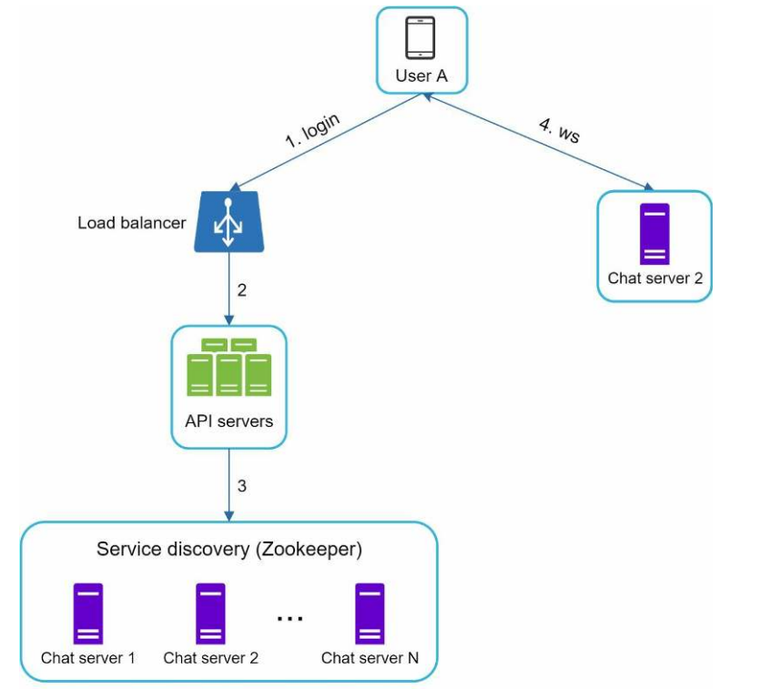

1. User A tries to log in to the app.
2. The load balancer sends the login request to API servers.
3. After the backend authenticates the user, service discovery finds the best chat server for User A. In this example, server 2 is chosen and the server info is returned back to User A.
4. User A connects to chat server 2 through WebSocket

## Messages flow

### 1 on 1 chat flow

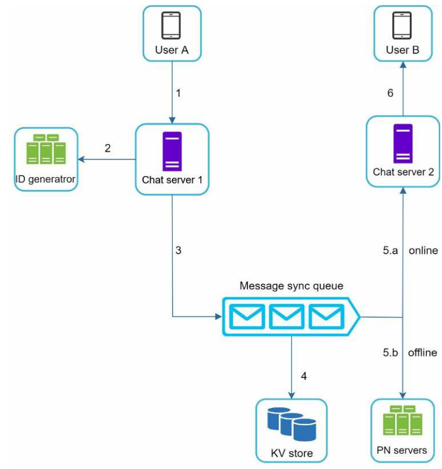

1. User A sends a chat message to Chat server 1.
2. Chat server 1 obtains a message ID from the ID generator.
3. Chat server 1 sends the message to the message sync queue.
4. The message is stored in a key-value store.
5. If User B is online, the message is forwarded to Chat server 2 where User B is connected.
6. If User B is offline, a push notification is sent from push notification (PN) servers.
7. Chat server 2 forwards the message to User B. There is a persistent WebSocket connection between User B and Chat server 2.

### Message synchronization across multiple devices

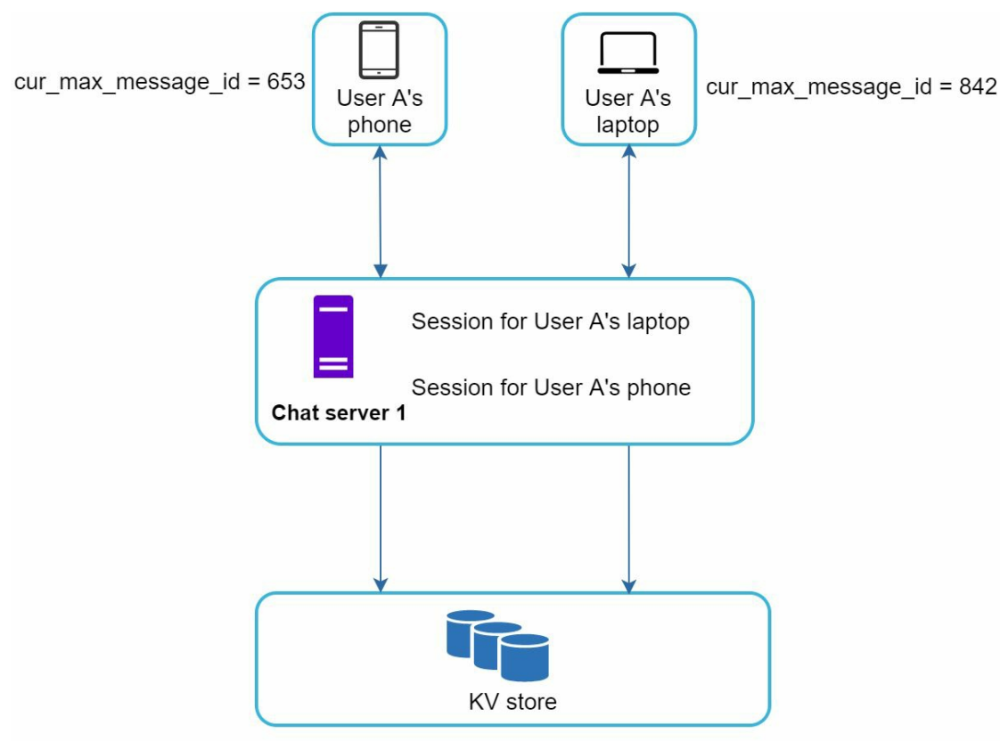

User A have two devices, laptop and phone, when user A logs in to the chat app it establishes a web socket connection with chat server 1. Similarly, there is a connection between the laptop and chat server 1

Each device maintain a variable called `cur_max_message_id`, which keeps the track of the last message that the device has received. Messages that satisfies the following conditions are considered new messages:

- Recipient id is the current logged in user id
- Message id is greater than `cur_max_message_id`

When a new message arrives, the chat server checks if the message is a new message for the current device, if so, the message is sent to the device.

### Small group chat flow

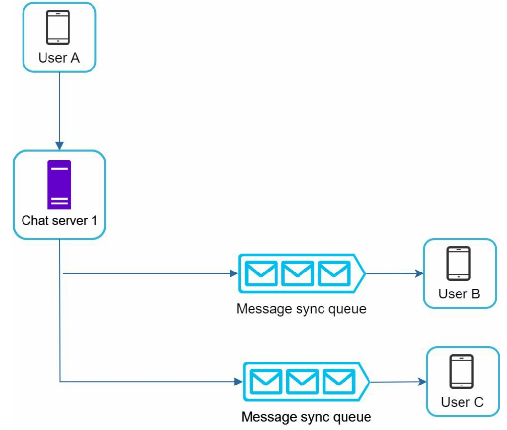

When user A sends a message in a group chat, this message is copired to each group member's message sync queue. Each group member's chat server will forward the message to the group member's device.  You can think of the message sync queue as an inbox for a recipient.

This design is good for small groups because:

- It simplifies message sync flow since each client need to check his inbox only
- When the group is small, copying the message to each group member's inbox is not a big deal

However, this design does not scale well for large groups because storing a copy for each member is expensive. For example, if a group has 1000 members, each message will be copied 1000 times.

On the recipient side, a recipient can receive messages from multiple users. Each recipient has an inbox (message sync queue) which contains messages from different senders.

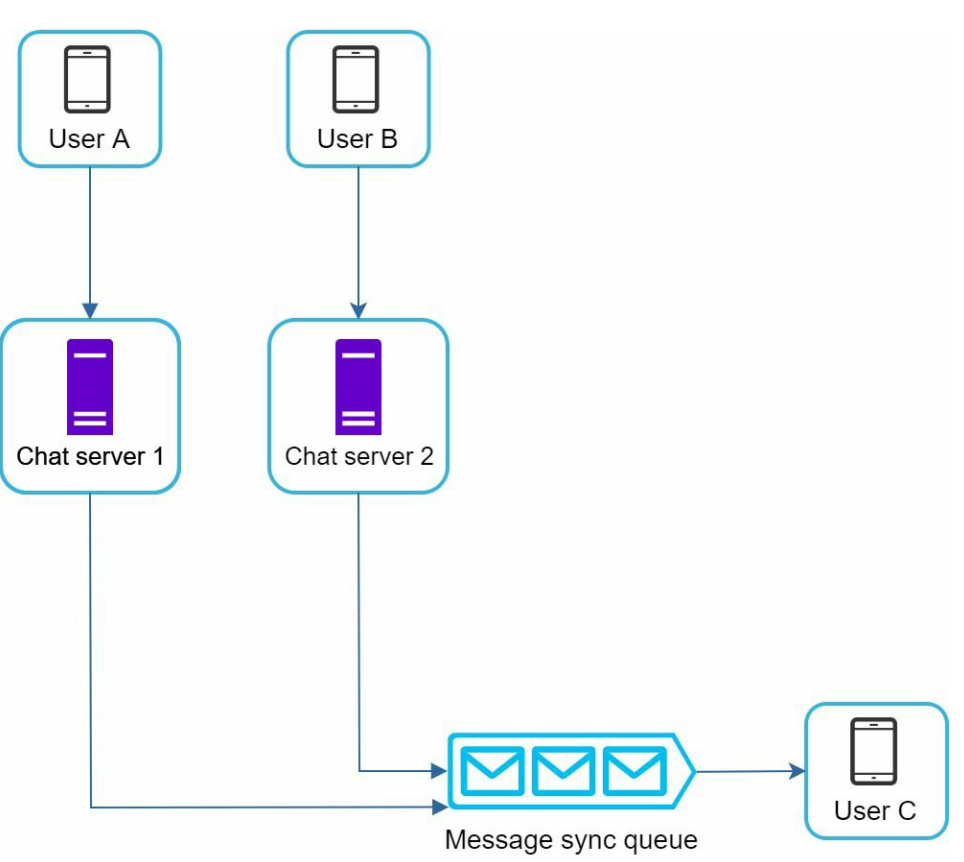

## Online presence

### User login

After logging and a ws connection is established between the client and the chat server, user A's online status and `last_seen_at` timestamp are updated in key value store. Presence indicator shows the user is online after he logs in.

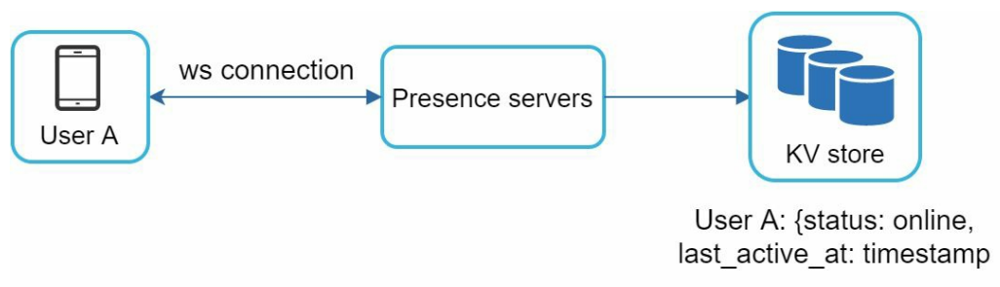

### User logout

When user A logs out, the chat server sends a logout request to the presence server. The presence server updates user A's online status and `last_seen_at` timestamp in key value store. Presence indicator shows the user is offline after he logs out.

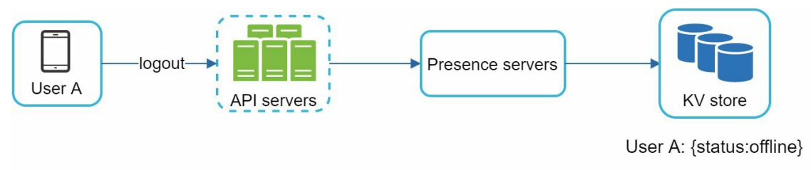

### User disconnection

Not all internet connection are consistent and reliable, the user can lose the connection and reconnect many times in a short period, so changeing the online indication too often introduce poor user experience.

We introduce heartbeat mechanism to solve this problem. The client sends a heartbeat request to the chat server every 5 seconds. If the chat server does not receive a heartbeat request from the client within 30 seconds, the chat server marks the user as offline.

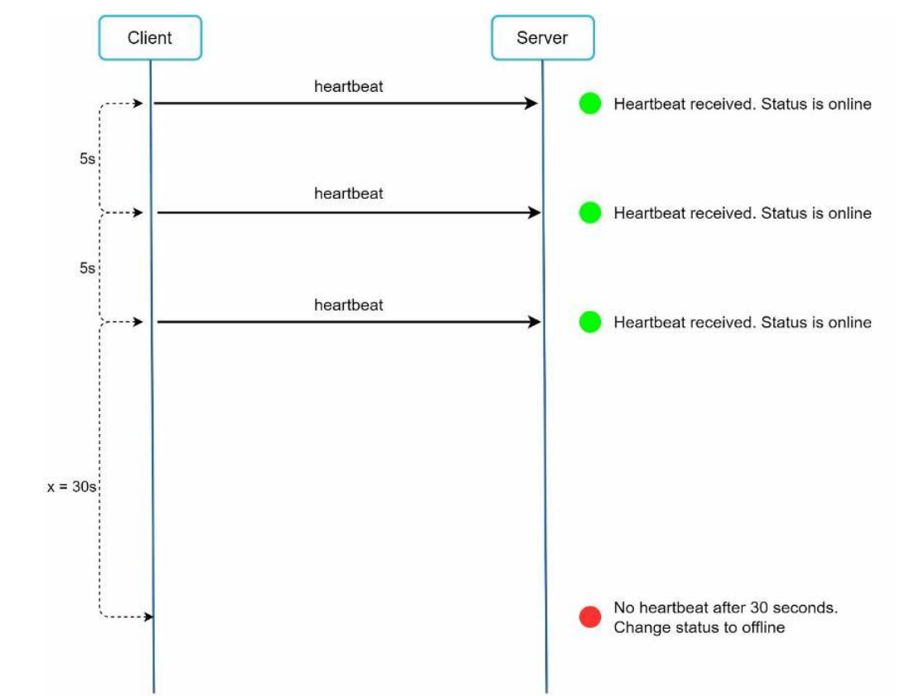

### Online status fanout

Presence servers use a publish-subscribe model, in which each friend pair maintains a channel. When User A's online status changes, it publishes the event to three channels, channel A-B, A-C, and A-D. Those three channels are subscribed by User B, C, and D, respectively. Thus, it is easy for friends to get online status updates. The communication between clients and servers is through real-time WebSocket.

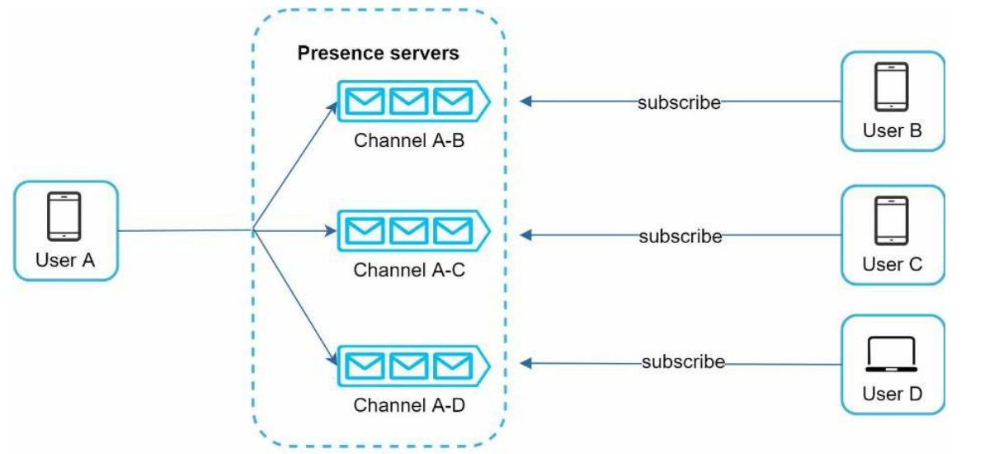

This design is effective for small groups, for larger groups (for example 100000 members)  informing all the 100000 member is expensive and time consuming since we generate and publish 100000 events, to solve this, we can for example fetch the online status only when a user enters a group or manual refresh.

# Step 4 - Wrap up

In this chapter, we designed a chat system that supports 1 on 1 and group chat. We discussed the following topics:

- Service discovery
- Messages flow
- Online presence
- Online status fanout
- Message synchronization across multiple devices
- Small group chat flow
- Message table for 1 on 1 chat
- Message table for group chat
- Message id

and more, if you have enough time in the interview, you can discuss the following topics:

- Support for media content
- End to end encryption
- Caching
- Improve load time
- Error handling
