# Chapter 13 - Design a Search Autocomplete System (Top k most searched queries | like Google)


# Step 1 - Understand the problem and establish design scope

After a discussion between you and your interviewer, here is the requirements:

- Matching is supported at the beginning of the query
- 5 autocomplete suggestions are returned
- System decide what suggestions are returned based on the popularity of the query
- The system doesn't support spelling correction
- English is the only supported language, if time permits, we can add support for other languages
- Assume lower case only
- 10 million DAU
- Fast response time (within 100ms)
- Autocomplete suggestion must be relevant to the query
- Scalable
- Highly available

## Back of the envelope estimation

- Assume 10 million DAU
- An average person performs 10 searches per day
- On average, 20 bytes per query
- On average, 20 requests are send for each query

For example, the following 6 requests are sent when you type `dinner`:

- `search?q=d`
- `search?q=di`
- `search?q=din`
- `search?q=dinn`
- `search?q=dinne`
- `search?q=dinner`

- QPS: 10 million users *10 queries per day* 20 characters per query / 86400 seconds per day = 24000 QPS
- Peak QPS: 2 * QPS = 48000 QPS
- Assume 20% of daily queries are new queries, 10 million users *10 queries per day* 20 bytes * 0.2 = 400 million bytes = 0.4 GB of new data per day

# Step 2 - Propose high-level design and get buy-in

At high level, the system is divided into two services:

- Data gathering service
- Query service

## Data gathering service

Assume that we have a frequency table that stores the quey string and its frequency, in the beginning, the frequency table is empty. Then users enter queries "twitch", "twitter" and "twillo" in order, the frequency table will be updated as follows:

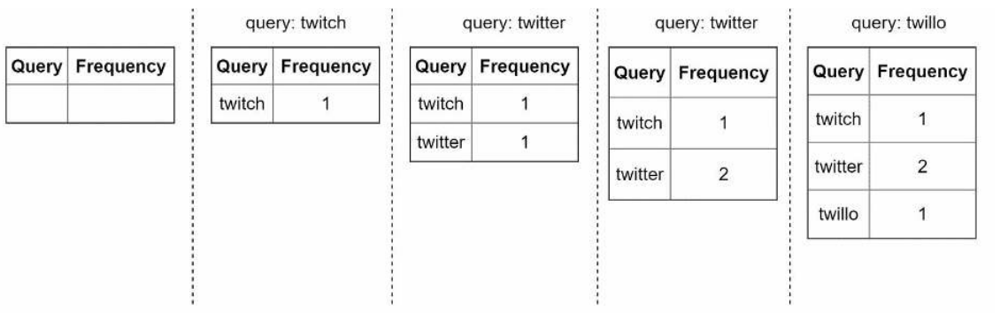

## Query service

Assume the following table, it has two fields, query and frequency.

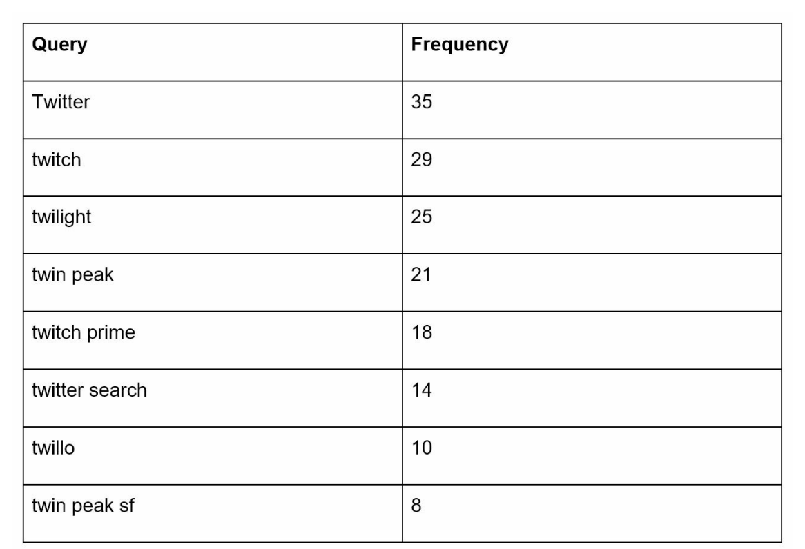

When a user types “tw” in the search box, the following top 5 searched queries are displayed

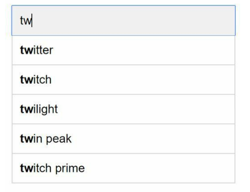

the following sql query is used to retrieve the top 5 searched queries:

```sql
SELECT * FROM frequency_table
WHERE query LIKE 'prefix%'
ORDER BY frequency DESC
LIMIT 5;
```

This is acceptable solution when data set is small, when it is large, accessing the database becomes a bottleneck

# Step 3 - design deep dive

## Trie data structure

Fetching the top 5 search queries from a relational database is inefficient. Therefore we use the trie data structure to store the queries and their frequencies.

- A trie is a tree-like data structure.
- The root represents an empty string.
- Each node represents a character and has 26 children, one for each letter in the alphabet. (To save space, we will not draw empty nodes in the following diagrams.)
- Each tree node represents a single word or a prefix string

The following figures shows a trie with search queries “tree”, “try”, “true”, “toy”, “wish”, “win”. Search queries are highlighted with a thicker border.

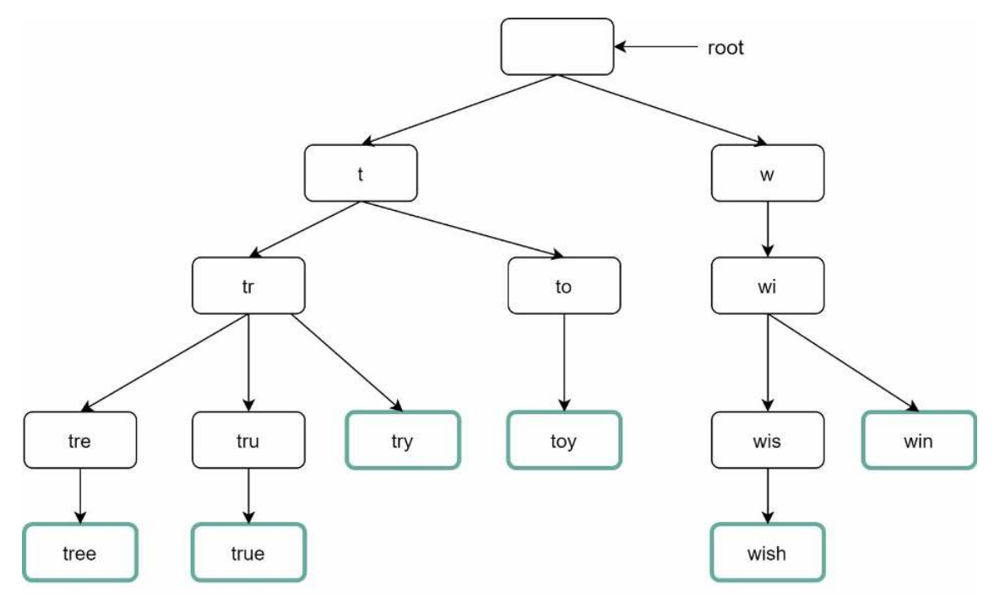

To support sorting by frequency, each node need to include frequency information. The following figure shows a trie with frequency information.

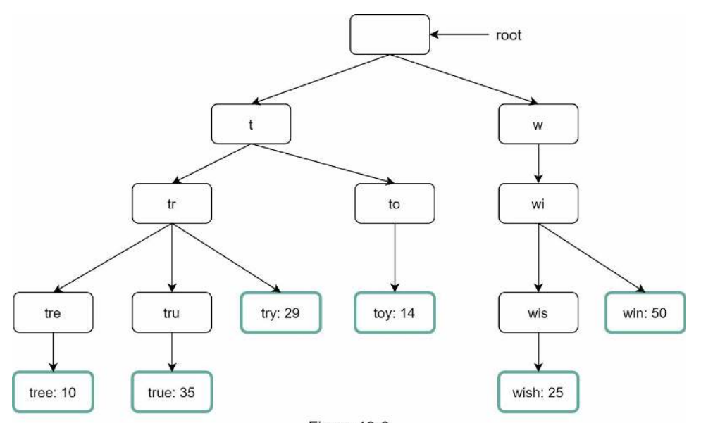

How does autocomplete work with trie? Before diving into the algorithm, let us define some
terms.

- p: length of the prefix string
- n: number of nodes in the trie
- c: number of children of a node

To get the most k searched queries:

1. Find the prefix, time complexity: O(p)
2. Traverse the subtree to get all valid children, time complexity: O(c)
3. Sort the children by frequency, time complexity: O(c log c)

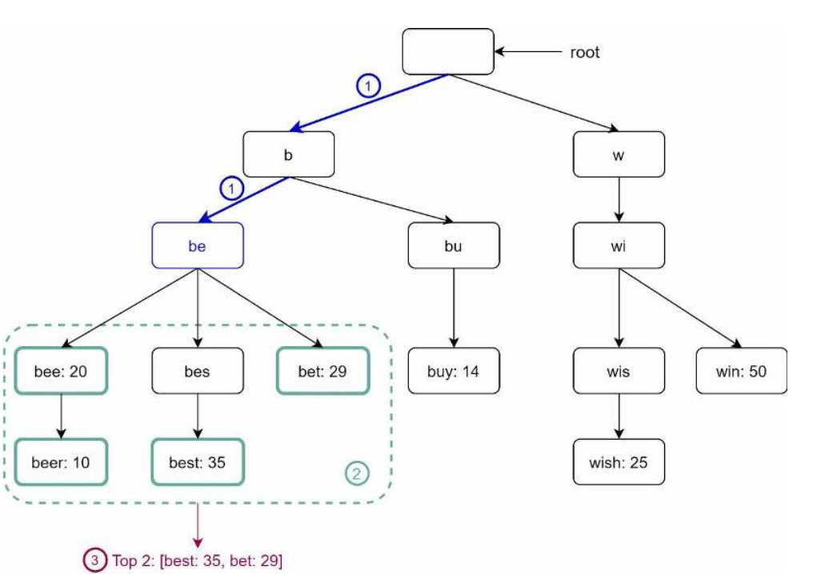

Total time complexity: O(p) + O(c) + O(c log c)

The above algorithm works but is slow because we need to traverse the entire trie to get the top k searched queries. To improve the performance:

- Limit the max length of the prefix string
- Cache top k searched queries at each node

### Limit the max length of the prefix string

Since users rarely type long search queries, we can limit the max length of the prefix string to 50. This will reduce the time complexity to O(50)

### Cache top k searched queries at each node

We can cache top k searched queries at each node. 5 to 10 autocomplete suggestions are enough for users, so we can cache top 10 searched queries at each node. This will reduce the time complexity to O(10)

By caching the top k queries, we significantly reduce the time complexity. However, this design requires a lot of space to store the cached queries. Trading space for time is well worth it as fast response time is very important.

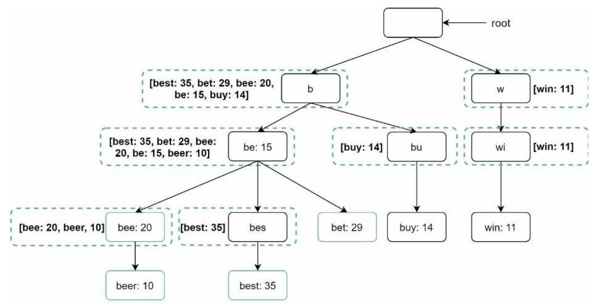

These optimizations reduce the time complexity to O(1)

## Data gathering service

In our previous design, whenever the user enters a query string, data is updated in real time, this is not practical since:

- Users may enter billions of queries per day, updating the trie on every query will slow down the system
- Top suggestion may not be changing frequently, updating the trie on every query is not necessary

> Note that it depends on the use case, real time application like twitter require up to date autocomplete suggestion, for many other services like google, keywords may not change on hourly basis (or may be, it depends)

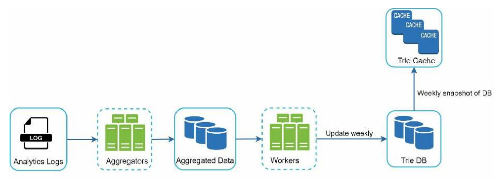

Let's break the data gathering service components:

- **Analytics logs**: Store the raw data of search queries

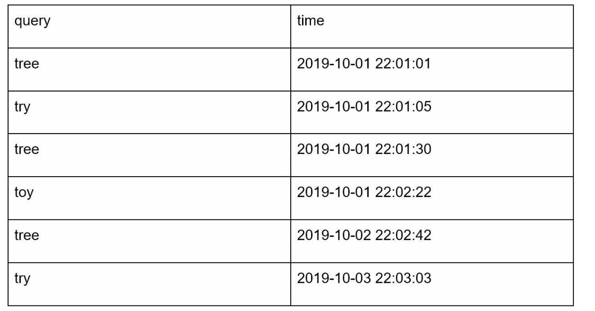

- **Aggregator**: Aggregate (process) the raw data.
- **Aggregated data**:

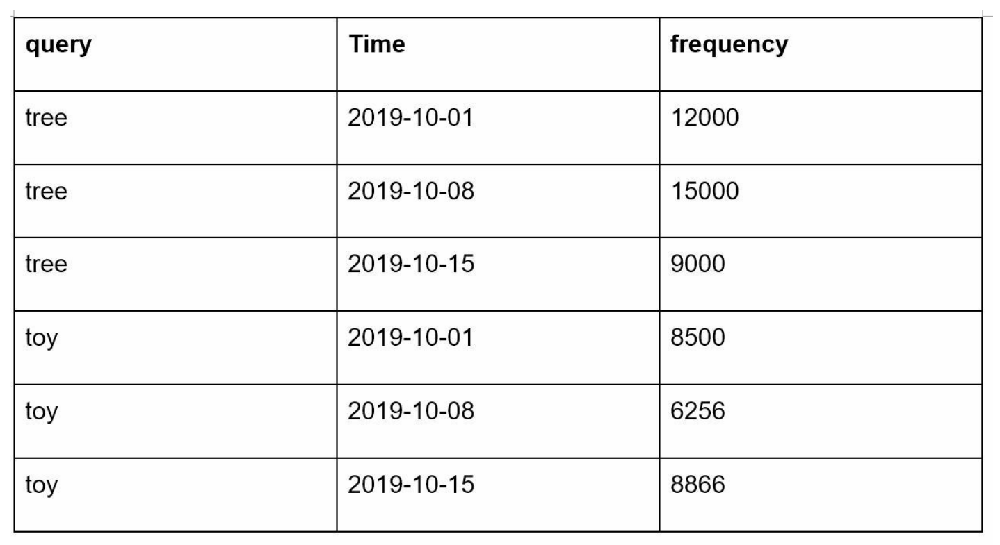

- **Workers**: Workers are set of services that perform asynchronous tasks at regular intervals. They build the trie and store it in the trie DB.
- **Trie cache**: Distributed cache for fast access.
- **Trie DB**: Trie DB is a key-value store that stores the trie data structure. It is a persistent storage.

## Query service

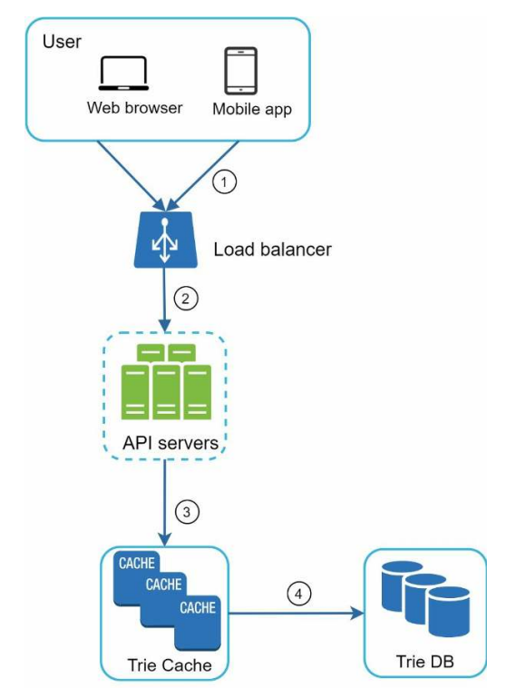

1. Search query is sent to the load balancer
2. The load balancer routes the request to api servers
3. api servers get the trie data from the cache and return the top k searched queries to the client
4. In case data is not in the cache, api servers get the trie data from the trie DB, store it in the cache and return the top k searched queries to the client

For further optimizations:

- Use ajax requests in the client side, no refresh is required
- Data sampling, instead of logging each query, we can log each one out of 10 queries
- Use browser cache to store autocomplete suggestions

The following figure shows the response header when you type “system design interview” on the Google search engine. As you can see, Google caches the results in the browser for 1 hour.

Please note: `“private”` in cache-control means results are intended for a single user and must not be cached by a shared cache. `“max-age=3600”` means the cache is valid for 3600 seconds, aka,and 1 hour.

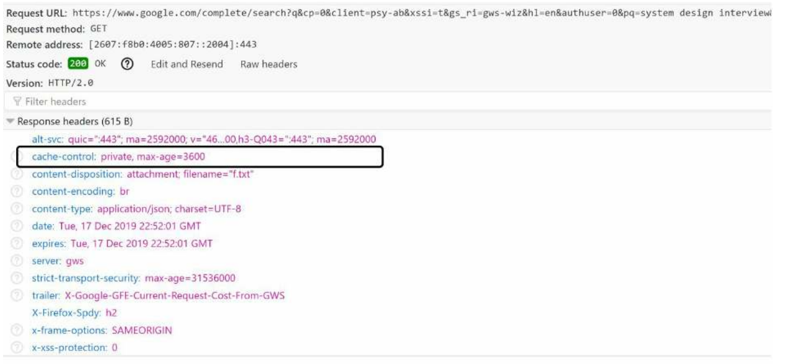

## Filter layer

We need to add filter layer between the cache and the api servers to filter out hateful, violent and sexual content


## Scale the storage

A naive way is to shard the database based on the first letter of the query string, for example

- If we need two servers, we can shard the database based on the first letter of the query string, one server stores queries that start with letters from a to m, the other server stores queries that start with letters from n to z
- If we need three servers, we can shard the database based on the first letter of the query string, one server stores queries that start with letters from a to i, the second server stores queries that start with letters from j to r, the third server stores queries that start with letters from s to z
- To store data in more than 26 servers, we can shard the database based on the first two letters of the query string, for example, one server stores queries that start with letters from aa to ag, the second server stores queries that start with letters from ah to az, the third server stores queries that start with letters from ba to bj, etc

Note that data in this approach are not evenly distributed, for example, there are more queries that start with letter “a” than queries that start with letter “z”. To solve this problem, we can analyze the historical data distribution to apply smarter sharding logic, for example, we can maintain two shards, one for the letter “s” and one for the letters from “u” to “z”.

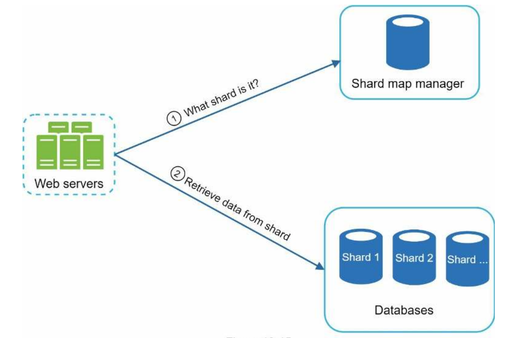

# Step 4 - wrap up

In this chapter, we learned how to design a search autocomplete system. We started with a naive solution and then improved it step by step. We learned how to use the trie data structure to store the queries and their frequencies. We learned how to use the cache to improve the performance. We learned how to shard the database to scale the storage.

If the time permits, wou and your interviewer can discuss the following topics:

- How to support multiple languages? Store unicode characters in the trie.
- What if suggestion for one country differs from suggestion for another country? Build different tries for different countries to reduce response time, store each in a different cdns
