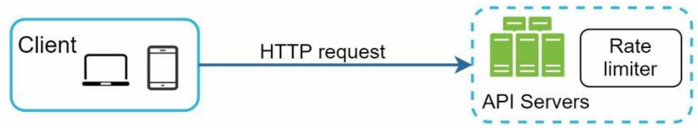
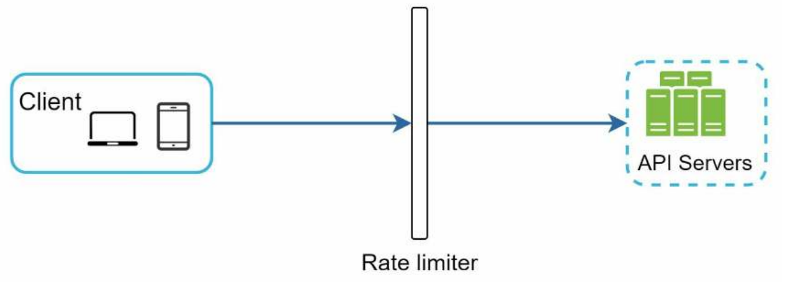
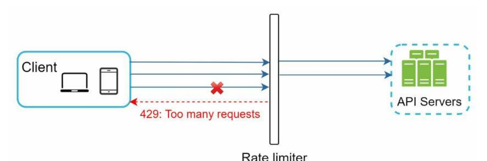
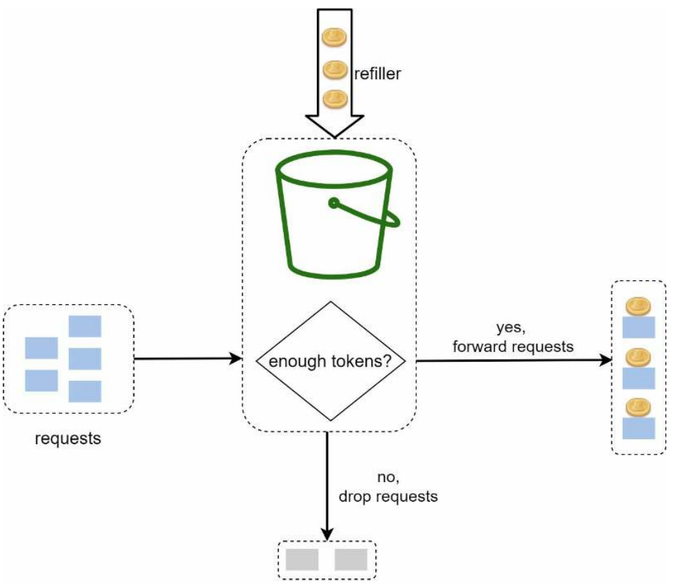
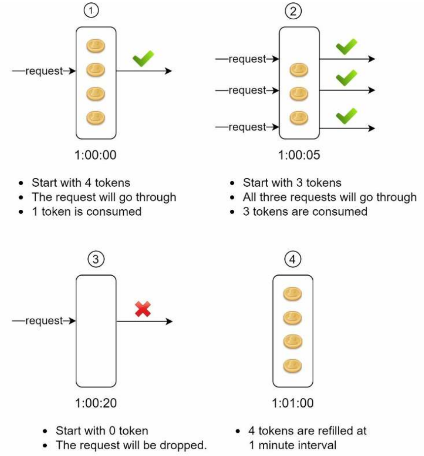
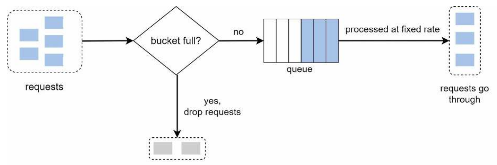
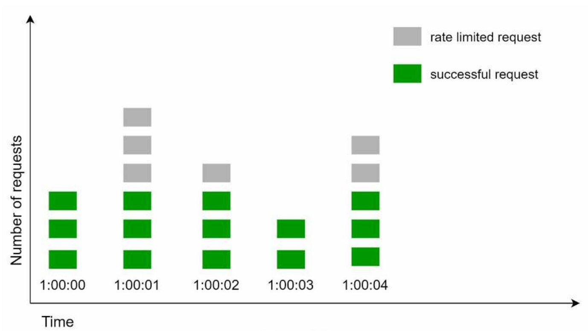
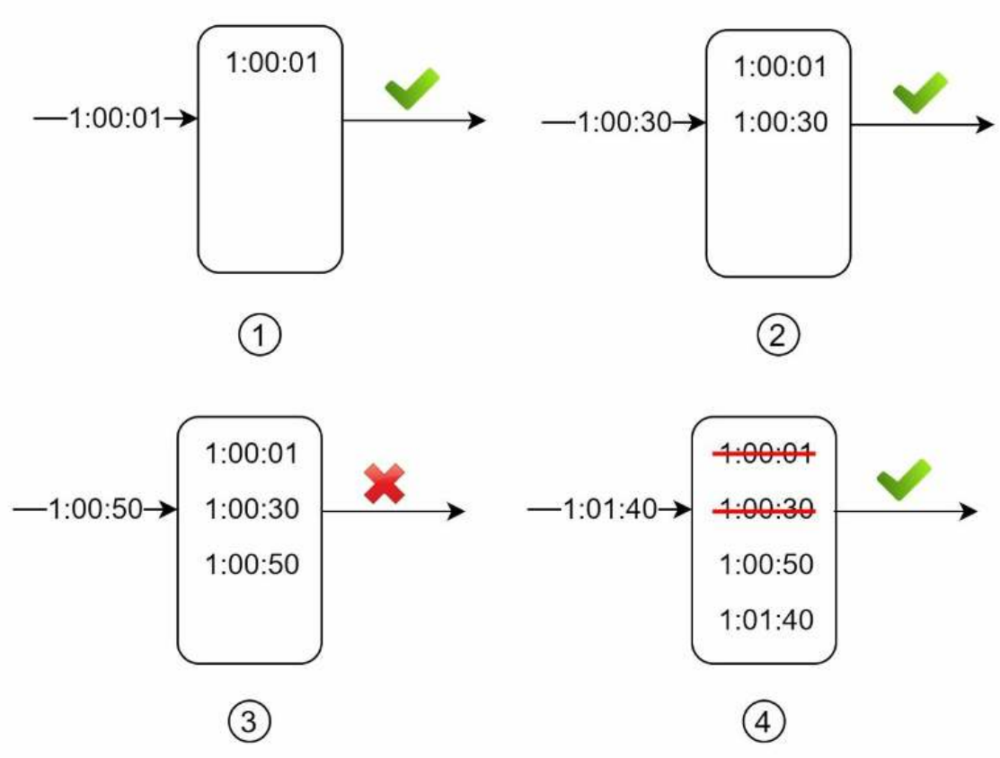
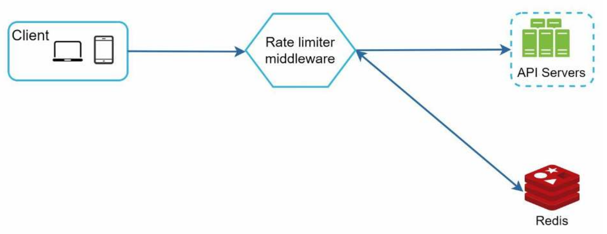
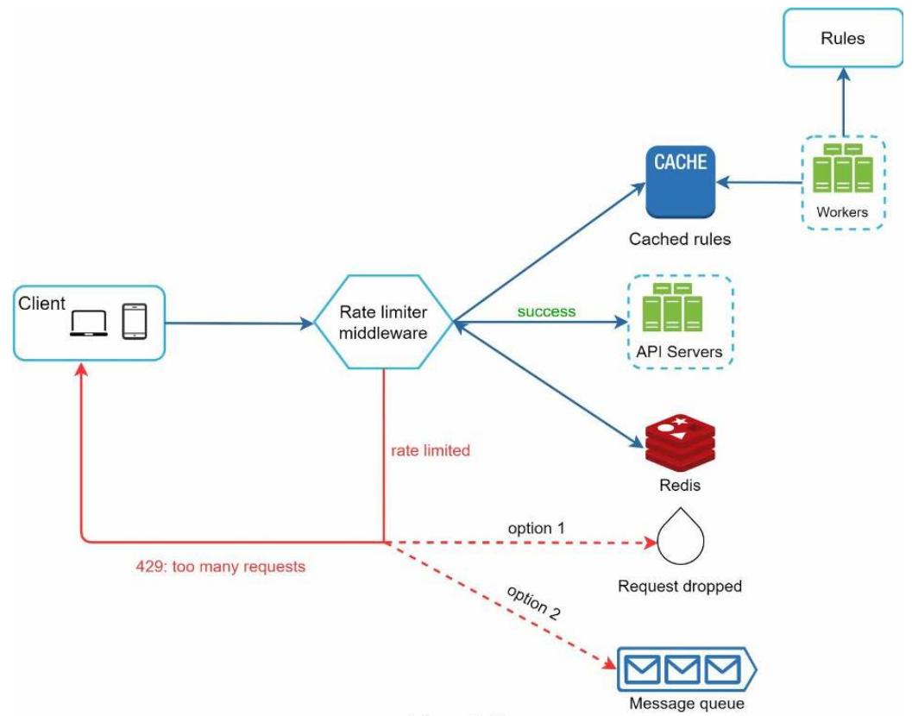

# Chapter 4 - Design a Rate Limiter

A rate limiter limits the number of client requests allowed to be sent to a server in a particular amount of time. Here are a few examples:

- A user can write a maximum of 20 posts per hour.
- A user can send a maximum of 5 friend requests per day.
- You can create a maximum of 10 accounts per day from the same IP address.

Before starting the design, let's discuss the benefits of rate limiting:

- **Prevent resource starvation cause by Denial Service (DoS) attacks**: A DoS attack is an attempt to make a system unavailable to its intended users. Attackers can send a large number of requests to a server, and the server will be overwhelmed and unable to respond to legitimate requests. Rate limiting can prevent this attacks, either intentional or unintentional, by limiting the number of requests from each client.
- **Reduce costs**: Limiting excess requests means fewer servers and allocating more resources to high priority APIs. This is extremely useful in cases you pay a third party services.
- **Prevent servers from being overloaded**

# Step 1 - Understand the problem and establish design scope

Rate limiting can be implemented using different algorithms, each with its pros and cons. The
interactions between an interviewer and a candidate help to clarify the type of rate limiters we
are trying to build.

Candidate: What kind of rate limiter are we going to design? Is it a client-side rate limiter or server-side API rate limiter?

Interviewer: Great question. We focus on the server-side API rate limiter.

Candidate: Does the rate limiter throttle API requests based on IP, the user ID, or other properties?

Interviewer: The rate limiter should be flexible enough to support different sets of throttle rules.

Candidate: What is the scale of the system? Is it built for a startup or a big company with a large user base?

Interviewer: The system must be able to handle a large number of requests.

Candidate: Will the system work in a distributed environment?

Interviewer: Yes.

Candidate: Is the rate limiter a separate service or should it be implemented in application code?

Interviewer: It is a design decision up to you.

Candidate: Do we need to inform users who are throttled?

Interviewer: Yes.

**Requirements**

Here is a summary of the requirements for the system:

- Accurately limit excessive requests.
- Low latency. The rate limiter should not slow down HTTP response time.
- Use as little memory as possible.
- Distributed rate limiting. The rate limiter can be shared across multiple servers or
processes.
- Exception handling. Show clear exceptions to users when their requests are throttled.
- High fault tolerance. If there are any problems with the rate limiter (for example, a cache
server goes offline), it does not affect the entire system.

# Step 2 - Propose high-level design and get buy-in

**Where to pu the rate limiter?**

- Client side : client is unreliable, can be easily bypassed and we may not have control over the client side implementation.
- Server side :

Beside the client side and server side implementation, there are an alternative way, instead of putting the rate limiter in the api servers, we can create a rate limiter middleware, which is a separate service that sits between the client and the server.

Example: the following figure represents a system in which the api allows 2 requests per second, and a client sends 3 requests per second. The rate limiter middleware will throttle the third request and return a `429 Too Many Requests` error to the client.

Cloud microservices have become widely popular and rate limiting is usually implemented with a component called an API gateway. An API gateway is a fully managed service that supports rate limiting, SSL termination, authentication, IP whitelisting, servicing static content, etc. For now, we only need to know that the API gateway is a middleware that supports rate limiting.

So, where should the rater limiter be implemented, on the server-side or in a gateway? There are no absolute answer. on your company’s current technology stack, engineering resources, priorities, goals, etc. Here are a few general guidelines:

- Evaluate your current stack, such as programming language, database, etc. Make sure that your programming language is efficient to implement a rate limiter on the server side.
- Identify the rate limiting algorithm that fits your needs, you have a full control on the algorithm if you implemented it on the server side, if you used a third party middleware, your choice are limited
- Building your own rate limiter takes time and resources. If you have a tight deadline or not the enough resources, consider using a third party middleware.

# Algorithms for rate limiting

Here are a list of popular algorithms for rate limiting:

- Token bucket
- Leaking bucket
- Fixed window counter
- Sliding window log

## Token bucket

The token bucket algorithm is one of the most popular rate limiting algorithms. It is used in network traffic shaping and controlling the bandwidth. The token bucket algorithm is based on an analogy of a fixed capacity bucket into which tokens, which represent a unit of bytes or a single request, are added at a fixed rate. When a packet arrives, it is checked whether there are enough tokens in the bucket. If there are enough tokens, the packet is forwarded and the number of tokens is reduced by one. If there are not enough tokens, the packet is considered to be non-conformant and is dropped.

The token bucket algorithm takes two parameters:

- **Bucket size**: The maximum number of tokens that the bucket can hold. The bucket is initialized with capacity tokens.
- **Refill rate**: The rate at which the bucket is refilled with new tokens.

How many buckets do we need? This varies, and it depends on the rate-limiting rules. Here are a few examples.

- If we want to limit the number of requests per api endpoint, we need one bucket per endpoint.
- If we want to limit the number of requests per user, we need one bucket per user.
- If we want to limit the number of requests per IP address, we need one bucket per IP address.
- If we want to limit the number of requests per application, we need one global bucket for all requests.

**Pros**

- Simple and easy to implement.
- Memory efficient.
- Allows burst of requests for short periods of time.

**Cons**:

- The bucket size and refill rate must be carefully chosen. It can be challenging to find the right values.

## Leaking bucket

The leaking bucket algorithm is similar to the token bucket algorithm. The main difference is that requests in leaking bucket algorithm are processed at a fixed rate. It is usually implemented with a FIFO queue. The algorithms works as follows:

- When a request arrives, the system checks if the queue is not full, the request is added to the queue.
- Otherwise, the request is dropped.
- At a fixed rate, the system processes the requests in the queue.

Leaking bucket algorithm takes the following two parameters:

- **Bucket size**: The queue size, which is the maximum number of requests that the queue can hold.
- **Outflow rate**: The rate at which the queue is processed.

**Pros**

- Memory efficient.
- Requests are processed at a fixed rate. This is suitable for cases where stable outflow rate is needed

**Cons**

- The bucket size and outflow rate must be carefully chosen. It can be challenging to find the right values.

## Fixed size window counter

The fixed size window counter algorithm is a simple algorithm that divides time into fixed size windows and counts the number of requests in each window. The algorithm works as follows:

- The algorithm divides the timeline into fixed size windows and assign a counter to each window.
- When a request arrives, the system checks if the counter for the current window is less than the maximum number of requests allowed per window. If so, the request is processed and the counter is incremented by one.
- Otherwise, the request is dropped until the next window starts.

The following figure illustrate an example in which the time unit is 1 second and the system allows a maximum of 3 requests per second. In each second window, if more than 3 requests are received, extra requests are dropped.

A major problem with this algorithm is that a burst of traffic at the edges of time windows could cause more requests than allowed quota to go through.

**Pros**

- Memory efficient.
- Easy to understand and implement.
- Resetting the available quota at the end of a unit time fits certain use cases.

**Cons**

- Spike in traffic at the edges of time windows could cause more requests than allowed quota to go through.

## Sliding window log

The sliding window log algorithm is an improvement over the fixed size window counter algorithm. Instead of dividing time into fixed size windows, the sliding window log algorithm uses a sliding window to track the number of requests in the last n seconds. The algorithm works as follows:

- The algorithm uses a sliding window to track the number of requests in the last n seconds.
- When a request arrives, the system checks if the number of requests in the last n seconds is less than the maximum number of requests allowed per n seconds. If so, the request is processed and the counter is incremented by one.
- Otherwise, the request is dropped.

**Pros**

- Is very accurate. In any rolling window, requests are limited to a fixed number.

**Cons**

- Consumes a lot of memory, even if a request is rejected, it's timestamp must me stored

# High level architecture

To design a rate limiter, we need a counter. But where to store the counter to make it accessible to all servers? There are two options:

- **Database**: The counter is stored in a database. This is a simple solution, but it is not efficient because the slowness of the database can affect the performance of the entire system.
- **Im memory cache**: The counter is stored in an in-memory cache. This is a more efficient solution, Redis is popular choice for this use case. It is an in-memory store that offer two commands: `INCR` and `EXPIRE`. The `INCR` command increments the counter by one and the `EXPIRE` command sets a time-to-live (TTL) for the counter. After this time, the counter is automatically deleted.

# Step 3 - Design deep dive

## Rate limiter rules

The rate limiter should be flexible enough to support different sets of throttle rules. Here are a few examples:

- Limit maximum of 1000 message per user per hour.
- Limit maximum of 5 login attempts per user per day.

## Exceeding the rate limiter

What should happen when a user exceeds the rate limiter? There are two options:

- **Block**: The user is blocked from sending more requests until the next time window.
- **Queue**: The user is allowed to send requests, but they are queued and processed after the current time window.
- **Ignore**: The user is allowed to send requests, but they are ignored. For example, the user can send a maximum of 1 request per second, and the rest of the requests are ignored.

## Rate limiter headers

How does the client know that the request is throttled or the number of remaining requests? The rate limiter should return a `429 Too Many Requests` error to the client. The client can use the some headers to get more information about the rate limiter:

- `X-RateLimit-Limit`: The maximum number of requests allowed per time window.
- `X-RateLimit-Remaining`: The number of remaining requests in the current time window.
- `X-RateLimit-Retry-After`: The number of seconds until the next time window.

## Detailed design

- Rules are stored on the disk, workers periodically load the rules from the disk and update the in-memory cache.
- When a client sends a request, the request sends it to the api limiter middleware.
- Rate limiter middleware load the rules from the cache and fetches the counter and the last request timestamp from Redis.
  - if the request is allowed, it is forwarded to the api servers.
  - Otherwise, the middleware returns a `429 Too Many Requests` error to the client. The request is either dropped or queued, depending on the rules.

## Rate limiter in a distributed environment

Building a rate limiter in a single environment is easy. But what if we have multiple servers? How do we make sure that the rate limiter is consistent across all servers? There are two challenges:

- Race condition: Two requests arrive at the same time, and they both increment the counter. This can cause the counter to be incremented more than the allowed quota. Locks are a common solution to this problem, but they are not efficient because it slows down the system.
- Synchronization: The rate limiter must be consistent across all servers. If a request is throttled on one server, it should be throttled on all servers.

# Step 4 - Wrap up

In this final step, the interviewer might ask you a few follow-up questions or give you the freedom to discuss other additional points. Here are a few directions to follow:

- Hard and soft limits.
- Rate limiting at different layers. In this chapter we discussed it at the application layer (HTTP layer 7). It is possible to implement rate limiting at other layers, such as the transport layer (TCP layer 4) or the network layer (IP layer 3).

> HTTP layers :
>
> - Layer 1: Physical layer
> - Layer 2: Data link layer
> - Layer 3: Network layer
> - Layer 4: Transport layer
> - Layer 5: Session layer
> - Layer 6: Presentation layer
> - Layer 7: Application layer

- Avoid being rate limited, design you client with best practices in mind, such as caching, batching, avoid sending too may requests, etc.
