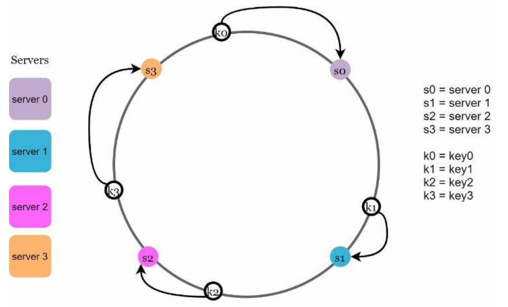
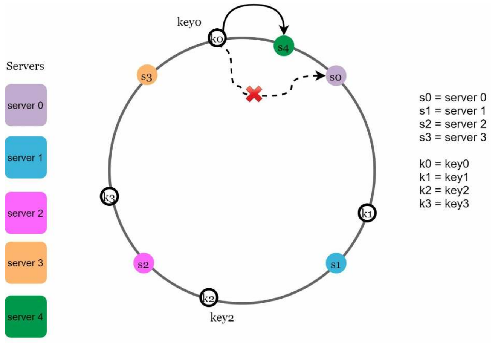
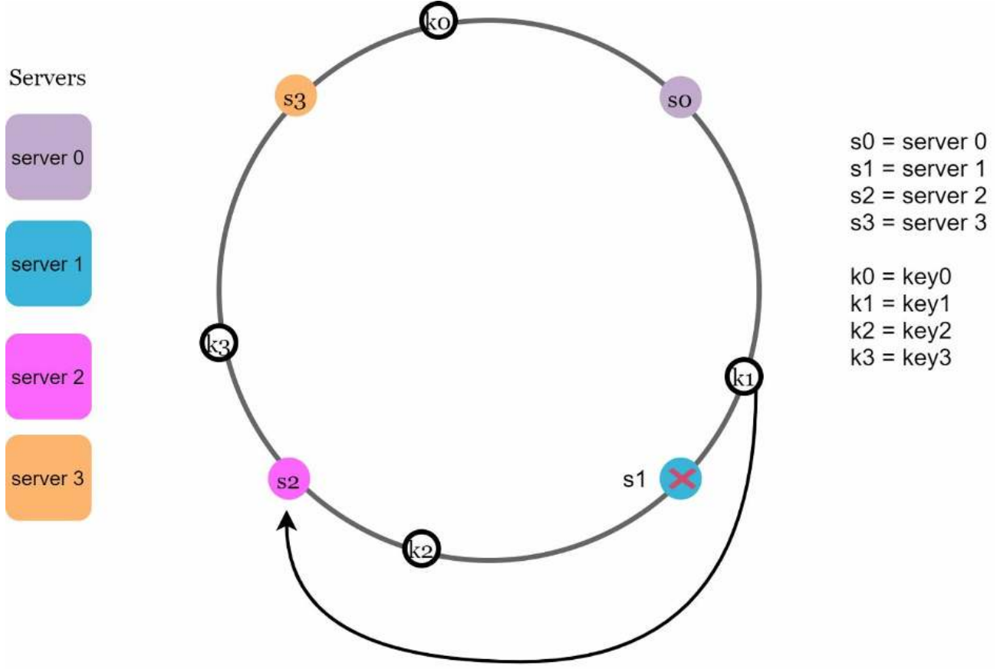
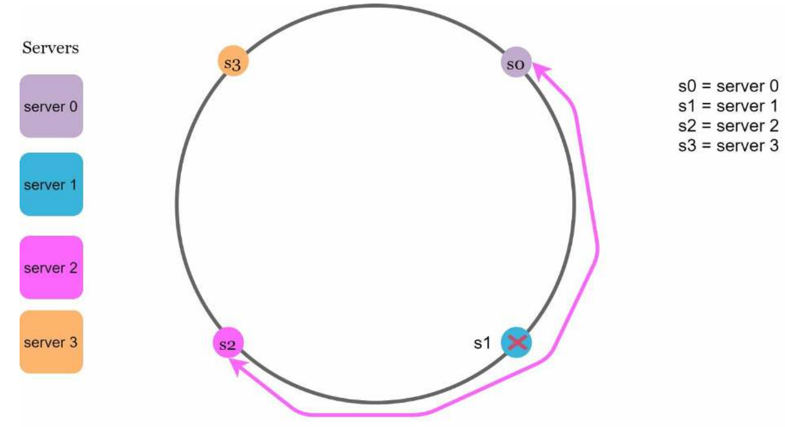
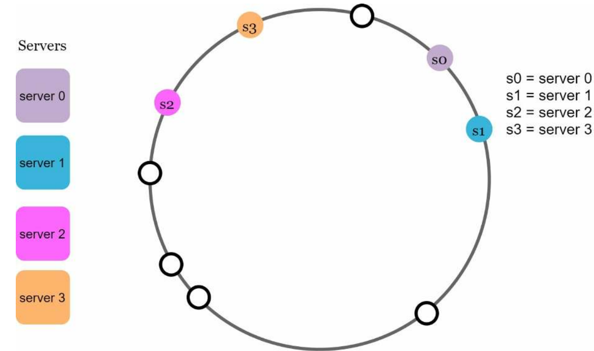
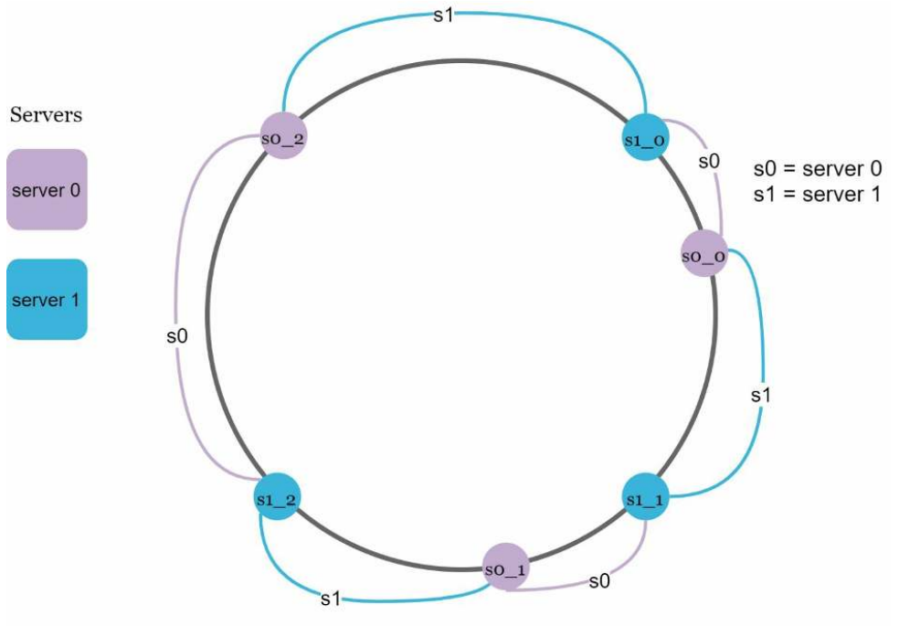
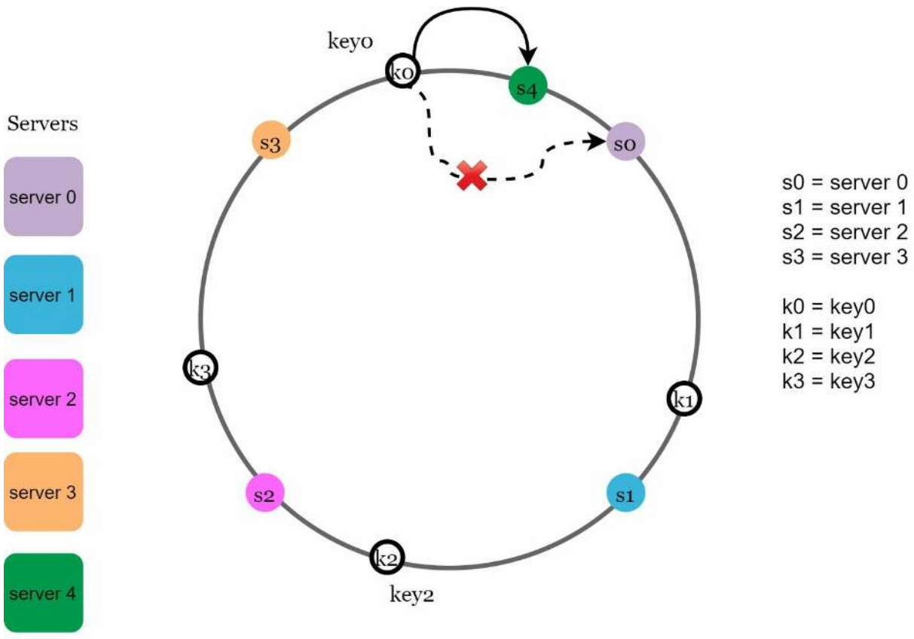
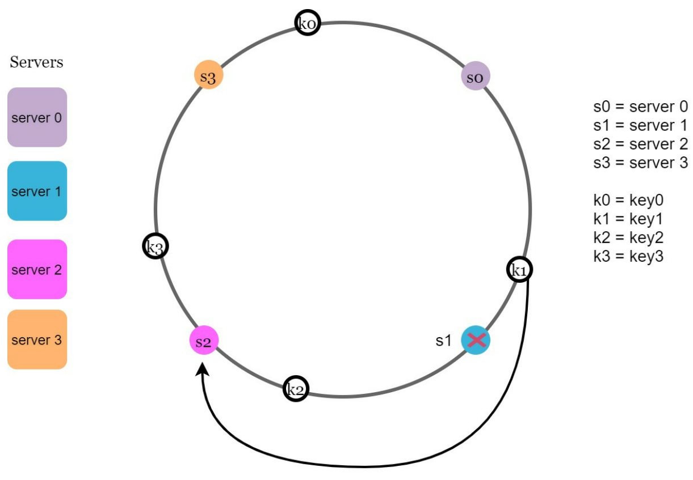

# Chapter 5 - Design consistent hashing

To achieve horizontal scaling, it is important to distribute requests/data efficiently and evenly across servers. Consistent hashing is a commonly used technique to achieve this goal.

# The rehashing problem

If you have $n$ cache servers, a common way to balance the load is to use the following hash function:

$$
\text{server index} = \text{hash(key)} \% n
$$

For example, if you have 3 servers and the id of a key 489613, the server index is 489613 % 3 = 1. This means that the key 489613 will be stored on server 1 (the second server).

This approach works well when the size of server pool is fixed and the data is evenly distributed. However, it has a few drawbacks, for example : When new servers are added or removed, most of the keys will be remapped to different servers. This is called the rehashing problem.

Consistent hashing is a technique that solves the rehashing problem.

# Consistent hashing

Imagine you have a bunch of data that you want to store or distribute across several computers, like servers in a network. You want to make sure that the data is spread out evenly and that if a computer goes down or a new one joins, you don't have to move all the data around, which can be really inefficient and slow.

Consistent hashing is a smart way to do this. Instead of trying to remember which computer should store which data, you use a special algorithm to map the data and the computers to points on a circle. Each computer is represented by a point on the circle, and each piece of data is also mapped to a point on the same circle.

When you want to find where to store or retrieve data, you find its position on the circle, and then you look for the nearest computer in a clockwise direction. This means you don't have to remember a huge list of which data is on which computer; you just find the nearest one on the circle.

This is called "consistent" hashing because it's pretty stable even if you add or remove computers. The circle helps ensure that most of the data stays where it was before, and only a small portion needs to be moved to accommodate changes. This makes it efficient and easy to manage a distributed system, like a network of servers.

# Server lookup

To determine which server a key should be stored on, we go clockwise from the key position on the ring until a server is found.

## Adding a server

When a new server is added, only a small portion of keys need to be remapped to the new server. In the following figure, after adding server 4, only key 0 need to be redistributed. Before server 4 is added, key 0 is stored on server 0. Now, key 0 will be stored on server 4 because server 4 is the first server it encounters by going clockwise from key 0’s position on the ring.

## Removing a server

When a server is removed, only a small portion of keys need to be remapped to the remaining servers. In the following figure, after removing server 1, only key 1 need to be redistributed. Before server 1 is removed, key 1 is stored on server 1. Now, key 1 will be stored on server 2 because server 2 is the first server it encounters by going clockwise from key 1’s position on the ring.

# Two issues in the basic approach

Two problems are identified with this approach:

- It is impossible to keep the same size of partitions on the ring for all servers considering a server can be added or removed

- It is possible to have non-uniform distribution of keys on the ring. For example, in the following figure, most of the keys are stored on server 2. However, server 1 and server 3 have no data.

To solve these problems, we use a technique called virtual nodes.

# Virtual nodes

To solve the two problems mentioned above, we use virtual nodes. Instead of mapping each server to a single point on the ring, we map each server to multiple points on the ring. Each point is called a virtual node (which refers to a real node). The more virtual nodes a server has, the more space it occupies on the ring. This solves the first problem because when a server is added or removed, only a small portion of keys need to be remapped to the new server. This also solves the second problem because the more virtual nodes a server has, the more evenly distributed the keys are on the ring.

As the number of virtual nodes increases, the distribution of keys becomes more balanced.

# Find affected keys

When a server is added or removed, a fraction of data needs to be redistributed. How can we
find the affected range to redistribute the keys?

In the following figure, server 4 is added onto the ring. The affected range starts from s4 (newly added node) and moves anticlockwise around the ring until a server is found (s3). Thus, keys located between s3 and s4 need to be redistributed to s4.

In the following figure, server (s1) is removed, the affected range starts from s1 (removed node) and moves anticlockwise around the ring until a server is found (s0). Thus, keys located between s0 and s1 must be redistributed to s2.

# Wrap up

In this chapter, we learned about consistent hashing and how it solves the rehashing problem. We also learned about virtual nodes and how they help to balance the load. Finally, we learned how to find the affected range when a server is added or removed. The benefits of consistent hashing are:

- Minimum number of keys need to be redistributed when a server is added or removed.
- It is easy to scale horizontally because data are more evenly distributed.
- Mitigate hotspot key problem. Excessive access to a specific shard could cause server overload.
