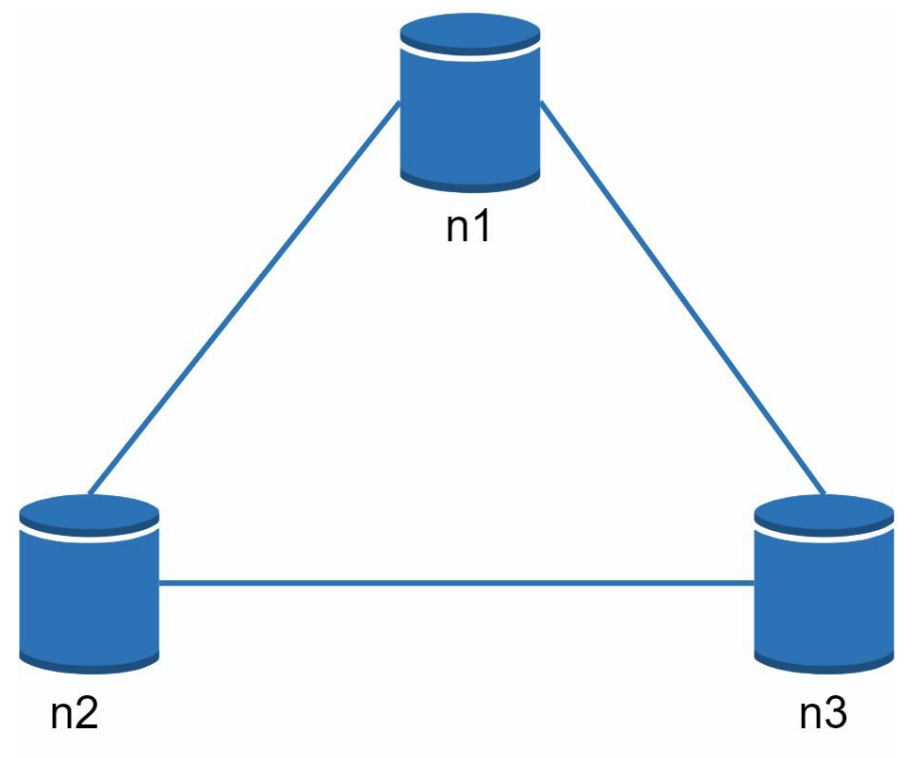

# Chapter 6 - Design a key value store

A key value store is a key value database, it is not a relational database. Each unique identifier is stored as a key with its associated value.

I a key value database, the key must be unique, and the value can be anything. The value can be accessed by the key.

Keys can be plain text or hashed values, for performance reasons, a short key works better than a long key.

In this chapter, we will design a key value store that supports the following operations:

- `put(key, value)`
- `get(key)`

# Understand the problem and establish design scope

In this chapter, we design a key value store with the following requirements:

- The size of the key value pair is small (less than 10 kb)
- Ability to store big data
- High availability: The system responds quickly to requests, even during failures
- High scalability: The system can handle a large amount of data and traffic
- Automatic scaling: The system can scale up and down automatically based on the traffic
- Tunable consistency: The system can trade off consistency for availability and partition tolerance
- Low latency: The system can respond to requests quickly

# Single server key value store

Developing a key value store in a single server is easy, an intuitive approach is to store key value pair in a hash table and keep every thing in memory.

Even if the memory is fast, it is limited, and it is not durable. If the server crashes, the data is lost, fitting everything in memory is not a good idea.

Two optimizations can be made to the single server key value store:

- Data compression: Compress the data before storing it in memory
- Store only frequently accessed data in memory, and store the rest in disk

Even after this optimization , a single server can reach its capacity limit quickly. This introduces the need for a distributed key value store.

# Distributed key value store

A distributed key value store is a key value store that runs on multiple servers. It is a distributed system, when designing a distributed system, we need to understand the CAP (**C**onsistency, **A**vailability, **P**artition tolerance) theorem.  

## CAP theorem

The CAP theorem states that a distributed system can only have two of the following three properties:

- Consistency: All clients see the same data at the same time no matter which server they connect to
- Availability: Every request gets a response even if a server fails
- Partition tolerance: The system continues to operate despite arbitrary message loss,  failure of part of the system or network partitions.

> A network partition, in the context of computer networks and distributed systems, refers to a situation where a network becomes divided or segmented, preventing some or all of its components from communicating with each other. This can occur for various reasons, such as hardware failures, software glitches, or network congestion. When a network partition occurs, it can have significant implications for the operation and reliability of distributed systems, and it can lead to a variety of challenges.

Nowadays, key-value stores are classified based on the two CAP characteristics they support:

- CP: Consistent and partition tolerant while sacrificing availability
- AP: Available and partition tolerant while sacrificing consistency
- CA: Consistent and available while sacrificing partition tolerance

Let's take a look at the following example, In distributed systems, data is usually replicated multiple times. Assume data are replicated on three replica nodes, n1, n2 and n3 as shown in the following figure.

In real world distributed systems, the network is not reliable, network partitions can happen. Assume a network partition happens, we must choose between consistency and availability, in the following figure, n3 goes down and can't comminate with n1 and n2. If clients write data to n1 or n2, data cannot be propagated to n3. If data is written to n3 but not propagated to n1 and n2 yet, n1 and n2 would have stale data.

If we choose consistency over availability, we must block all write operations until the network partition is resolved to avoid data inconsistency. Bank systems usually choose consistency over availability as they have extremely high consistency requirements. For example, it is crucial for a bank system to display the most up-to-date balance info. If inconsistency occurs due to a network partition, the bank system returns an error before the inconsistency is resolved.

However, if we choose availability over consistency, we can still serve read requests even if the network partition is not resolved. In this case, we can return stale data to clients. For example, a social media system can return stale data to clients if a network partition occurs. The social media system can still serve read requests even if the network partition is not resolved. For writes, n1 and n2 will accept writes and propagate the writes to n3 when the network partition is resolved.

# System components

A distributed key value store we are designing consists of the following components:

- Data partition
- Data replication
- Consistency
- Inconsistency resolution
- Handling failures
- System architecture diagram
- Write path
- Read path

# Data partitions

For large application, fitting the dataset in one server is not possible, we need to partition the data and store it in multiple servers. Data partitioning is the process of splitting a large dataset into multiple smaller datasets. Each smaller dataset is stored in a separate server.

There are two challenges while partitioning data:

- Distribute the data *evenly* across servers
- Minimize the data movement when a server is added or removed

Consistent hashing discussed in chapter 5 is a good solution for data partitioning.

# Data replications

Data replication is the process of storing the same data in multiple servers. Data replication is used to improve the availability of the system. If a server fails, the data can still be accessed from other servers.

For example, in the following figure

If there are number of servers, after a key is mapped to a position on the hash ring, walk clockwise from that position and choose the first N servers on the ring to store data copies. If (N = 3), key0 is replicated at s1, s2, and s3.

> Nodes in the same data centers cam fail in the same time due to power outages, network failures, etc. To improve the availability of the system, we should replicate data across nodes on distinct data centers.

# Consistency

Since data is replicated at multiple nodes, it must be synchronized across replicas. Let's establish the following definitions:

N = Number of replicas
W = Write quorum of size W, For a write operation to be successful, the write must be written to at least W replicas
R = Read quorum of size R, For a read operation to be successful, the read must be read from at least R replicas

Consider the following example with N = 3:

W = 1 doesn't mean that the data is written to one server, it means that the coordinator must receives at least on acknowledgement from one server to consider the write operation successful. In the above example, if W = 1, the write operation is successful if the coordinator receives an acknowledgement from s1, s2 or s3. If W = 2, the write operation is successful if the coordinator receives acknowledgement from s1 and s2, or s1 and s3, or s2 and s3.

Notice the trade off between latency and consistency, if W = 1 or R = 1, an operation is returned quickly because a coordinator only needs to wait for a response from any of the replicas. However, the system is not consistent because the data is not replicated to all replicas. If W or R > 1, the system offers better consistency. However, the query is much slower because the coordinator needs to wait for responses from multiple replicas.

If W + R > N, strong consistency is guaranteed because there are must at least replica (overlapping node) that has the latest data.

How to configure N, W, and R to fit our use cases? Here are some of the possible setups:

- If R = 1 and W = N, the system is optimized for a fast read.
- If R = N and W = 1, the system is optimized for a fast write.
- If W + R > N, the system is optimized for strong consistency.
- If W + R <= N, strong consistency is not guaranteed.

Depending on the requirement, we can tune the values of W, R, N to achieve the desired level of consistency.

## Consistency Models

There are three consistency models:

- Strong consistency: Strong consistency guarantees that a read operation always returns the most recent write operation. A client never sees stale data.
- Weak consistency: Subsequent read operations may return stale data. A client may see stale data.
- Eventual consistency: This is a specific form of weak consistency. Given enough time, all accesses to that item will return the last updated value.

Strong consistency is achieved by forcing a replica not to accept writes until every replica has agreed on current write. This approach is not ideal for high availability systems.

# ٍSystem architecture diagram

Main features of the architecture are listed as follows:

- Client communicates with the key value store through a simple API
- A coordinate is a node acts as a proxy between the client and the key value store
- Nodes are organized in a ring topology using consistent hashing
- The system is completely decentralized, there is no single point of failure, and adding or removing nodes is easy
- Data is replicated across multiple nodes for high availability

As the system is decentralized, each node has set of responsibilities:

# Write path

1. The write request is persisted into a commit log file.
2. Data is saved in the memory cache.
3. When the memory cache is full, data is flushed to SSTable on disk.

# Read path

If the data is in the memory cache, the data is returned to the client.

Otherwise, the data is read from the SSTable on disk.

