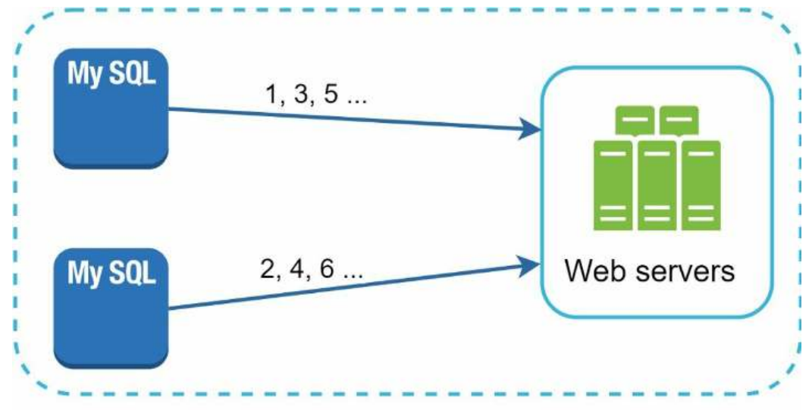
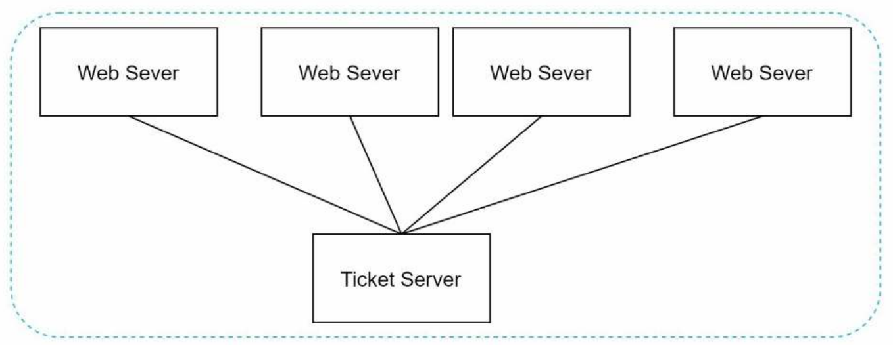
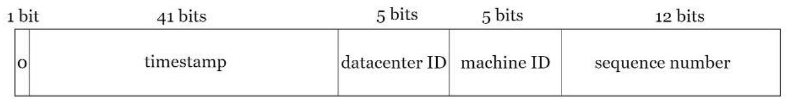
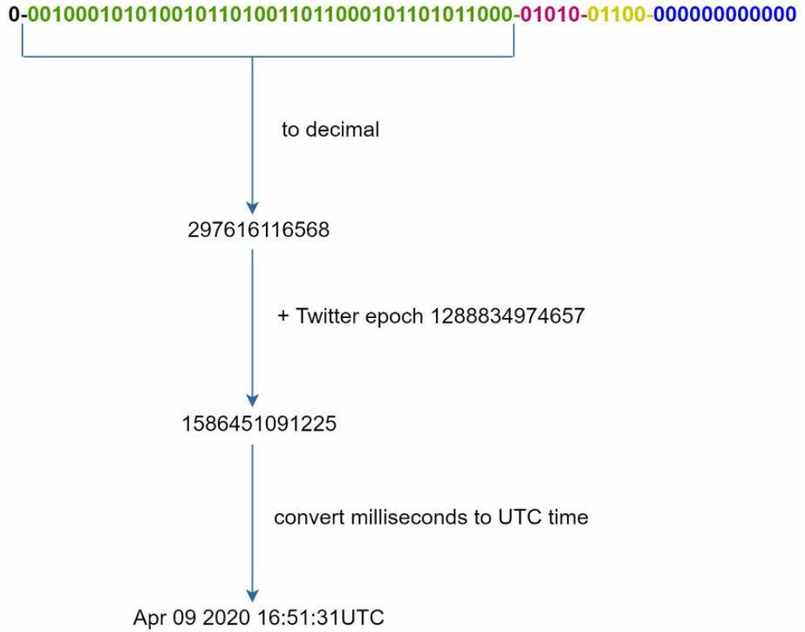

# Chapter 7 - Design a unique ID generator in distributed systems

Your first though may be to use primary key with `auto_increment` attribute. But this is not a good idea in distributed systems. Because each node will generate its own unique ID, and there is no guarantee that the IDs generated by different nodes will be unique and not synced properly.

# Step 1 - Understand the problem and establish a design scpoe

After a discussion between you and your interviewer, here is the requirements:

- IDs must me unique
- IDs are numerical values only
- IDs fits into 64-bit
- IDs are ordered by date
- Ability to generate over 10,000 unique IDs per second

# Step 2 - Propose high-level design and get buy-in

Let's list the available options:

- Multi master replications
- Universally unique identifiers (UUIDs)
- Ticket servers
- Twitter snowflake

## Multi master replications

Thi approach uses the databases `auto_increment` feature. Each database has its own `auto_increment` value, we increase it not by 1 but by k, where k is the number of databases server used, this solves the scalability issue. But this approach has some drawbacks:

- Hard to scale with a large number of servers multiple data centers
- It does not scale well when a server is added or removed

## UUIDs

UUID is a 128-bit number used to identify information in computer systems. UUID has a very low probability of getting collusion. Quoted from Wikipedia, “after generating 1 billion UUIDs every second for approximately 100 years would the probability of creating a single duplicate reach 50%”

This guarantees that the IDs generated by different nodes will be unique. This is an example of a uuid: 09c93e62-50b4-468d-bf8a-c07e1040bfb2

Pros:

- Simple
- Easy to scale

Cons:

- IDs are 128 bit long, but the requirement is 64 bit
- IDs are not numerical values
- IDs do not go up with time, which makes it impossible to sort IDs.

## Ticket Servers

The idea is to centralize `auto_increment` feature into a single server. This server will be responsible for generating unique IDs for all servers.

Pros:

- Simple, it works for small to medium scale systems
- Numerical IDs

Cons:

- Single point of failure

## Twitter Snowflake

Approaches mentioned above give us some ideas about how different ID generation systems work. However, none of them meet our specific requirements, we will discuss Twitter’s unique ID generation system called “snowflake”.

Divide and conquer is a good strategy to solve such a problem, we divide the 64-bit ID into different sections:

Each section is explained below:

- **Sign bit**: It will always be 0, this reserved for future uses. It possible to use this bit to distinguish between positive and negative numbers.
- **Timestamp**: 41 bits are used to store the timestamp.
- **Data center ID**: 5 bits are used to store the data center ID. This means that we can have up to 32 data centers.
- **Machine ID**: 5 bits are used to store the machine ID. This means that we can have up to 32 machines per data center.
- **Sequence**: 12 bits are used to store the sequence number.

# Step 3 - Design deep dive

## Timestamp

The most important 41 bits make up the timestamp section. As timestamps grow with time, IDs are sortable by time.

The maximum timestamp we can represent is 2^41 - 1, which is 69 years.

## Sequence

The sequence number is used to handle the case when multiple IDs are generated in the same millisecond. The sequence number is initialized to 0 and incremented by 1 for every ID generated in the same millisecond. The maximum sequence number we can represent is 2^12, which is 4096.

# Step 4 - Wrap up

In this chapter, we discussed how to design a unique ID generator in distributed systems. We discussed different approaches and their pros and cons (multi master replication, uuid, ticket server). We also discussed Twitter’s snowflake ID generation system which suits our requirements.
