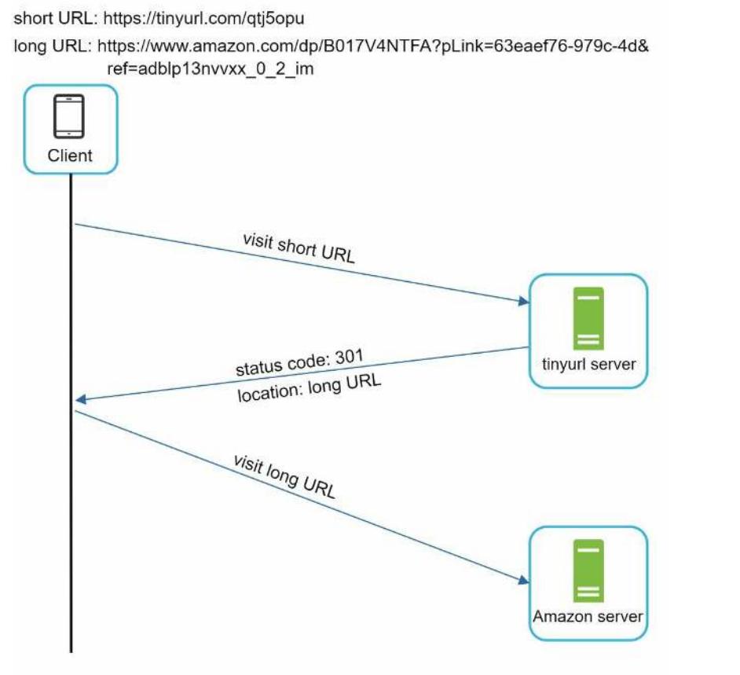
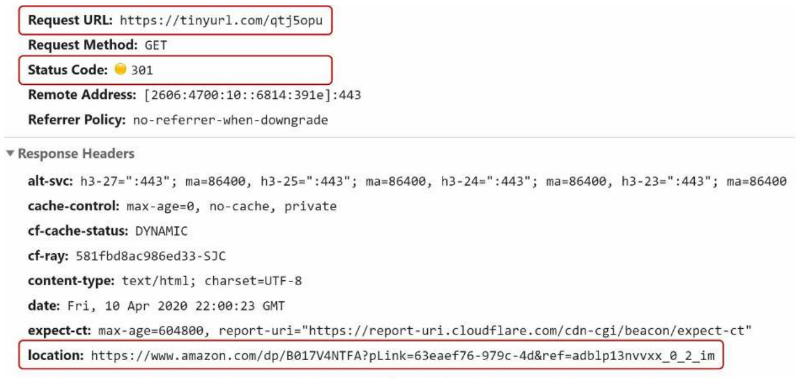
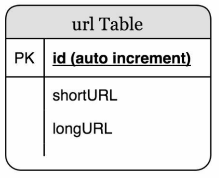
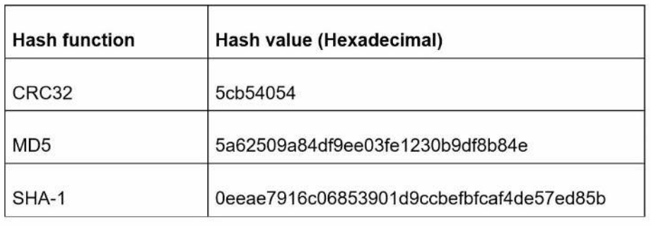
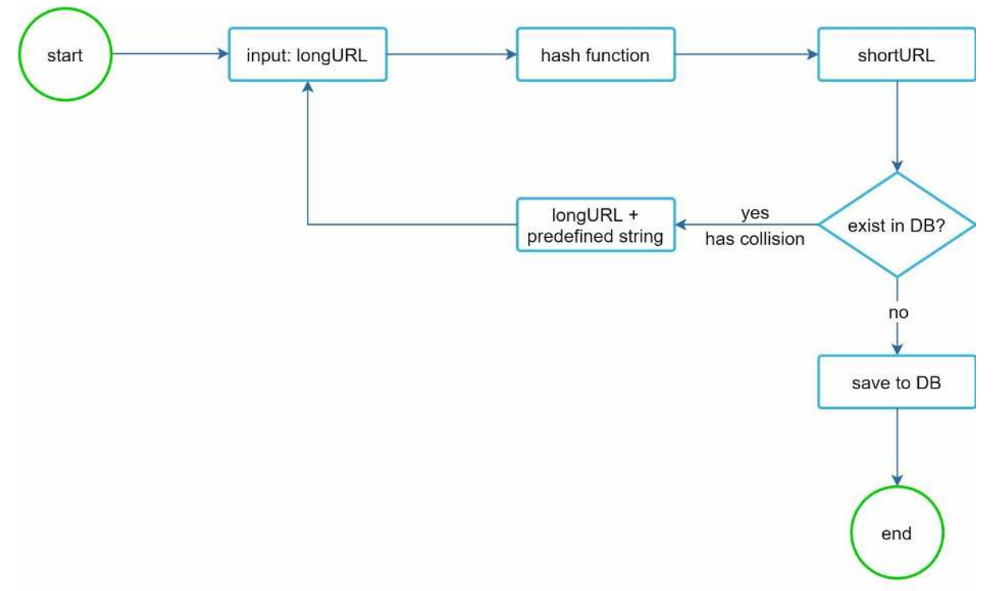
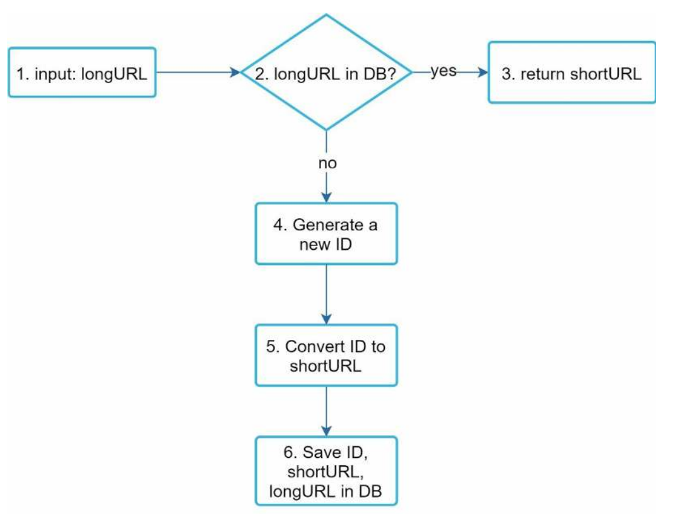
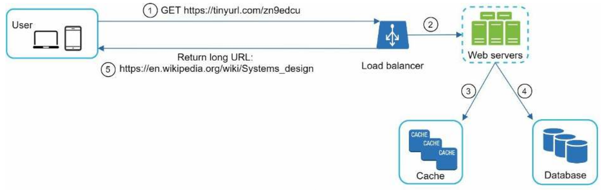

# Chapter 8 - Design a URL Shortener

# Step 1 - Understand the problem and establish a design scope

After a discussion between you and your interviewer, here is the requirements:

- The system should be able to generate a short URL for any given URL, for example, `https://www.systeminterview.com/q=chatsystem&c=loggedin&v=v3&l=long` -> `http://tinyurl.com/jlg8zpc`
- 100 million urls are generated per day
- The url must be as short as possible
- The url is a combination of letters and numbers (0-9, a-z, A-Z)
- For simplicity,  let us assume shortened URLs cannot be deleted or updated

## Back-of-the-envelope estimation

- Write operations: 100 million per day
- Write operations per second: 100 million / (24 hours * 3600 seconds) = 1157
- Read operations: assume the ratio is 10:1, so 11570 per second
- Assume the url shortener will run for 10 years, so we need to store 100 million *365* 10 = 365 billion urls
- Storage requirement: 365 billion * 100 bytes = 36.5 TB

# Step 2 - Propose high-level design and get buy-in

## API Endpoints

We design a restful API for the url shortener service:

- URL Shortener: to create a new short url, send `POST` request to `/api/v1/shorten` with the original url in the request body
  - Request body: `{"url": "https://www.systeminterview.com/q=chatsystem&c=loggedin&v=v3&l=long"}`
  - Returns: `{"short_url": "http://tinyurl.com/jlg8zpc"}`
- URL Redirecting: to redirect to the original url, send `GET` request to `/api/v1/shortUrl` with the short url in the request body
  - Request body: `{"short_url": "http://tinyurl.com/jlg8zpc"}`
  - Returns: `{"url": "https://www.systeminterview.com/q=chatsystem&c=loggedin&v=v3&l=long"}` with HTTP redirection

## URL Redirecting

That is what happens when you enter a tinyurl in your browser,  it changes the short URL to the long URL with 301 redirect:

One thing worth discussing is the status code 301 vs 302:

- 301 redirect: Moved permanently to a new location, the browser will cache the new location, every subsequent request will be redirected to the new location immediately without calling the url shortener server.
- 302 redirect: Moved temporarily to a new location, the browser will not cache the new location, every subsequent request will be redirected to the new location by calling the url shortener server.

Each redirection method has its pros and cons. If the priority to reduce the server load, use 301 redirect. If analytics is more important, use 302 redirect.

## URL shortening

We need to find a hash function to convert the original url to a short url.

The hash function must satisfy the following requirement, each long url must be mapped to one unique short url, and the short url can be mapped back to the original long url.

# Step 3 - Design deep dive

## Data model

In the high level design, we may store the <shortUrl, longUrl> in a hash table as a good starting point, but memory resources can reach it capacity quickly. We need to store the data in a relational database. The simplest version of the table is to store the [id, shortUrl, longUrl] in a table.

## Hash function

Hash function is used to hash a long URL to a short URL, also known as hashValue.

### Hash value length

The hashValue consists of characters [0-9, a-z, A-Z], contains 10 + 26 + 26 = 62 characters. We need to find the value of n such that 62^n > 365 billion. The following table shows the value of n corresponding to different hashValue length:

| n | Maximum number of urls |
|---|------------------------|
| 1 | 62^1 = 62              |
| 2 | 62^2 = 3844            |
| 3 | 62^3 = 238328          |
| 4 | 62^4 = 14776336        |
| 5 | 62^5 = 916132832       |
| 6 | 62^6 = 56800235584     |
| 7 | 62^7 = 3521614606208 = ~3.5 trillions   |

When n = 7, the maximum number of urls is 3.5 trillions, which is greater than 365 billion. So we need to use 7 characters to represent the hashValue.

### Hash + collision resolution

A straightforward solution is to use well-known hash functions like CRC32, MD5, or SHA-1

As shown in the previous table, even the shortest hash value (from CRC32) is too long (more than 7 characters). How can we make it shorter?

The first approach is to take the first 7 characters, but it may cause collisions. To resolve collisions, we may recursively append a new predefined string until no more collision is discovered.

### Base 62 conversion

The second approach is to use a counter to generate a unique number for each url, and convert the number to its base 62 representation.

For example

$11157_{10} = 2 \times 62^2 + 55 \times 62^1 + 59 \times 62^0 = [2, 55, 59] \rightarrow [2, T, X]$ in base 62

Thus, the short URL is `https://tinyurl.com/2TX`

### Comparison of the two approaches

| Hash + collision resolution | Base 62 conversion |
|-----------------------------|--------------------|
| Fixed length                | Variable length, goes up with the id    |
| No need for unique id       | Need to generate unique id |
| Collision is possible and must be resolved      | Collision is not possible |
| Impossible to guess the next id | Possible to guess the next id (Security concern) |

> Tip: Never use incremental id as the short url, watch this video for more: [https://youtu.be/gocwRvLhDf8](https://youtu.be/gocwRvLhDf8)

## URL shortening deep dive

## URL redirecting deep dive

The flow of URL redirecting is summarized as follows:

1. A user clicks a short URL `link: https://tinyurl.com/zn9edcu`
2. The load balancer forwards the request to web servers.
3. If a shortURL is already in the cache, return the longURL directly.
4. If a shortURL is not in the cache, fetch the longURL from the database. If it is not in the database, it is likely a user entered an invalid shortURL.
5. The longURL is returned to the user.
