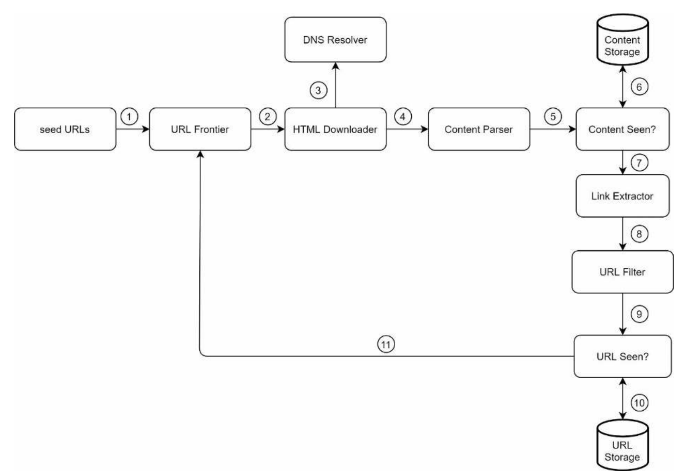

# Chapter 9 - Design a Web Crawler

Web crawler is a program that automatically traverses the web by downloading web pages and following the links from page to page. It is also called a spider or a bot. It is usually used by search engines to keep track of all new or updated content on the web.


A crawler is used for several purposes:

- **Search engine indexing**: crawlers help in indexing web pages so that they can be returned in search results.
- **Web archiving**: crawlers are used to collect web pages for future uses.
- **Data mining**: crawlers are used to collect data from websites for data analysis. For example, top financial firms use crawlers to download shareholder meetings and annual reports to learn key company initiatives.
- **Web monitoring**: The crawlers help to monitor copyright and trademark infringements over the Internet.

# Step 1 - Understand the problem and establish design scope

The basic algorithm of a web crawler is :

1. Given a set of seed URLs, download this web pages.
2. Extract the links from the web pages.
3. Add the extracted links to the list of URLs to be crawled. Repeat these 3 steps.

After a discussion between you and your interviewer, here is the requirements:

- The crawler is used for search engine indexing.
- 1 billion web pages are crawled per month.
- HTML only, no need to crawl images, videos, etc.
- The crawler should consider newly added of updated web pages.
- The crawler should store the crawled web pages up to 5 years.
- The crawler should be able to detect duplicate URLs and ignore them.

Beside this requirements, we also need to consider the characteristics of a good web crawler:

- **Scalability**: The crawler should be able to handle a large number of web pages.
- **Robustness**: The web is full of traps. Bad HTML, unresponsive servers, crashes, malicious links, etc. are all common. The crawler must handle all those edge cases.
- **Politeness**: The crawler should not overload the web servers. It should not send too many requests to the same server in a short period of time.
- **Extensibility**: The crawler should be able to be extended to support new features effortlessly.

## Back-of-the-envelope estimation

- Assume 1 billion web pages are crawled per month.
- QPS: 1 billion / (30 days *24 hours* 3600 seconds) = ~400 pages per second
- Peak QPS: 2 * 400 = 800 pages per second
- Assume the average size of a web page is 500 KB, so the storage requirement is 500 KB * 1 billion = 500 TB
- Assume the crawler will run for 5 years, so the total storage requirement is 500 TB *12 months* 5 years = 30 PB

# Step 2 - Propose high-level design and get buy-in


Let's explore each component in detail.

## Seed URLs

Seed URLs are the starting point of the crawler. The crawler will download the web pages from the seed URLs and extract the links from the web pages. The seed URLs can be provided by the user or the crawler can use a list of *popular* websites as the seed URLs. A good seed URL serves as a good starting point that a crawler can utilize to traverse as many links as possible.

## URL Frontier

The component that stores URLs to be downloaded is called URL Frontier. It is a (FIFO) queue of URLs to be crawled.

## HTML Downloader

The HTML Downloader downloads the web pages from the URLs in the URL Frontier.

## DNS Resolver

The DNS Resolver resolves the domain name to the IP address. The crawler needs to know the IP address of the web server to send the HTTP request. For example, the domain name `www.systeminterview.com` is resolved to the IP address `198.35.26.96`

## Content Parser

The Content Parser parses the downloaded web pages and validate it because malformed HTML can cause the crawler to crash or can waste the storage space. Content parser can slow the crawler so it must be a separate component.

## Content Seen

The content seen field is used to eliminate the the data redundancy and shorten the processing time. The crawler will check if the content of the web page has been seen before. If yes, the crawler will ignore the web page. If not, the crawler will add the web page to the content seen field and continue to process the web page.

## Content Storage

The Content Storage stores the downloaded web pages.

- Most of the content is stored on the disk
- Popular web pages can be stored in memory for faster access

## URL Extractor

URL Extractor parses and extracts links from HTML pages


Note how relative URLs are converted to absolute URLs by adding `https://en.wikipedia.org` prefix.

## URL Filter

The URL filter excludes certain content types, file extensions, error links and URLs in “blacklisted” sites.

## URL Seen

The URL Seen field is used to eliminate the data redundancy and shorten the processing time. The crawler will check if the URL has been seen before. If yes, the crawler will ignore the URL. If not, the crawler will add the URL to the URL seen field and continue to process the URL.

## URL Storage

The URL Storage stores the URLs that have been seen before.

## Web Crawler Workflow



# Step 3 - Design deep dive

## URL Frontier

The URL Frontier is a queue of URLs to be crawled. The crawler will download the web pages from the URLs in the URL Frontier. The URL Frontier is a critical component of the crawler. It must be fast, scalable and reliable.

### Politeness

The crawler should not overload the web servers. It should not send too many requests to the same server in a short period of time.

The general idea of enforcing politeness is to download one page at a time from the same host. A delay can be added between two download tasks.

### Priority

The crawler should prioritize the URLs in the URL Frontier. The priority of a URL can be determined by the following factors:

- **Popularity**: The crawler should prioritize the popular URLs. The popularity of a URL can be determined by the number of links pointing to it.
- **Freshness**: The crawler should prioritize the newly added or updated URLs.
- **Importance**: The crawler should prioritize the important URLs. The importance of a URL can be determined by the number of links pointing to it and the importance of the web page that contains the URL.
- **Page Rank**: The crawler should prioritize the URLs with high page rank. The page rank of a URL can be determined by the number of links pointing to it and the page rank of the web page that contains the URL.

### Freshness

The crawler should consider newly added or updated web pages and periodically recrawl the web pages. To optimize freshness:

- Recrawl based of the update history
- Prioritize the important and popular URLs

### Storage

Since memory can reach its capacity quickly, and disk is slow, we adopt a hybrid approach, most of the crawled pages will be stored on the disk, and the popular pages will be stored in memory for faster access.

## HTML Downloader

The HTML Downloader downloads web pages from the internet using the HTTP protocol. Before discussing the HTML Downloader, we look at Robots Exclusion Protocol first.

### Robots Exclusion Protocol

Robots Exclusion Protocol is a standard used by websites to communicate with web crawlers and other web robots. The standard specifies how to inform the web robot about which areas of the website should not be processed or scanned. The standard is usually called robots.txt.

The robots.txt file is placed in the root directory of the website. For example, the robots.txt file of `www.amazon.com` is `https://www.amazon.com/robots.txt`

This is an example of amazon's robots.txt file:

```
User-agent: *
Disallow: /gp/cart/
Disallow: /gp/registry/
Disallow: /gp/gift-central/
Disallow: /gp/wishlist/
Disallow: /gp/redirect.html
```

### Performance optimization

The HTML Downloader should be fast and reliable. To optimize the performance:

- **Distributed craweler**: The crawler should be distributed across multiple machines to handle a large number of web pages.


- **Cache DNS**: The crawler should cache the DNS records to avoid the DNS lookup overhead.
- **Locality**: The crawler should download the web pages from the closest web server to reduce the network latency.
- **Short timeout**: Some websites may take long time to respond or not respond at all. The crawler should set a short timeout to avoid waiting too long for the response.

## Robustness

To improve the robustness of the crawler:

- **Consistent hashing**: The crawler should use consistent hashing to distribute the workload across multiple machines. If a machine crashes, the crawler can still work properly.
- **Save crawl state and data**: The crawler should save the crawl state and data periodically. If the crawler crashes, it can resume the crawl from the last saved state.
- **Exception handling**: The crawler should handle exceptions properly. For example, if the crawler encounters a malformed HTML, it should log the error and continue to crawl other web pages. (No crash)
- **Data validation**: The crawler should validate the downloaded web pages. If the web page is malformed, the crawler should discard it.

## Extensibility

As almost every system evolves, one of the design goals is to make the system flexible enough to support new content types. The crawler can be extended by plugging in new modules. Tho following figure shows adding a new module.


- PNG Downloader module is plugged-in to download PNG files.
- Web Monitor module is added to monitor the web and prevent copyright and trademark infringements.

## Detect and avoid problematic content

- **ٌRedundant content**: The crawler should detect and avoid redundant content. For example, the crawler should not download the same web page from different URLs.
- **Spider traps**: A spider trap is a web page that causes a crawler in an infinite loop. For instance, an infinite deep directory structure is listed as follows: `www.spidertrapexample.com/foo/bar/foo/bar/foo/bar/…` Such spider traps can be avoided by setting a maximal length for URLs.
- **Data noise**: Some data has no value, such as advertisements, spam urls, etc. The crawler should detect and avoid those data.

# Step 4 - wrap up

In this chapter, we discussed the design of a web crawler. We started with the requirements and characteristics of a good web crawler. Then we proposed the high-level design and discussed each component in detail. Finally, we discussed the design considerations and trade-offs.

We still missed some important topics, such as:

- Server side rendering: Some websites use javascript to render the web pages (client side rendering). The crawler should be able to render the web pages properly on the server side before parsing the web pages.
- Filtering unwanted pages.
- Database replication and sharding.
- Horizontal scaling.
- Availability, consistency and reliability.
- Analytics and monitoring.
