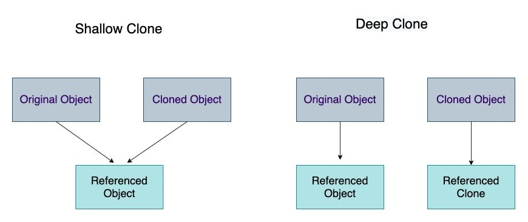

# Chapter 1 - Introduction to Object-Oriented Concepts


* object-oriented (OO) software development has been around since the early 1960s.

* When systems are working fine, in most cases you should not change them, at least not simply for the sake of change.

* Object Wrappers : A wrapper is a class that encapsulates (wraps) the functionality of another class or program.

## Procedural Versus Object-Oriented Programming

* Procedural programming is a programming paradigm, derived from structured programming, based on the concept of the procedure call. Procedures, also known as *routines*, *subroutines*, or *functions*, simply contain a series of computational steps to be carried out.

* Object-oriented programming (OOP) is a programming paradigm based on the concept of "objects", which may contain data, in the form of fields, often known as *attributes*; and code, in the form of procedures, often known as *methods*.

> In OO design, the attributes and behaviors are contained within a single object, whereas in procedural, or structured design, the attributes and behaviors are normally separated.

* Data Hiding : In OO terminology, data is referred to as *attributes*, and behaviors are referred to as *methods*. Restricting access to certain attributes and/or methods is called *data hiding*.

## What Is an Object?

* An object is an instance of a class. Objects are the basic building blocks of an OO system.

### Object data

* An object's data is referred to as its *attributes*. The data stored within an object represents the state of the object. 

e.g. A bank account object might have attributes such as account number, balance, and interest rate.

### Object behavior

* An object's behavior is referred to as its *methods*. The methods of an object represent the operations that can be performed on the object.

e.g. A bank account object might have methods such as deposit, withdraw, and calculate interest. Also the getter and setter methods.

For example, in java we can create a class called `BankAccount` and create an object of that class called `myAccount` as follows:

```java
public class BankAccount {

    // Attributes
    private int accountNumber;
    private double balance;
    private double interestRate;

    // constructor
    public BankAccount(int accountNumber, double balance, double interestRate) {
        this.accountNumber = accountNumber;
        this.balance = balance;
        this.interestRate = interestRate;
    }

    // getter and setter methods
    public int getAccountNumber() {
        return accountNumber;
    }

    public double getBalance() {
        return balance;
    }

    public void setBalance(double balance) {
        this.balance = balance;
    }

    public double getInterestRate() {
        return interestRate;
    }

    public void setInterestRate(double interestRate) {
        this.interestRate = interestRate;
    }

    // methods
    public void deposit(double amount) {
        balance += amount;
    }

    public void withdraw(double amount) {
        balance -= amount;
    }

    public void calculateInterest() {
        double interest = balance * interestRate;
        return interest;
    }
}
```

## What Is a Class?

* A class is a blueprint or template that describes the details of an object. (think of a cookie cutter)

* A class is a logical grouping of objects that have common properties and behaviors.

`public` vs `private` vs `protected` vs `default`:

https://stackoverflow.com/questions/215497/in-java-what-is-the-difference-between-public-default-protected-and-private

## Encapsulation and Data Hiding

* Encapsulation is the process of combining data and behavior into a single package called an object.

* Data hiding is the process of hiding the internal data of an object from the outside world.

* Encapsulation and data hiding are closely related. In fact, encapsulation is often referred to as data hiding.

### Interface

* An interface is a collection of abstract methods that has no implementation. An interface is a contract between a class and the outside world.


## Inheritance

* Inheritance is the process by which one class acquires the properties of another class. The class that acquires the properties of another class is called the *subclass*, and the class from which the subclass is derived is called the *superclass*.

* Inheritance is a powerful feature of OO programming because it allows you to reuse existing code without having to rewrite it.

## Abstraction

* Abstraction is the process of hiding the internal details of an object from the outside world. Only the functionality that is necessary to the user should be made available.

* Abstraction is closely related to encapsulation and data hiding.


Abstraction vs Encapsulation: 

https://stackoverflow.com/questions/742341/difference-between-abstraction-and-encapsulation

## Is-a Relationships

* Inheritance is often referred to as an *is-a* relationship. For example, a checking account is a bank account, a savings account is a bank account, and a certificate of deposit (CD) is a bank account. In each case, the subclass inherits the properties of the superclass.

## Polymorphism

* Polymorphism is the ability to take more than one form. In OO programming, polymorphism refers to the ability of an object to provide different behaviors to its users depending on its state.

For example, suppose you have an array of three shapes: a `circle`, a `square`, and a `triangle`. Each shape has a method called `area()` that calculates the area of the shape. The `area()` method is polymorphic because it provides different behavior for each shape.

Here is an example of polymorphism in java:

```java
public abstract class Shape {
    double area;
    public abstract double getArea();
}

public class Circle extends Shape{
    private double radius;
    public Circle(double radius) {
        this.radius = radius;
    }
    @Override
    public double getArea() {
        area = Math.PI * radius * radius;
        return area;
    }
}


public class Square extends Shape {
    private double side;

    public Square(double side) {
        this.side = side;
    }

    @Override
    public double getArea() {
        area = side * side;
        return area;
    }
}


```

You can create an array of shapes and call the `area()` method on each shape as follows:

```java
public class Main {
    public static void main(String[] args) {
        Shape[] shapes = new Shape[2];
        shapes[0] = new Circle(5);
        shapes[1] = new Square(5);
        for (Shape shape : shapes) {
            System.out.println(shape.getArea());
        }
    }
}
```

## Composition

* Composition is the process of combining two or more objects into a more complex object. For example, a car is composed of an engine, a transmission, and a body.

* Composition is often referred to as a *has-a* relationship. For example, a car has an engine, a transmission, and a body.

Example of composition in java:

```java
public class Engine {
    private String model;
    private int horsepower;

    public Engine(String model, int horsepower) {
        this.model = model;
        this.horsepower = horsepower;
    }

    public String getModel() {
        return model;
    }

    public int getHorsepower() {
        return horsepower;
    }
}

public class Transmission {
    private String model;
    private int gears;

    public Transmission(String model, int gears) {
        this.model = model;
        this.gears = gears;
    }

    public String getModel() {
        return model;
    }

    public int getGears() {
        return gears;
    }
}

public class Car {
    private Engine engine;
    private Transmission transmission;

    public Car(Engine engine, Transmission transmission) {
        this.engine = engine;
        this.transmission = transmission;
    }

    public Engine getEngine() {
        return engine;
    }

    public Transmission getTransmission() {
        return transmission;
    }

}
```

```java
public class Main {
    public static void main(String[] args) {
        Engine engine = new Engine("V8", 400);
        Transmission transmission = new Transmission("Automatic", 5);
        Car car = new Car(engine, transmission);
        System.out.println("car.engine.model = " + car.getEngine().getModel() + "\ncar.engine.horsepower = " + car.getEngine().getHorsepower());
        System.out.println("car.transmission.model = " + car.getTransmission().getModel() + "\ncar.transmission.gears = " + car.getTransmission().getGears());
    }
}
```

# Chapter 2: How to Think in Terms of Objects

Three important things you can do to develop a good sense of the OO thought process:


* Knowing the difference between the interface and implementation
* Thinking more abstractly
* Giving the user the minimal interface possible

## Knowing the difference between the interface and implementation

* The interface of a class is the set of public methods that it provides. The implementation is the code that is executed when each of those methods is called.

For an example, consider a real life car and a car object in java. The interface of a car is the steering wheel, the gas pedal, and the brake pedal. The implementation is the engine, the transmission, and the brakes mechanism.

A change in the implementation should have no impact on the driver, whereas a change to the interface might.

### The interface

The services presented to an end user comprise the interface. The interface is the set of public methods that a class provides. The interface is the contract between a class and its users. The interface is the only thing that the user needs to know about a class.

As a rule of thumb, the interface to a class should contain only what the user needs to know. In the car example, the user needs to know how to steer the car, how to accelerate, and how to brake. The user does not need to know how the engine works, how the transmission works, or how the brakes work.

### The implementation

The implementation details are hidden from the user. One goal regarding the implementation should be kept in mind: A change to the implementation should not require a change to the user’s code.

In the car example, the user should be able to drive the car regardless of whether the car has a gasoline engine or an electric motor. The user should be able to drive the car regardless of whether the car has a manual transmission or an automatic transmission. The user should be able to drive the car regardless of whether the car has disc brakes or drum brakes.


### Minimual interface

Although perhaps extreme, one way to determine the minimalist interface is to initially provide the user no public interfaces. Of course, the class will be useless; however, this forces the user to come back to you and say, “Hey, I need this functionality.” Then you can negotiate. Thus, you add interfaces only when it is requested. Never assume that the user needs something.

## Thinking more abstractly

One of the main advantages of OO programming is that classes can be reused. In general, reusable classes tend to have interfaces that are more abstract than concrete. Concrete interfaces tend to be very specific, whereas abstract interfaces are more general. However, simply stating that a highly abstract interface is more useful than a highly concrete interface, although often true, is not always the case.

To illustrate the difference between an abstract and a concrete interface, let’s create a taxi object. It is much more useful to have an interface such as “drive me to the airport” than to have separate interfaces such as “turn right,”“turn left,”“start,”“stop,” and so on.

## Giving the user the minimal interface possible

Provide the user with as little
knowledge of the inner workings of the class as possible.

Give the users only what they absolutely need. In effect, this means the class has as few interfaces as possible.

# Chapter 3: Advanced Object-Oriented Concepts

## Constructors

* A constructor is a special method that is called when an object is instantiated (i.e., created). The constructor is used to initialize the object.

* A constructor has the same name as the class and no return type. If there is a return type, then the compiler will treat the constructor as a method.

```java
// Constructor
public Cabbie() {
/* code to construct the object */
}

// Method
public void Cabbie() {
/* code to construct the object */
}
```

### When is a constructor called?

* A constructor is called when an object is instantiated (i.e., created). The constructor is used to initialize the object.

```java
Cabbie myCabbie = new Cabbie();
```

### What is inside a constructor?

* A constructor is used to initialize the object. The constructor is used to set the initial values of the object’s instance variables, for example, if you have a stopwatch object, you might want to initialize the stopwatch to zero.

```java
public class Stopwatch {
    private int elapsedTime;
    private int previousTime;
    private boolean isRunning;

    public Stopwatch() {
        elapsedTime = 0;
        previousTime = 0;
        isRunning = false;
    }
}
```

### The default constructor

If you do not provide a constructor, then the compiler will provide a default constructor.

The only action that a default constructor takes is to call the constructor of its superclass. In many cases, the superclass will be part of the language framework, like the `Object` class in Java. For example, if a constructor is not provided for the Cabbie class, the following default constructor is inserted

```java
public Cabbie() {
    super();
}
```

**Providing a Constructor**

The rule of thumb is that you should always provide a constructor, even if you do not plan on doing anything inside it. You can provide a constructor with nothing in it and then add to it later. Although there is technically nothing wrong with using the default constructor provided by the compiler, it is always nice to know exactly what your code looks like. 

It is not surprising that maintenance becomes an issue here. If you depend on the default constructor and then maintenance is performed on the class that added another constructor, then the default constrictor is not created. In short, the default constructor is only added if you don’t include one.As soon as you include just one, the default constructor is not included.

### Using multiple constructors

* You can have more than one constructor in a class. This is called overloading the constructor. The constructors must have different signatures. The signature of a constructor is the number and type of the parameters. (Not the return type.)


```java
public class Cabbie {
    private String name;
    private int numPassengers;

    public Cabbie(String name) {
        this.name = name;
        numPassengers = 0;
    }

    public Cabbie(String name, int numPassengers) {
        this.name = name;
        this.numPassengers = numPassengers;
    }
}
```

### Overloading methods

* You can have more than one method in a class with the same name. This is called overloading the method. The methods must have different signatures. The signature of a method is the number and type of the parameters. (Not the return type.)

```java
// different parameter list
public void getCab (String cabbieName);
// different parameter list
public void getCab (int numberOfPassengers);
```

### The concept of scope

* Scope refers to the visibility of a variable. A variable can be visible to the entire class, or it can be visible only to a method. The scope of a variable is determined by where it is declared.

the state of the object is represented by attributes.There are three types of attributes :

* Local attributes
* Object attributes
* Class attributes


### Local attributes

* Local attributes are declared inside a method and visible only to that method. Local attributes are not visible to any other method or class.

```java
public class Number {
    public method1() {
        int count;
    }
    public method2() {

    }
}
```

The method `method1` contains a local variable called `count`.This integer is accessible only inside `method1`.The method `method2` has no idea that the integer `count` even exists.

Note that scope is delineated by the curly braces `{}`.

For more fun with scope, consider the following example:

```java
public class Number {
    public method1() {
        int count;
    }
    public method2() {
        int count;
    }
}
```

Although both methods have a variable called `count`, they are two different variables. The variable `count` in `method1` is not visible to `method2`, and vice versa.

### Object attributes

There are many design situations in which an attribute must be shared by several methods within the same object.

```java
public class Number {
    private int count;
    public method1() {
        count = 1;
    }
    public method2() {
        count = 2;
    }
}
```

You can play some interesting games with scope. Consider the following code:

```java
public class Number {
    private int count;
    public method1() {
        int count;
    }
    public method2() {
        int count;
    }
}
```

In this case, there are actually three totally separate memory locations with the name of count for each object.The object owns one copy, and `method1()` and `method2()` each
have their own copy.


To access the object variable from within one of the methods, say `method1()`, you can use a pointer called `this` in the C-based languages:

```java
public method1() {
    int count;
    this.count = 1;
}
```

Notice that there is some code that looks a bit curious:

```java
this.count = 1;
```


The selection of the word `this` as a keyword is perhaps unfortunate. However, we must live with it.The use of the `this` keyword directs the compiler to access the object variable `count` and not the local variables within the method bodies.


*Note*

The keyword `this` is a reference to the current object.

### Class attributes


As mentioned earlier, it is possible for two or more objects to share attributes. In Java, C#, and C++, you do this by making the attribute static:

```java
public class Number {
    private static int count;
    public method1() {
    }
    public method2() {
    }
}
```

There are many valid uses for class attributes, for example, to keep track of the number of objects created from a class.

```java
public class Number {
    private static int count;
    public Number() {
        count++;
    }
    public static int getCount() {
        return count;
    }
}
```

The method `getCount()` is a static method. It is a method that is not associated with any object. It is associated with the class itself. You can call the method without creating an object:

```java
int count = Number.getCount();
```

However, you must be aware of potential synchronization problems.

## Operator Overloading

* Operator overloading is a feature of some programming languages that allows the programmer to redefine the meaning of an operator when applied to operands of a user-defined type.

* Operator overloading is syntactic sugar. It allows you to write code that is easier to read and understand.

* Operator overloading is supported in C++, however, it is not supported in Java or C#.

For example, the `+` operator is used to add two numbers together. However, it can also be used to concatenate two strings together in java, java itself has overloaded the `+` operator, but it does not allow operator overloading.

You may read more from here 

https://stackoverflow.com/questions/3559563/why-doesnt-java-need-operator-overloading

## Multiple Inheritance

* Multiple inheritance is a feature of some object-oriented computer programming languages in which an object or class can inherit characteristics and features from more than one parent object or parent class.

In some OO languages, such as C++, you can.

However, this situation falls into a category similar to operator overloading. Multiple inheritance is a very powerful technique, and in fact, some problems are quite difficult to solve without it. Multiple inheritance can even solve some problems quite elegantly. However, multiple inheritance can significantly increase the complexity of a system, both for the programmer and the compiler writers.

As with operator overloading, the designers of Java and .NET decided that the increased complexity of allowing multiple inheritance far outweighed its advantages, so they eliminated it from the language. In some ways, the Java and .NET language construct of interfaces compensates for this; however, the bottom line is that Java and .NET do not allow conventional multiple inheritance

There are a good discussion on stackoverflow about this topic

https://stackoverflow.com/questions/2515477/why-is-there-no-multiple-inheritance-in-java-but-implementing-multiple-interfac

## Classes and References

From Effective C++:

> The problem with complex data structures and objects is that they might contain references. Simply making a copy of the reference does not copy the data structures or the object that it references. In the same vein, when comparing objects, simply comparing a pointer to another pointer only compares the references—not what they point to.


### Deep copy vs shallow copy

A deep copy is when all the references are followed and new copies are created for all referenced objects. There might be many levels involved in a deep copy. For objects with references to many objects, which in turn might have references to even more objects, the copy itself can create significant overhead. A shallow copy would simply copy the reference and not follow the levels.

The following figure shows the difference between deep copy and shallow copy



# Chapter 4: The Anatomy of a Class

Our sample class

```java
public class Cabbie {
    // attributes
    private static string companyName = "Blue Cab Company";
    private string name;
    private Cab myCab;

    // constructors
    // default constructor
    public Cabbie() {
        name = null;
        myCab = null;
    }

    // constructor with parameters
    public Cabbie(string name, String cabSerialNumber) {
        this.name = name;
        this.myCab = new Cab(cabSerialNumber);
    }

    // accessors methods
    public string getName() {
        return name;
    }

    public void setName(string name) {
        this.name = name;
    }

    public Cab getMyCab() {
        return myCab;
    }

    public void setMyCab(Cab myCab) {
        this.myCab = myCab;
    }

    public static string getCompanyName() {
        return companyName;
    }

    // other methods
    public void giveDestination(){
        private void turnRight() {
            // code to turn right
        }
        private void turnLeft() {
            // code to turn left
        }
    }
}

```

## The name of the class

the name must be descriptive. The choice of a name is important because it provides information about what the class does and how it interacts within larger systems.

The name is also important when considering language constraints. For example, in Java, the public class name must be the same as the filename. If these names do not match, the application won’t compile.

## Comments

Comments are important. They are the only way to document the code. The comments should be clear and concise.

There are three types of comments:

* Block comments `/* */`
* Line comments `//`
* Javadoc comments `/** */`

I like this video, it explains why you shouldn't comment your code, and when two use comments

[Don't Write Comments](https://youtu.be/Bf7vDBBOBUA)

## Attributes

Attributes are the variables that are associated with the class, they represent the state of the object. They are also called instance variables or object variables. Attributes are the data that the class manipulates. Attributes are declared within the class body, but outside of any method bodies.

Note the keword `private` before the attributes, this is called access modifier, it specifies the visibility of the attribute. There are four access modifiers in Java:

* `public` - The attribute is visible to all classes.
* `private` - The attribute is visible only to the class that declares it. 
* `protected` - The attribute is visible to the class that declares it and to any subclasses and subpackage.
* `default` - The attribute is visible to the class that declares it and to any classes in the same package.

`public` vs `private` vs `protected` vs `default`:

https://stackoverflow.com/questions/215497/in-java-what-is-the-difference-between-public-default-protected-and-private

Also note the keyword `static` before the attribute, this is called class attribute, it is associated with the class itself, not with any object. There is only one copy of a class attribute, regardless of how many objects are created from the class. Class attributes are declared with the keyword `static`. A case where you might use a class attribute is when you want to keep track of the number of objects that have been created from the class, so whenever the constructor is called, you increment the class attribute.

> **Hide as Much Data as Possible** All the attributes in this example are private. This is in keeping with the design principle of keeping the interface design as minimal as possible. The only way to access these attributes is through the method interfaces provided (which we explore later in this chapter).


## Constructors

Constructors are special methods that are called when an object is created. Constructors are used to initialize the attributes of the object. Constructors are declared with the same name as the class. Constructors do not have a return type, not even void. Constructors are called with the `new` keyword.

This Cabbie class contains two constructors. We know they are constructors because they have the same name as the class: Cabbie. The first constructor is the default constructor:

```java
public Cabbie() {
    name = null;
    myCab = null;
}
```

Technically, this is not a default constructor provided by the system. Recall that the compiler will provide an empty default constructor if you do not code any constructor for a class. By definition, the reason it is called a default constructor here is because it is a constructor with no arguments, which, in effect, overrides the compiler’s default constructor.

If you provide a constructor with arguments, the system will not provide a default constructor. Although this can seem complicated, the rule is that the compiler’s default constructor is included only if you provide no constructors in your code.

Note that coding no constructor is bad practice. It is better to provide a default constructor, even if it is empty.

Another use of the construction instead of initializing the attributes in the declaration is to validate the values of the attributes. For example, if the name of the cabbie must be at least two characters long, you can validate this in the constructor:

```java
public Cabbie(string name, String cabSerialNumber) {
    if (name.length() < 2) {
        throw new IllegalArgumentException("Name must be at least two characters long");
    }
    this.name = name;
    this.myCab = new Cab(cabSerialNumber);
}
```

Multiple constructors are called constructor overloading. The constructors must have different signatures. The signature of a method is the name of the method and the number and type of its parameters. The signature of the default constructor is `Cabbie()`, and the signature of the constructor with parameters is `Cabbie(string, String)`.

## Accessor methods

Also called as getters and setters, they are used to access the attributes of the class. This gives the programmer the ability to control how the attributes are accessed. For example, you may not want any fellow programmers to be able to change the name of the company, so you would not provide a setter for the company name attribute.

## Public interface methods and private implementation methods

Usually, the public interface methods are the methods that are called by other classes, and the private implementation methods are the methods that are called by the public interface methods. The programmer may want to provide a public interface but hide the implementation details. For example, You may want to provide a public method to update the password of a user if he forgets it, but you don't want to expose the encryption details of how the password is encrypted.

```java
public void updatePassword(string newPassword) {
    String encryptedPassword = encrypt(newPassword);
    this.password = encryptedPassword;
}

private String encrypt(string password) {
    // code to encrypt the password
}
```
