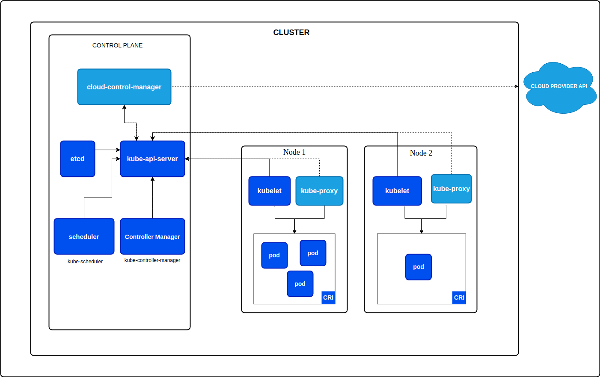

# Kubernetes

## What is Kubernetes?

[Kubernetes](https://kubernetes.io/) is an open-source platform designed to automate deploying, scaling, and operating application containers in different deployment environments. It groups containers that make up an application into logical units for easy management and discovery.

## The need for orchestration tool

In the past, applications were deployed on physical servers. As the number of applications increased, the number of servers also increased. Managing these servers manually or using scripts was a tedious task. Kubernetes was developed to solve this problem.

## Why Kubernetes?

Kubernetes is a powerful tool that can help you manage complex applications and their services. It can help you to:

- Deploy applications quickly and predictably.
- Scale your applications up and down on the fly.
- High availability by running multiple replicas of your application (no downtime).
- Diaster recovery by restarting failed containers.

# Kubernetes Architecture

The Kubernetes architecture consists of a master node and a set of worker nodes. The master node is responsible for managing the cluster. The worker nodes are responsible for running the actual applications.

## Master Node

The master node (also known as the control plane) is responsible for managing the Kubernetes cluster. It is responsible for:

- Scheduling applications
- Managing the state of the cluster
- Scaling applications
- Rolling out new updates
- Monitoring and logging
- ... and more

The master node consists of the following components:

- **API Server**: The API server is the entry point to control the cluster. (via an api or ui or cli)
- **Scheduler**: The scheduler is responsible for scheduling applications on worker nodes. It determines which node to assign pods to based on resource availability.
- **Controller Manager**: The controller manager is responsible for maintaining the desired state of the cluster. It watches for changes in the cluster and makes changes to bring the actual state closer to the desired state.
- **etcd**: etcd is a distributed key-value store that is used to store the state of the cluster. It is used to store configuration data and the state of the cluster. (such in case of server failure, the state can be recovered)

> If you lost access to the master node, you would not be able to manage the cluster. The master node is a single point of failure. To avoid this, you can set up at least two master nodes.
>
## Worker Node

The worker node is responsible for running the actual applications. It consists of the following components:

- **Kubelet**: The kubelet is responsible for running the pods on the node. It takes a set of PodSpecs that are provided through various mechanisms and ensures that the containers described in those PodSpecs are running and healthy.
- **Kube Proxy**: The kube-proxy is responsible for routing traffic to the appropriate containers. It maintains network rules on nodes. These network rules allow network communication to your Pods from network sessions inside or outside of your cluster.

## Virtual Network

The virtual network is a network overlay that allows pods to communicate with each other. It is responsible for routing traffic between pods on different nodes.

Each pod gets its own IP address. This allows pods to communicate with each other as if they were running on the same machine.

# Main Kubernetes Components

## Pod

A pod is the smallest deployable unit in Kubernetes. It is a group of one or more containers, with shared storage and network resources, and a specification for how to run the containers.

Pods are abstraction over containers, so instead of dealing with docker containers directly, you deal with pods.

Every pod is usually responsible for a single application. It can contain one or more containers. For example, a pod can contain a database container.

## Service

A service is an abstraction that defines a logical set of pods and a policy by which to access them. It enables external traffic to be routed to a set of pods.

Services assign permanent IP addresses to pods. This allows other pods to communicate with the service without needing to know the IP address of the pods, therefore if a pod dies and is replaced, the service will automatically route traffic to the new pod.

There are two types of services:

- **External Service**: Exposes the service to the outside world.
- **Internal Service**: Exposes the service only within the cluster. (you don't want to expose your database to the outside world)

## Ingress

An Ingress is an API object that manages external access to services in a cluster, typically HTTP. It provides HTTP and HTTPS routing to services in a cluster.

## ConfigMap

A ConfigMap is an API object used to store non-confidential data in key-value pairs. It allows you to decouple environment-specific configuration from your container images, so that your applications are easily portable.

Imagine you have a database username and you want to change it in the future. Instead of changing it in the code, rebuild the image and redeploy the application, you can use a ConfigMap to store the username and change it at runtime.

## Secret

A Secret is an API object used to store sensitive data, such as passwords, OAuth tokens, and ssh keys. It allows you to decouple sensitive information from your container images, so that your applications are easily portable.

## Volume

A Volume is a directory that is accessible to all containers in a pod. It allows you to share data between containers in a pod.

Imagine you want to restart your database container, you don't want to lose the data. You can use a volume to store the data on physical storage and share it between the old and new container.

## Deployment

A Deployment is an abstraction over pods that provides declarative updates to applications. It manages the deployment and scaling of the application.

Deployment tells Kubernetes how to create or modify instances of the pods that hold a containerized application. Deployments can help to efficiently scale the number of replica pods, enable the rollout of updated code in a controlled manner, or roll back to an earlier deployment version if necessary.

Now even if a node failed, users can still access the application.

Note that after using deployments, services now acts as a load balancer for the pods. It forwards the request to the least busy pod.

## StatefulSet

A StatefulSet is an API object used to manage stateful applications. It is used to manage the deployment and scaling of a set of pods in which the state is important.

Imagine you have a database and you want to scale it. You can use a StatefulSet to manage the deployment and properly handle the mechanism of reading and writing data to the database avoiding data inconsistency.

Managing databases is kubernetes is a bit more complex, there for many people prefer to move the database out of the kubernetes cluster.

# Kubernetes Configuration

Kubernetes configuration is done using YAML or JSON files. It is declarative, meaning you specify what you want to happen, and Kubernetes makes it happen.

Controller manager is responsible for maintaining the desired state of the cluster. It watches for changes in the cluster and makes changes to bring the actual state closer to the desired state specified in the configuration files.

Each configuration in kubernetes has:

- **API Version**: This is the version of the Kubernetes API that you are using.
- **Kind**: This is the type of object that you are creating. For example, a Pod, Service, Deployment, etc.

And has three main section:

- **Metadata**: This is data about the object. It includes the name, namespace, and labels.
- **Spec**: This is the desired state of the object. It includes the configuration of the object. (depends on the kind of object)
- **Status**: Automatically populated by the Kubernetes API. It contains the current state of the object. Kubernetes will update this field to reflect the actual state of the object and try to bring it closer to the desired state.

A common practice is to store the configuration file in a version control system like git. This allows you to track changes to the configuration over time and to collaborate with others.

# MiniKube

[Minikube](https://github.com/kubernetes/minikube) is a tool that makes it easy to run Kubernetes locally. It runs a single-node Kubernetes cluster inside on your local machine containing the master and worker node.

It is a great way to get started with Kubernetes and to develop and test your applications locally.

# kubectl

`kubectl` is a command-line tool that allows you to run commands against Kubernetes clusters. It is used to deploy applications, inspect and manage cluster resources, and view logs.
