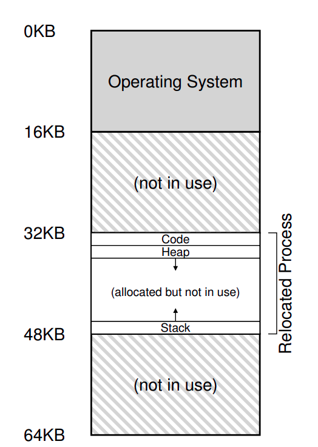

# Chapter 15 - Mechanism: Address Translation

How to efficiently and flexibly virtualize the memory? how to provide the flexibility needed by the applications and in the same time maintain the control over the memory locations an application can access?

The general technique we will use, is called **hardware based address translation**, or just **address translation**. The idea is to use a hardware mechanism to translate the virtual addresses that the application uses into physical addresses that the memory system uses.

Of course, the hardware cannot virtualize memory, it just provides the low level mechanisms t he os can use to implement the virtualization.

The goal is to create that beautiful illusion: each process has its own address space, starting at 0 and going up to some maximum value, and the process can access any memory location it wants, but behind the scenes: many programs just sharing the same physical memory at the same time.

## Assumptions

The first assumption will be simple and silly, the user's address space must be place contiguously in memory, and the size of the address space is not big, it is smaller than the physical memory. And every space address is exactly the same size.

Don't worry if these assumptions are unrealistic, we will relax them later to achieve realistic memory virtualization.

## An Example

An example of what physical memory looks like once this process address space has been placed in memory:



In this figure, you can see that the os uses the first slot of the physical memory for itself, then it reallocates the process into a slot starting at physical memory address 32KB, the other two slots are free.

## Dynamic (Hardware-based) Reallocation

Dynamic reallocation is a simple idea also referred to as **base and bounds**. The idea is to use two registers in the hardware to keep track of the base and the bounds of the process address space. (the bound register sometimes is called the limit register).

The base and bound pairs enables us to place the address space anywhere we would like in physical memory while we are sure that the process can only access its own address space.

In this setup, each program is written and compiled as if it starts at address 0, and the hardware will translate the address to the correct physical address using the base register.

```txt
Physical Address = Virtual Address + Base Register
```

The bound register is here for protection, it is used to check if the address the program is trying to access is within the bounds of the process address space, if not so, the os will raise an exception and the process will likely be terminated.

Note that base and bound registers are kept of the chip, (one pair per CPU). Sometimes people call the part of the processor that helps with address translation the **memory management unit (MMU)**.

> Note that there are two ways to check the limits of the address, either by storing the size of the address space in the bound register, or by storing the address of the last byte in the address space, the difference reflects on how the equality is checked.

## OS Issues

- First: The os mush take action when a process is created, finding space for its address space in memory, fortunately, given our assumption (each address space is smaller than the physical memory and all the same size), this is easy. It simple views the physical memory as an array of slots and track whether each one is free or in use by a free list. The os will search the free list when a new process is created to find room for the process address space and then mark it as used.

- Second: The os must take action when a process is terminated, reclaiming all of its memory for use in other processes. The os puts the memory back on the free list, and cleans up any associated data structures.

- Third: The os must take action when context switching occurs. There is only one base and bound pair per CPU, and it values are different for each process. Thus, the os must save and restore the base and bound pairs when it switches between processes.

We should note that when a process is stopped, (not running), it is possible for the os to move its address space from one location in memory to another location easily, to move the address space, the os simply changes the base register to point to the new location and copies the address space from its current location to the new location.

Also note that the access to the base and bounds registers is obviously privileged, special hardware instructions are required to access base and bound registers, if a process running in a user mode tries to access these registers, the hardware will raise an exception and the os will likely terminate the process. Imagine the security flaw if a process can change its own base and bounds registers.
