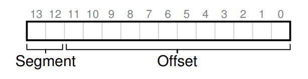

# Chapter 16 - Segmentation

The disadvantage of the base and bounds approach is that it requires the user's address space to be contiguous in memory, this simple approach is wasteful, it also makes it hard to run a program when the entire address space does not fit in memory.

So how to support a large address space with potentially a lot of free space between the stack and the heap?

## Segmentation: Generalized Base and Bounds

The idea of segmentation is simple, instead of having a single base and bounds pair, we have multiple pairs, one for each segment of the address space.

A segment is just a contiguous portion of address space of a particular length, and in our address space, there is different segments for the code, the stack, the heap, and the global variables.

What segmentation allows os to do is to place each one of those segment in different parts of the physical memory, and thus avoid filling physical memory with unused virtual space address.

The hardware will have a segment table, which is an array of segment descriptors, each descriptor contains the base and bounds of the segment, and the length of the segment.

| Segment | Base | Bounds |
|---------|------|--------|
| Code    | 0    | 64KB   |
| Stack   | 64KB | 16KB   |
| Heap    | 80KB | 16KB   |
| Globals | 96KB | 16KB   |

If we tried to access an illegal address, the hardware will raise an exception, and the os will likely terminate the process, this is the origin of the segmentation fault.

The term segmentation fault persists even in modern systems, even in machines that has no support for segmentation, the term is used to describe any illegal memory access.

## Which Segment Are We Referring To?

How does the hardware know which segment we are referring to?

One common approach, sometimes referred as **explicit** approach, is to chop up the address space into segments based on the top few bits of the virtual address, so for example if there are three segments, we need two bits to represent them.

The hardware uses the remaining bits to as an offset into the segment, and the base and bounds pair to translate the address to the physical address.

Note that the offset eases the bound checks too, we can simply check if the offset is less than the bounds, if not so, the address is illegal.

You may notice that if we use the top two bits, and we only have three segments (code, heap, stack), we will have one segment that is not used, this is a waste of space, some systems buts code and heap in the same segment, thus use only one bit to represent the segment.

There are another ways for the hardware to determine which segment a particular address is in, in the implicit approach, the hardware determines the segment by noticing how the address was formed, if for example the address was generated from the program counter (it was an instruction fetch), then the address is within the code segment. If the address was generated from a stack pointer, then the address is within the stack segment. Otherwise, the address is within the heap segment.

## What About The Stack?

In the example in the book we have a stack segment that grows downward, this is a common approach, the stack starts at the top of the segment and grows downward, so we need an extra hardware support, instead of just base and bounds, we need a pointer to determine in which direction the stack grows. (for example, a bit that set to 1 if the segment grows in the positive direction, and 0 if it grows in the negative direction).

The updated view of the stack segment descriptor:

| Segment | Base | Bounds | Direction |
|---------|------|--------|-----------|
| Stack   | 64KB | 16KB   | 0         |
| Heap    | 80KB | 16KB   | 1         |
| Globals | 96KB | 16KB   | 1         |
| Code    | 0    | 64KB   | 1         |

With this extra information, the hardware must translate the virtual addresses slightly differently, it must subtract the offset from the bounds instead of adding it.

Also the bound check must be done differently by ensuring the absolute value of the offset is less than the segment size.

## Support for Sharing

As support for segmentation grew, system designers soon realized that they could increase the efficiencies with a little more hardware support. Specially, to save memory, sometimes it is useful to share certain memory segments between address spaces, for example, the code segment is often shared between multiple processes.

To support sharing, we need an extra information from the hardware (protection bits). These bits are used to determine if a segment is read-only, read-write, or execute-only.

As a result, the same physical address can be mapped to different virtual addresses.

| Segment | Base | Bounds | Direction | Protection |
|---------|------|--------|-----------|------------|
| Stack   | 64KB | 16KB   | 0         |Read-Write  |
| Heap    | 80KB | 16KB   | 1         |Read-Write  |
| Globals | 96KB | 16KB   | 1         |Read-Write  |
| Code    | 0    | 64KB   | 1         |Read-Execute|

## Fine-granted vs Coarse-grained Segmentation

In the example above, we have a coarse-grained segmentation, where each segment is a contiguous portion of the address space, and the hardware uses the top bits of the address to determine the segment.

In a fine-grained segmentation, the address space is divided into many small segments, and the hardware uses a segment number to determine the segment.

The advantage of fine-grained segmentation is that it allows for more flexibility in the size of the segments, and it allows for more sharing of segments between processes.

The disadvantage is that it requires more hardware support, and it is more complex to implement.

## OS Support

Segmentation raises a number of new issues:

- First: What should the os do on a context switch? The os must save and restore the segment table, and the segment registers.

- Second: What should the os do when a process is created? The os has to be able to find space in physical memory for its segments, and mark them as used.

A problem arises when the physical memory quickly become full of holes of free space, making it hard to allocate new segments or to grow existing ones. This problem is known as **external fragmentation**.

One solution to this problem is to use **compaction**, where the os moves the segments around in memory to eliminate the holes, this is a costly operation and consumes a lot of CPU time.

A simple approach is to use a free list management algorithm that tries to keep large extents of free space available for allocation, there are hundreds of algorithms that can be used to manage the free list.

One example is best-fit (which keeps a list of free spaces and returns the one closest in size to the requested space), another example is first-fit (which returns the first free space that is large enough), and more complex ones like buddy algorithms, which is a good place to start if you want to learn more about memory management.

Unfortunately, though no matter how smart the algorithm is, external fragmentation will always be a problem, a good algorithm will try to minimize it.
