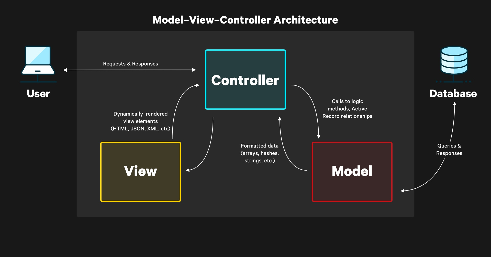

# Getting Started with Ruby on Rails

## Ruby Philosophy

Rails is designed to make programming web application easier by making assumptions about what every developer needs to get started, it allows you to write less code while accomplishing more than many other languages and frameworks.

Rails is opinionated and makes the assumption that there is a "best" way to do things, and it's designed to encourage you to follow that path.

Rails philosophy includes two major guiding principles:

- DRY
- Convention over Configuration

## Creating a new Rails application

To create a new Rails application, you use the `rails new` command followed by the name of the application you want to create. For example, to create a new Rails application called `myapp`, you would run the following command:

```bash
rails new myapp
```

to create a new rails application in the current directory, you can run the following command:

```bash
rails new .
```

## Directory Structure

When you create a new Rails application, Rails will generate a number of files and directories for you. Here is a brief overview of the most important directories:

- `app/` contains the models, views, controllers, helpers, mailers, jobs and assets for your application. You'll focus on this folder for the remainder of this guide.
- `bin/` contains the `rails` script that starts your app and can contain other scripts you use to setup, deploy or run your application.
- `config/` contains configurations for your application's routes, database and more.
- `config.ru` is a Rack configuration file.
- `db/` contains your current database schema and the database migrations.
- `Dockerfile` configuration for docker
- `Gemfile` and `Gemfile.lock` contain your application's dependencies.
- `lib/` extended modules for your application
- `log/` application log files
- `public/` static files and compiled assets
- `Rackfile` the file that locates and loads tasks that can be run from the command line. Rather than changing the `Rakefile`, you should add your own tasks by adding files to the `lib/tasks` directory of your application.
- `README.md`
- `script/` contains scripts and benchmarks
- `storage/` Active Storage files and SQLite databases
- `test/` unit tests, fixtures, and other test files
- `tmp/` temporary files like cache and pid files
- `vendor/` a place for third party code
- `.dockerignore` the file tells docker which files it should not copy into the container.
- `.gitattributes` metadata for git
- `.git/` git repository
- `.github/` github files
- `.gitignore` files that git should ignore
- `.kamal/` contains the kamal secrets and deployment files
- `.rubocop.yml` rubocop configuration
- `.ruby-version` the version of ruby that the application uses

## Model-View-Controller Basics

Rails code is organized using model view controller MVC pattern:

- Model - Manages the data in your application, Typically your database tables
- View - Handles rendering responses in different formats like HTML, JSON, XML
- Controller - Handles user interactions and logic for each request



## Hello, rails

lets boot up our first rails server:

```bash
rails server
```

Or. for short:

```bash
rails s
```

You can now visit <http://localhost:3000> to view your new website!

The shown page is a smoke test to make sure that your Rails installation is working correctly.

## Autoloading in development

Once you start your rails server, new files or changes to existing files are detected and automatically reloaded in development mode. This allows you to focus on development without needing to restart the server on every change.

You may also note that rails applications rarely use `require` like many other programming languages, rails uses a naming convention to automatically load files so you focus more on writing application code.

## Creating a database model

Active record is a feature of rails that maps relational database to ruby code, it help to generate sql for interacting with the database like performing CRUD operations. The default database in rails is SQLite, but you can use other databases like MySQL or PostgreSQL.

to add a new database model

```bash
rails generate model Product name:string description:text
```

The command does several things:

1. creates a migration in `db/migrate` directory
2. An active record model in `app/models` directory
3. Test and test fixtures for this model

> Note that model names are singular, because an instantiated model represents a single record in the database.

## Database migrations

A migration is a set of changes we want to make to our database/

We are telling rails how to change the database to add, change or remove tables, columns or other attributes. This helps to keep track of the changes we make in the development on our computer so we can safely deployed to the production, live and safe.

## Running migrations

We defined what changes should be done to the database, now we can use the following command to apply these changes (run the migrations):

```bash
rails db:migrate
```

> if you did a mistake, you can run `rails db:rollback` to undo the last migration.

## Rails console

Rails console enables you to interact with your application from the command line.

```bash
rails console
```

Or, for short:

```bash
rails c
```

## Active record model basics

When we ran the rails model generator to create the product model it creates a file the `app/models/product.rb` file that looks like this:

```ruby
class Product < ApplicationRecord
end
```

You might be surprised that there are no code in this class, how rails know what defines the model?

When the product model is used, rails will query the database table for the column names and types and automatically generates code for these attributes. Rails saves use from writing this boilerplate code and instead takes care of it for use behind the scenes so we can focus on application code.

## Creating a new record

We can create a new record in the database using the `create` method:

```ruby
> product = Product.new(name: 'Ruby on Rails', description: 'A web-application framework that includes everything needed to create database-backed web applications according to the Model-View-Controller (MVC) pattern.')
```

The product variable is now an instance of the Product model, and we can save it to the database using the `save` method:

```ruby
> product.save
```

Similar to `save`, we can use the `create` method to create and save a new record in the database in a single call:

```ruby
> Product.create(name: 'Ruby on Rails', description: 'A web-application framework that includes everything needed to create database-backed web applications according to the Model-View-Controller (MVC) pattern.')
```

## Querying the database

You can also lookup the records from the database using the active record model.

To list all the products we can use `all` method:

```ruby
> Product.all
```

to find a specific record by filter use the `where` method:

```ruby
> Product.where(name: 'Ruby on Rails')
```

to order the results use the `order` method:

```ruby
> Product.order(name: :desc)
```

To find the a record by id, use the `find` method:

```ruby
> Product.find(1)
```

to update the records there is two methods, using `update` or assigning the attributes and calling `save`:

```ruby
> product = Product.find(1)
> product.update(name: 'laravel')
```

or you can assign the attributes and call `save`:

```ruby
> product = Product.find(1)
> product.name = 'laravel'
> product.save
```

To delete a record, use the `destroy` method:

```ruby
> product = Product.find(1)
> product.destroy
```

## Validations

Active record models can have validations to ensure that the data is correct before saving it to the database.

Let's add a `presence` validation to the product model to ensure all products have a name:

```ruby
class Product < ApplicationRecord
  validates :name, presence: true
end
```

> If your console is open while you are editing the model, you will need to reload the console to see the changes by typing `reload!`.

Now if you try to save a product without a name, you will get an error:

```ruby
> product = Product.new(description: 'A web-application framework that includes everything needed to create database-backed web applications according to the Model-View-Controller (MVC) pattern.')
> product.save
=> false
```

To get the errors, you can use the `errors` method:

```ruby
> product.errors
=> #<ActiveModel::Errors [#<ActiveModel::Error attribute=name, type=blank, options={}>]> 
```

To get a user friendly error message, you can use the `full_messages` method:

```ruby
> product.errors.full_messages
=> ["Name can't be blank"]
```

## A Request journey through rails

To get rails to say hello, you need to create at least a route, a controller with an action and a view.

A route maps the request to a controller action, a controller action performs the necessary work to generate the response and prepares any data for the view, a view displays data in a desired format.

In terms of implementation, routes are rules written in ruby DSL, controllers are ruby classes and their public methods are actions, and views are templates written in HTML with embedded ruby.

## Routes

Route is the part of the url that determines how an incoming htp request is directed to the appropriate controller action.

`route` in rails refers to a line of code the pairs an http method and a url path and tells rails which controller and action should respond to a request.

To define a route in rails, you can use the `get` method in the `config/routes.rb` file:

```ruby
Rails.application.routes.draw do
  get '/products', to: 'products#index'
end
```

To route the post requests another controller action, you can use the `post` method:

```ruby
Rails.application.routes.draw do
  get '/products', to: 'products#index'
  post '/products', to: 'products#create'
end
```

Routes may also need to match urls with certain patterns, to show a specific product, you can use the `get` method with a dynamic segment:

```ruby
Rails.application.routes.draw do
  get '/products', to: 'products#index'
  post '/products', to: 'products#create'
  get '/products/:id', to: 'products#show'
end
```

So if user visits `/products/1`, the `:id` params is set to `1`

## CRUD routes

There are four common actions you will generally need for a resource, create, read, update, delete, this translates to 7 typical routes:

- `index` show all the records
- `new` render a form for creating a new record
- `create` processes the new for submission, handles the errors and create the record
- `show` renders a specific record for viewing
- `edit` renders a form for updating a specific record
- `update` handles the edit form submission, handles errors and updating the record
- `destroy` deletes a specific record

For example, we can define the routes for the crud operations for the product model:

```ruby
get '/products', to: 'products#index'
get '/products/new', to: 'products#new'
post '/products', to: 'products#create'
get '/products/:id', to: 'products#show'
get '/products/:id/edit', to: 'products#edit'
patch '/products/:id', to: 'products#update'
put '/products/:id', to: 'products#update'
delete '/products/:id', to: 'products#destroy'
```

Typing out these routes every time is redundant, so rails provides a shortcut for defining them, to create all of the same crud routes, replace the above code with the following:

```ruby
resources :products
```

to see all the routes that are defined in your application, you can run the following command:

```bash
rails routes
```

you will see the defined routes by `resources :products` and rails build in routes like health check.

## Controllers and actions

Now after creating the routes, let's implement the controller and actions to handle the requests to these urls.

```ruby
rails generate controller Products index --skip-routes

      create  app/controllers/products_controller.rb
      invoke  erb
      create    app/views/products
      create    app/views/products/index.html.erb
      invoke  test_unit
      create    test/controllers/products_controller_test.rb
      invoke  helper
      create    app/helpers/products_helper.rb
      invoke    test_unit
```

This command creates a handful files for our controller

- The route itself
- A view folder for the controller
- A view file for the action we specified
- A test file for this controller
- a helper file for extracting logic in our views

Let's take a look at the ProductsController:

```ruby
class ProductsController < ApplicationController
  def index
  end
end
```

The index method here is an action, even though it is an empty method, rails will default to render a template with matching name

The index action will render the `app/views/products/index.html.erb` file by default, if we opened this file, we will see:

```erb
<h1>Products#index</h1>
<p>Find me in app/views/products/index.html.erb</p>
```

## Making requests

Let's see this in action in the browser, start the rails server:

```bash
rails server
```

and visit <http://localhost:3000/products> to see the rendered view.

Since the index action is empty, the view is rendered by default, and the view is just a simple HTML file.

If you opened <http://localhost:3000>, you will see the default rails welcome page, to change this, you can edit the `config/routes.rb` file and change the root route:

```ruby
root 'products#index'
```

## Instance variables

Rails uses instance variables to pass data from the controller to the view, instance variables are prefixed with `@` and are available in the view.

For example, to pass a list of products to the view, you can define an instance variable in the controller:

```ruby
class ProductsController < ApplicationController
  def index
    @products = Product.all
  end
end
```

In your view, you can access the `@products` instance variable:

```erb
<%= debug @products %>
```

ERB is short for embedded ruby, and allows us to execute ruby code to generate html with rails, the `<%= %>` tag tells erb to execute the ruby code inside and output the return value.

Let's update the index view to rended the products details:

```erb
<h1>Products</h1>

<ul>
  <% @products.each do |product| %>
    <li>
      <strong><%= product.name %></strong>
      <p><%= product.description %></p>
    </li>
  <% end %>
</ul>
```

## CRUD Actions

We already added the functionality to access all the products, now let's add the functionality to show single product by id.

```ruby

class ProductsController < ApplicationController
  def index
    @products = Product.all
  end

  def show
    @product = Product.find(params[:id])
  end
end
```

And the view for the show action:

```erb
<h1><%= @product.name %></h1>

<p><%= @product.description %></p>

<%= link_to 'Back', products_path %>
```

It will be helpful if we add a link to the show page in the index view:

```erb
<h1>Products</h1>

<ul>
  <% @products.each do |product| %>
    <li>
      <a href="/products/<%= product.id %>"> <strong><%= product.name %></strong> </a>
      <p><%= product.description %></p>
    </li>
  <% end %>
</ul>
```

Rails generate url helpers for each route, so instead of hardcoding the url, you can use the `product_path` helper.

Examples of helpers

- `products_path` returns `/products`
- `product_path(1)` returns `/products/1`
- `products_url` returns `http://localhost:3000/products`
- `product_url(1)` returns `http://localhost:3000/products/1`

`link_to` is a helper method that generates an anchor tag and display a given name, so you can replace the hardcoded url with the helper method:

```erb
<h1>Products</h1>

<ul>
  <% @products.each do |product| %>
    <li>
      <%= link_to product.name, product_path(product) %>
      <p><%= product.description %></p>
    </li>
  <% end %>
</ul>
```

## Creating Products

We manages to create new products via rails console, now let's create a form to create new products.

We need to create two actions for create:

- the new product form to collect product information
- the create action to save the product and check for errors

```ruby
class ProductsController < ApplicationController
  def index
    @products = Product.all
  end

  def show
    @product = Product.find(params[:id])
  end

  def new
    @product = Product.new
  end

  def create
    @product = Product.new(product_params)

    if @product.save
      redirect_to @product
    else
      render 'new'
    end
  end

  private
    def product_params
      params.require(:product).permit(:name, :description)
    end
end
```

The `new` action instantiates a new `Product` which we will use for displaying the form fields.

We update the index view to have a link to create new products:

```erb
<h1>Products</h1>

<%= link_to "New Product", new_product_path %>

<ul>
  <% @products.each do |product| %>
    <li>
      <%= link_to product.name, product_path(product) %>
      <p><%= product.description %></p>
    </li>
  <% end %>
</ul>
```

Let's create the form for the new product:

```erb
<h1>New Product</h1>

<%= form_with model: @product do |form| %>
  <div>
    <%= form.label :name %>
    <%= form.text_field :name %>
  </div>

  <div>
    <%= form.submit %>
  </div>
<% end %>
```

In this view, we are using the rails `form_with` helper to generate the html form to create products, the `model: @product` tells rails to use the `@product` instance variable to generate the form fields.

To handle the form post request, we need to update the routes to include the new and create actions:

```ruby
  def create
    @product = Product.new(product_params)

    if @product.save
      redirect_to @product
    else
      render 'new'
    end
  end

  private
    def product_params
      params.require(:product).permit(:name, :description)
    end
```

## Strong parameters

The create action handles the data submitted by the form, but it needs to be filtered by security, we using `product_params` method to filter the data, we tell rails to inspect the params hash and only permit the `name` and `description` attributes.

## Handling errors

After assigning the these params to the new product record, we can try to save it to the database, `@product.save` tells rails to run the validation and save the record to the database.

If `save` is successful, we want to redirect the user to the new record by `redirect_to @product`, if it fails, we want to render the new form again with the errors.

## Editing Products

The process of editing a record is very similar to creating a new record, we need to create two actions:

- `edit`
- `update`

```ruby
  def edit
    @product = Product.find(params[:id])
  end

  def update
    @product = Product.find(params[:id])
    if @product.update(product_params)
      redirect_to @product
    else
      render :edit, status: :unprocessable_entity
    end
  end
```

you can now add an edit link to the show view:

```erb
<h1><%= @product.name %></h1>

<%= link_to "Back", products_path %>
<%= link_to "Edit", edit_product_path(@product) %>
```

## Before actions

Before actions are methods the allows you to extract shared code between actions and run them before the action is executed. In the above code, `@product = Product.find(params[:id])` is repeated in the `edit` and `update` actions, we can extract this code to a before action:

```ruby
class ProductController < ApplicationController
  before_action :set_product, only: [:show, :edit, :update]

  # ...

  def show
  end

  def edit
  end

  def update
    if @product.update(product_params)
      redirect_to @product
    else
      render :edit, status: :unprocessable_entity
    end
  end

  private
    def set_product
      @product = Product.find(params[:id])
    end
end
```

## Extracting partials

Partials are reusable templates that can be rendered in other views, they are useful for extracting repeated code and keeping your views DRY.

For example, we can extract the form fields to a partial in `app/views/products/_form.html.erb`, the file name starts with an underscore to indicate that it is a partial:

```erb
<%= form_with model: product do |form| %>
  <div>
    <%= form.label :name %>
    <%= form.text_field :name %>
  </div>

  <div>
    <%= form.submit %>
  </div>
<% end %>
```

To render the partial in the new and edit views, you can use the `render` method in new and edit views:

```erb
<h1>New Product</h1>

<%= render 'form', product: @product %>
<%= link_to "Cancel", products_path %>
```

```erb
<h1>Edit product</h1>

<%= render "form", product: @product %>
<%= link_to "Cancel", @product %>
```

## Deleting Products

The last action we need to implement is the delete action, this action is simple, we just need to find the product and call the `destroy` method:

```ruby
class ProductsController < ApplicationController
  before_action :set_product, only: [:show, :edit, :update, :destroy]
  # ...

  def destroy
    @product.destroy

    redirect_to products_path
  end
end
```

To add a delete link to the show view, you can use the `link_to` helper:

```erb
<h1><%= @product.name %></h1>

<%= link_to "Back", products_path %>
<%= link_to "Edit", edit_product_path(@product) %>
<%= button_to "Delete", @product, method: :delete, data: { turbo_confirm: "Are you sure?" } %>
```

## Adding Authentication

Let's add authentication to make sure it requires a user to be logged in to create, edit, update or delete products.

Rails comes with an authentication generator that we can use, it creates user and session models and the controllers and views to be able to login and logout.

```bash
rails generate authentication
```

Then migrate the database to add user and session tables

```bash
rails db:migrate
```

let's create an new user via the rails console:

```bash
rails console
```

```ruby
> User.create!(email_address: 'taha.m8875@gmail.com', password: 'password', password_confirmation: 'password')
```

> methods with `?` at the end returns a boolean value, for example `user.admin?` returns true or false.
> methods with `!` at the end are dangerous methods that means "this method will change the object", methods without `!` are safe methods.
>
> ```ruby
>   foo = "A STRING"
>   foo.downcase! 
>   puts foo # a string
>   foo = "A STRING"
>   bar = foo.downcase
>   puts foo # A STRING
>   puts bar # a string
> ```

Restart the server and try to access the products page, you will be redirected to the login page.

## Adding logout

To add a logout link, you can add a button to the top of `app/views/layouts/application.html.erb`, this layout is where to html that you want to include in every page like a header or footer.

```erb
<!DOCTYPE html>
<html>
  <!-- ... -->
  <body>
    <nav>
      <%= link_to "Home", root_path %>
      <%= button_to "Log out", session_path, method: :delete if authenticated? %>
    </nav>

    <main>
      <%= yield %>
    </main>
  </body>
</html>
```

This will display a logout button if the user is authenticated, the `authenticated?` method is provided by the authentication generator and sends a delete request to the session path to logout.

## Allowing unauthenticated access

Our store index and show page can be accessed by anyone, by defaults, all actions require authentication, to allow unauthenticated access to the index and show actions, you can use the `allow_unauthenticated_access` method in the controller:

```ruby
class ProductsController < ApplicationController
  allow_unauthenticated_access only: [:index, :show]
  # ...
end
```

Now try to logout and access the products page, you will be able to see the products without logging in.

## Showing links for authenticated users only

Since logged out users can't create products, we can modify the index view to only show the new product link if the user is authenticated:

```erb
<%= link_to "New Product", new_product_path if authenticated? %>
```

You can add a link to the login page if the user is not authenticated:

```erb
<%= link_to "Log in", login_path unless authenticated? %>
```

You can also refactor the show page to only show the edit and delete links if the user is authenticated:

```erb
<h1><%= @product.name%></h1>

<p><%= @product.description %></p>

<p><%= link_to 'Back', products_path %></p>

<% if authenticated? %>
  <p><%= link_to 'Edit', edit_product_path(@product) %></p>
  <%= button_to "Delete", @product, method: :delete, data: { turbo_confirm: "Are you sure?" } %>
<% end %>
```

## Caching products

Caching a specific parts of a page can improve performance. Rails simplifies this process with solid cache, a database bached cache store that comes included by default.

using the `cache` method, we can store html in the cache, let's cache the header in the show view:

```erb
<% cache @product do %>
  <h1><%= @product.name %></h1>
<% end %>
```

By passing `@product` into `cache`, rails generate a unique key for the product. Active record models have a `cache_key` method that returns a string like `products/1` the cache helper in the views combines this with the template digest to create a unique key for this html.

to enable caching in development run the following command:

```bash
rails dev:cache
```

## Rich text fields with actions text

Many applications need rich text with embeds (i.e. multimedia elements) and rails provides this functionality out of the box with action text.

To use action text, you first need to run the installer:

```bash
rails action_text:install
bundle install
rails db:migrate
```

Restart your rails server to make sure all new feature are loaded.

Now let's add a rich text description to our product model:

```bash
class Product < ApplicationRecord
  has_rich_text :description
  validates :name, presence: true
end
```

The form can be updated to include a rich text field for the description:

```erb
<%= form_with model: product do |form| %>
  <%# ... %>

  <div>
    <%= form.label :description, style: "display: block" %>
    <%= form.rich_text_area :description %>
  </div>

  <div>
    <%= form.submit %>
  </div>
<% end %>
```

Our controller also need to permit this new parameter when the form is submitted, so we will update the permitted params to include the `description`:

```ruby
  def product_params
    params.require(:product).permit(:name, :description)
  end
```

Let's update the show view to display the description:

```erb
<% cache @product do %>
  <h1><%= @product.name%></h1>
  <p><%= @product.description %></p>
<% end %>
```

## File uploads with active storage

Actions storage is build upon another feature of rails called active storage that makes it easy to upload files.

Try editing a product and drop an image into the rich text editor, then update the record, you will see that rails uploads the image and renders it inside the rich text editor.

you can use active storage directly, let's add an image to the product model:

```bash
class Product < ApplicationRecord
  has_one_attached :featured_image
  has_rich_text :description
  validates :name, presence: true
end
```

We can add a file upload field to our product form before submit button:

```erb
<%= form_with model: product do |form| %>
  <%# ... %>

  <div>
    <%= form.label :featured_image, style: "display: block" %>
    <%= form.file_field :featured_image, accept: "image/*" %>
  </div>

  <div>
    <%= form.submit %>
  </div>
<% end %>
```

add featured image as a permitted parameter in the controller

```ruby
  def product_params
    params.require(:product).permit(:name, :description, :featured_image)
  end
```

Lastly, we want to display the image in the show view:

```erb
<%= image_tag @product.featured_image if @product.featured_image.attached? %>
```

Try uploading an image and viewing the product, you will see the image displayed.

## Internationalization (I18n)

Rails make it easy to translate your app into another language

The `translate` or `t` helper in our views looks up a translation by name and returns the text for the current local.

in the index view let's update the header to use a translator

```erb
<h1><%= t "hello" %></h1>
```

Refresh the page, you will see a "Hello World" message, where it came from?

Since the default language is en, rails looks in `config/locales/en.yml` for the translation, which created during `rails new` command.

```yaml
en:
  hello: "Hello world"
```

Let's create a new local file for the arabic language, create a new file `config/locales/ar.yml`:

```yaml
ar:
  hello: "مرحبا بالعالم"
```

We need to tell rails which local to use, the simplest option is to look for the local param in the url:

```ruby
class ApplicationController < ActionController::Base
  include Authentication
  # Only allow modern browsers supporting webp images, web push, badges, import maps, CSS nesting, and CSS :has.
  allow_browser versions: :modern

  around_action :switch_locale

  def switch_locale
    local = params[:locale] || I18n.default_locale
    I18n.with_locale(local) { yield }
  end
end
```

This will run every request and search for a local in the params or fallback to the default local.

Now you can visit <http://localhost:3000?locale=ar> to see the arabic translation.

Now instead of hello world let's translate the products index view title:

```erb
<h1><%= t ".title" %></h1>
```

Notice the dot before the title, it tells rails to use a relative local lookup, relative lookups include the controller and action automatically in the key so you don't have to type it out, for example, the key for the products index view is `en.products.index.title`.

```yaml
en:
  products:
    index:
      title: "Products"
```

In the arabic local file:

```yaml
ar:
  products:
    index:
      title: "المنتجات"
```

# Adding In Stock Notification

A common feature of e commerce stores is an email subscription to get notified when a product is back in stock, now that we have seen the basics of rails, let's add this feature to our store

## Basic inventory tracking

First, let's add an inventory count to the product model so we can keep track of stock, we can generate this model using the rails generator:

```bash
rails generate migration AddInventoryCountToProducts inventory_count:integer
```

Then run the migration:

```bash
rails db:migrate
```

We need to add the inventory count to the product form in `app/views/products/_form.html.erb`:

```erb
  <div>
    <%= form.label :inventory_count, style: "display: block" %>
    <%= form.number_field :inventory_count %>
  </div>
```

The controller also needs to permit this new parameter when the form is submitted:

```ruby
  def product_params
    params.require(:product).permit(:name, :description, :featured_image, :inventory_count)
  end
```

It also will be helpful to validate that our inventory count is never a negative number:

```ruby
class Product < ApplicationRecord
  has_one_attached :featured_image
  has_rich_text :description
  validates :name, presence: true
  validate :inventory_count, numericality: { greater_than_or_equal_to: 0 }
end
```

With these updates, we can now track the inventory count for each product.

## Adding Subscribers to the Products

In order to notify users when a product is back in stock, we need to keep tracking of these subscribers, let's create a new model called `Subscriber` to store these email addresses and associate them with the respective product:

```bash
rails generate model Subscriber product:belongs_to email
```

Then run the migration:

```bash
rails db:migrate
```

By including `product:belongs_to` in the generator command, we told rails that subscribers and products have a one-to-many relationship, each subscriber belongs to a product.

A product can have many subscribers, so we then add `has_many :subscribers, dependent: :destroy` to the product model:

```ruby
class Product < ApplicationRecord
  has_many :subscribers, dependent: :destroy
  has_one_attached :featured_image
  has_rich_text :description
  validates :name, presence: true
  validates :inventory_count, numericality: { greater_than_or_equal_to: 0 }
end
```

We need the controller to handle these subscribers, let's create that in `app/controllers/subscribers_controller.rb`:

```ruby
class SubscribersController < ApplicationController
  allow_unauthenticated_access
  before_action :set_product

  def create
    @product.subscribers.where(subscriber_params).first_or_create
    redirect_to @product, notice: "You are now subscribed to this product."
  end

  private

  def set_product
    @product = Product.find(params[:product_id])
  end

  def subscriber_params
    params.require(:subscriber).permit(:email)
  end
end
```

Our redirect sets a notice in the rails flash, the flash is used for storing messages to display on the next page.

To display the flash message, we need to add the notice to `app/views/layouts/application.html.erb`:

```erb
<html>
  <!-- ... -->
  <body>
    <div class="notice"><%= notice %></div>
    <!-- ... -->
  </body>
</html>
```

To subscribe user to a specific product, we will use a nested route so we know which product the subscriber belongs to. In `config/routes.rb`, we change the `resources :products` to the following:

```ruby
  resources :products do
    resources :subscribers, only: [ :create ]
  end
```

On the product show page, we can check if there is inventory and display the amount in stock, otherwise, we can display an out of stock message with the subscribe form to get notified when it is back in stock:

Create a new partial `app/views/products/_inventory.html.erb`:

```erb
<% if product.inventory_count? %>
  <p><%= product.inventory_count %> in stock</p>
<% else %>
  <p>Out of stock</p>
  <p>Email me when available.</p>

  <%= form_with model: [product, Subscriber.new] do |form| %>
    <%= form.email_field :email, placeholder: "you@example.com", required: true %>
    <%= form.submit "Submit" %>
  <% end %>
<% end %>
```

then update the show view to render this partial:

```erb
<%= render "inventory", product: @product %>
```
