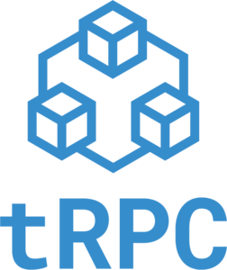

# tRPC Cheat Sheet



tRPC is a modern and lightweight RPC (Remote Procedure Call) framework. It guaranties type-safety between client and server.

Type safety is a great plus for any project, it makes the code less error prone and easier to maintain. Which introduces great developer experience.

One note is that you should use typescript because both provides the same goal (type safety), the other note that the server and client need to be in the same repository.

> Should you use tRPC? [Watch on Youtube : Don't Migrate to tRPC](https://youtu.be/iOWg95FLHHE)
> If you building a new project : Yes
> If you have an existing project and you want to migrate to tRPC : No, probably it is a overkill
> If you have an existing project and you want to use it for new features : Yes
> If the backend and frontend are in different repositories : No
> If the backend stack is not using typescript (python, java, etc) : No

# What is tRPC? It is just a function

RPC is short for "Remote Procedure Call". It is a way of calling functions on one computer (the server) from another computer (the client). With traditional HTTP/REST APIs, you call a URL and get a response. With RPC, you call a function and get a response.

```ts
// HTTP/REST
const res = await fetch("/api/users/1");
const user = await res.json();
// RPC
const user = await api.users.getById({ id: 1 });
```

The cheat sheets is divided into 2 parts:

- [Server side](https://github.com/taham8875/cheat-sheets/blob/main/tRPC/tRPC-server.md)
- [Client side](https://github.com/taham8875/cheat-sheets/blob/main/tRPC/tRPC-client.md)
